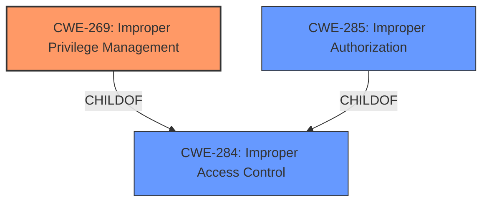

# Analysis for CVE-2022-30743

# Summary
| CWE ID | CWE Name | Confidence | CWE Abstraction Level | CWE Vulnerability Mapping Label | CWE-Vulnerability Mapping Notes |
|---|---|---|---|---|---|
| CWE-269 | Improper Privilege Management | 0.8 | Class | Primary CWE | Discouraged |
| CWE-285 | Improper Authorization | 0.6 | Class | Secondary Candidate | Discouraged |

## Evidence and Confidence

*   **Confidence Score:** 0.7
*   **Evidence Strength:** HIGH

## Relationship Analysis
The primary CWE considered was CWE-269 (**Improper Privilege Management**). It is a Class-level CWE and a child of CWE-284 (**Improper Access Control**). The mapping guidance discourages direct use of CWE-269 and suggests looking at its children. However, no child CWE fully captures the described **improper privilege management** in the vulnerability description. CWE-285 (**Improper Authorization**) was also considered because the impact involves unauthorized access. However, the root cause is more related to the management of privileges, making CWE-269 more appropriate.

## Vulnerability Chain
The vulnerability chain starts with **improper privilege management** (CWE-269), leading to attackers gaining unauthorized access to contact and gallery data.
- **Root Cause:** CWE-269 (**Improper Privilege Management**)
- **Impact:** Unauthorized access to sensitive data.

## Summary of Analysis
Initial assessment strongly points towards CWE-269 (**Improper Privilege Management**) due to the explicit mention of "**Improper privilege management**" as the root cause in both the vulnerability description and the CVE reference summary: "Improper privilege management vulnerability in Samsung Account." The retriever results also list CWE-269 as the top combined result. While the mapping guidance discourages the use of CWE-269 and recommends examining its children, none of the child CWEs provide a better fit based on the available evidence.
CWE-285 (**Improper Authorization**) was also considered, but the **rootcause** focuses on how privileges are managed, not on a failure during authorization checks.
The chosen CWE is at the Class level, but selecting a more specific CWE would require more detailed information about the exact mechanism of the **improper privilege management**. Because the evidence strongly suggests **improper privilege management** as the **rootcause**, selecting CWE-269 is justified despite the mapping guidance.

Relevant CWE Information:
# Enhanced Context (25 CWEs)
The following CWEs were identified as potentially relevant to this vulnerability:

## CWE-280: Improper Handling of Insufficient Permissions or Privileges
**Abstraction Level**: Base
**Similarity Score**: 0.76
**Source**: dense

**Description**:
The product does not handle or incorrectly handles when it has insufficient privileges to access resources or functionality as specified by their permissions. This may cause it to follow unexpected code paths that may leave the product in an invalid state.

**Mapping Guidance**:
- Usage: Allowed
- Rationale: This CWE entry is at the Base level of abstraction, which is a preferred level of abstraction for mapping to the root causes of vulnerabilities.

This CWE was considered but not selected because the vulnerability description does not indicate the product fails to handle insufficient privileges. Instead, it describes an **improper privilege management** issue.

## CWE-274: Improper Handling of Insufficient Privileges
**Abstraction Level**: Base
**Similarity Score**: 0.76
**Source**: dense

**Description**:
The product does not handle or incorrectly handles when it has insufficient privileges to perform an operation, leading to resultant weaknesses.

**Mapping Guidance**:
- Usage: Discouraged
- Rationale: This CWE entry could be deprecated in a future version of CWE.

This CWE was considered but not selected because it is similar to CWE-280, and the vulnerability description does not indicate the product fails to handle insufficient privileges.

## CWE-266: Incorrect Privilege Assignment
**Abstraction Level**: Base
**Similarity Score**: 0.75
**Source**: dense

**Description**:
A product incorrectly assigns a privilege to a particular actor, creating an unintended sphere of control for that actor.

**Mapping Guidance**:
- Usage: Allowed
- Rationale: This CWE entry is at the Base level of abstraction, which is a preferred level of abstraction for mapping to the root causes of vulnerabilities.

This CWE was considered but not selected. While the vulnerability involves **improper privilege management**, the description lacks specific details about an incorrect privilege assignment to a particular actor.

## CWE-267: Privilege Defined With Unsafe Actions
**Abstraction Level**: Base
**Similarity Score**: 0.75
**Source**: dense

**Description**:
A particular privilege, role, capability, or right can be used to perform unsafe actions that were not intended, even when it is assigned to the correct entity.

**Mapping Guidance**:
- Usage: Allowed
- Rationale: This CWE entry is at the Base level of abstraction, which is a preferred level of abstraction for mapping to the root causes of vulnerabilities.

This CWE was considered but not selected because the vulnerability description does not specify if a privilege can be used to perform unsafe actions.

## CWE-653: Improper Isolation or Compartmentalization
**Abstraction Level**: Class
**Similarity Score**: 0.75
**Source**: dense

**Description**:
The product does not properly compartmentalize or isolate functionality, processes, or resources that require different privilege levels, rights, or permissions.

**Mapping Guidance**:
- Usage: Allowed
- Rationale: This CWE entry is at the Base level of abstraction, which is a preferred level of abstraction for mapping to the root causes of vulnerabilities.

This CWE was considered but not selected because the vulnerability description doesn't specify if the product fails to properly compartmentalize or isolate functionality.

## CWE-1220: Insufficient Granularity of Access Control
**Abstraction Level**: Base
**Similarity Score**: 0.75
**Source**: dense

**Description**:
The product implements access controls via a policy or other feature with the intention to disable or restrict accesses (reads and/or writes) to assets in a system from untrusted agents. However, implemented access controls lack required granularity, which renders the control policy too broad because it allows accesses from unauthorized agents to the security-sensitive assets.

**Mapping Guidance**:
- Usage: Allowed
- Rationale: This CWE entry is at the Base level of abstraction, which is a preferred level of abstraction for mapping to the root causes of vulnerabilities.

This CWE was considered but not selected because the provided vulnerability description does not specify if access controls lacked required granularity.

## CWE-639: Authorization Bypass Through User-Controlled Key
**Abstraction Level**: Base
**Similarity Score**: 0.74
**Source**: dense

**Description**:
The system's authorization functionality does not prevent one user from gaining access to another user's data or record by modifying the key value identifying the data.

**Mapping Guidance**:
- Usage: Allowed
- Rationale: This CWE entry is at the Base level of abstraction, which is a preferred level of abstraction for mapping to the root causes of vulnerabilities.

This CWE was considered but not selected because there's no indication of a user-controlled key being used to bypass authorization.

## CWE-668: Exposure of Resource to Wrong Sphere
**Abstraction Level**: Class
**Similarity Score**: 0.74
**Source**: dense

**Description**:
The product exposes a resource to the wrong control sphere, providing unintended actors with inappropriate access to the resource.

**Mapping Guidance**:
- Usage: Discouraged
- Rationale: CWE-668 is high-level and is often misused as a catch-all when lower-level CWE IDs might be applicable. It is sometimes used for low-information vulnerability reports [REF-1287]. It is a level-1 Class (i.e., a child of a Pillar). It is not useful for trend analysis.

This CWE was considered but not selected because it is too general, and a more specific CWE is available (CWE-269).

## CWE-807: Reliance on Untrusted Inputs in a Security Decision
**Abstraction Level**: Base
**Similarity Score**: 0.74
**Source**: dense

**Description**:
The product uses a protection mechanism that relies on the existence or values of an input, but the input can be modified by an untrusted actor in a way that bypasses the protection mechanism.

**Mapping Guidance**:
- Usage: Allowed
- Rationale: This CWE entry is at the Base level of abstraction, which is a preferred level of abstraction for mapping to the root causes of vulnerabilities.

This CWE was considered