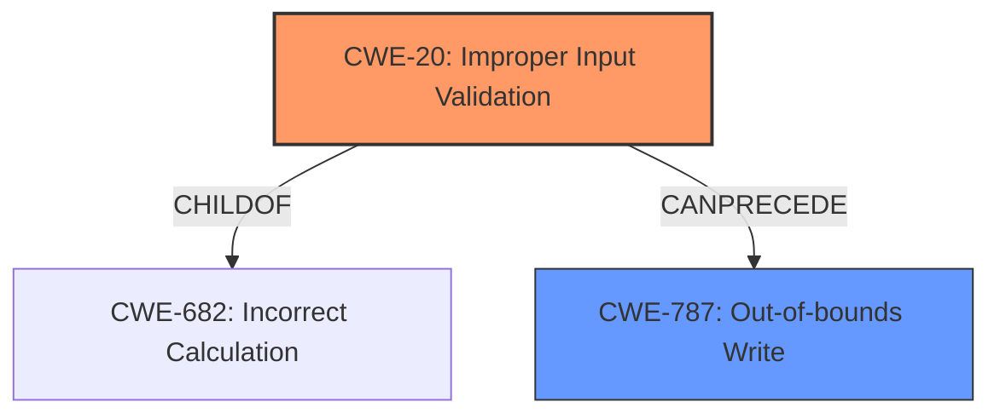

# Enhanced Analysis for CVE-2022-3075

# Summary
| CWE ID | CWE Name | Confidence | CWE Abstraction Level | CWE Vulnerability Mapping Label | CWE-Vulnerability Mapping Notes |
|---|---|---|---|---|---|
| CWE-20 | Improper Input Validation | 0.9 | Base | Primary | Allowed |
| CWE-787 | Out-of-bounds Write | 0.6 | Base | Secondary | Allowed |

## Evidence and Confidence

*   **Confidence Score:** 0.8
*   **Evidence Strength:** HIGH

## Relationship Analysis
The primary CWE, CWE-20, is a base-level weakness that represents a general class of input validation issues. While broad, it is directly supported by the vulnerability description. The secondary CWE, CWE-787, represents a potential consequence of the insufficient validation, where a crafted HTML page could lead to out-of-bounds writes. CWE-20 is a child of CWE-682, which represents incorrect calculation, and CWE-787 can be a consequence of failing to prevent an integer overflow, meaning that CWE-20 can precede CWE-787.



## Vulnerability Chain
The vulnerability chain starts with **insufficient data validation** (CWE-20) in the Mojo interface of Google Chrome. This **weakness** allows a remote attacker who has compromised the renderer process to send a crafted HTML page, which could lead to a sandbox escape, potentially through an out-of-bounds write (CWE-787).

## Summary of Analysis
The initial analysis identified CWE-20 as the primary weakness due to the explicit mention of **insufficient data validation** in the vulnerability description and the CVE Reference Links Content Summary. The description clearly states that the vulnerability is caused by **insufficient data validation** in Mojo. The CVE Reference Links Content Summary confirms this by stating, "Root cause of vulnerability: **Insufficient data validation** in Mojo" and "Weaknesses/vulnerabilities present: **Insufficient data validation**".
The phrase "**insufficient data validation**" is the root cause of the vulnerability, which aligns directly with CWE-20.

The relationship analysis revealed that CWE-20 is a high-level weakness, and while it's best to be specific, the provided information does not offer a more detailed description of what specific data was not validated or how the validation was **insufficient**. While the potential impact is a sandbox escape, leading to an out-of-bounds write (CWE-787), this is a consequence of the **insufficient validation**, not the root cause itself. Therefore, CWE-20 is the most appropriate primary classification.

CWE-787 is a strong secondary candidate since it would follow the **insufficient data validation**, and it is likely that the crafted HTML page exploits the **insufficient data validation** to write to an unauthorized area of memory.

The confidence score is high because the description explicitly states the cause.

Relevant CWE Information:

# Enhanced Context (25 CWEs)
The following CWEs were identified as potentially relevant to this vulnerability:

## CWE-1289: Improper Validation of Unsafe Equivalence in Input
**Abstraction Level**: Base
**Similarity Score**: 0.78

**Description**:
The product receives an input value that is used as a resource identifier or other type of reference, but it does not validate or incorrectly validates that the input is equivalent to a potentially-unsafe value.

## CWE-838: Inappropriate Encoding for Output Context
**Abstraction Level**: Base
**Similarity Score**: 0.78

**Description**:
The product uses or specifies an encoding when generating output to a downstream component, but the specified encoding is not the same as the encoding that is expected by the downstream component.

## CWE-843: Access of Resource Using Incompatible Type ('Type Confusion')
**Abstraction Level**: Base
**Similarity Score**: 0.77

**Description**:
The product allocates or initializes a resource such as a pointer, object, or variable using one type, but it later accesses that resource using a type that is incompatible with the original type.

## CWE-451: User Interface (UI) Misrepresentation of Critical Information
**Abstraction Level**: Class
**Similarity Score**: 0.76

**Description**:
The user interface (UI) does not properly represent critical information to the user, allowing the information - or its source - to be obscured or spoofed. This is often a component in phishing attacks.

## CWE-116: Improper Encoding or Escaping of Output
**Abstraction Level**: Class
**Similarity Score**: 0.76

**Description**:
The product prepares a structured message for communication with another component, but encoding or escaping of the data is either missing or done incorrectly. As a result, the intended structure of the message is not preserved.

## CWE-74: Improper Neutralization of Special Elements in Output Used by a Downstream Component ('Injection')
**Abstraction Level**: Class
**Similarity Score**: 0.76

**Description**:
The product constructs all or part of a command, data structure, or record using externally-influenced input from an upstream component, but it does not neutralize or incorrectly neutralizes special elements that could modify how it is parsed or interpreted when it is sent to a downstream component.

## CWE-134: Use of Externally-Controlled Format String
**Abstraction Level**: Base
**Similarity Score**: 0.76

**Description**:
The product uses a function that accepts a format string as an argument, but the format string originates from an external source.

## CWE-138: Improper Neutralization of Special Elements
**Abstraction Level**: Class
**Similarity Score**: 0.75

**Description**:
The product receives input from an upstream component, but it does not neutralize or incorrectly neutralizes special elements that could be interpreted as control elements or syntactic markers when they are sent to a downstream component.

## CWE-653: Improper Isolation or Compartmentalization
**Abstraction Level**: Class
**Similarity Score**: 0.75

**Description**:
The product does not properly compartmentalize or isolate functionality, processes, or resources that require different privilege levels, rights, or permissions.

## CWE-41: Improper Resolution of Path Equivalence
**Abstraction Level**: Base
**Similarity Score**: 0.75

**Description**:
The product is vulnerable to file system contents disclosure through path equivalence. Path equivalence involves the use of special characters in file and directory names. The associated manipulations are intended to generate multiple names for the same object.

## CWE-125: Out-of-bounds Read
**Abstraction Level**: Base
**Similarity Score**: 6026.65
**Source**: sparse

**Description**:
The product reads data past the end, or before the beginning, of the intended buffer.

## CWE-190: Integer Overflow or Wraparound
**Abstraction Level**: Base
**Similarity Score**: 6008.76

**Description**:
The product performs a calculation that can
         produce an integer overflow or wraparound when the logic
         assumes that the resulting value will always be larger than
         the original value. This occurs when an integer value is
         incremented to a value that is too large to store in the
         associated representation. When this occurs, the value may
         become a very small or negative number.

## CWE-367: Time-of-check Time-of-use (TOCTOU) Race Condition
**Abstraction Level**: Base
**Similarity Score**: 5866.35

**Description**:
The product checks the state of a resource before using that resource, but the resource's state can change between the check and the use in a way that invalidates the results of the check. This can cause the product to perform invalid actions when the resource is in an unexpected state.

## CWE-123: Write-what-where Condition
**Abstraction Level**: base
**Similarity Score**: 4.82

**Description**:
CWE-123: Write-what-where Condition

## CWE-416: Use After Free
**Abstraction Level**: variant
**Similarity Score**: 4.33

**Description**:
CWE-416: Use After Free

## CWE-170: Improper Null Termination
**Abstraction Level**: base
**Similarity Score**: 4.33

**Description**:
CWE-170: Improper Null Termination

## CWE-1284: Improper Validation of Specified Quantity in Input
**Abstraction Level**: base
**Similarity Score**: 4.33

**Description**:
CWE-1284: Improper Validation of Specified Quantity in Input

## CWE-120: Buffer Copy without Checking Size of Input ('Classic Buffer Overflow')
**Abstraction Level**: base
**


## CWE Relationship Analysis

Current CWEs represent these abstraction levels: .


### Vulnerability Chain Analysis

**Chain starting from CWE-41:**
- 41 (Improper Resolution of Path Equivalence) - ROOT


**Chain starting from CWE-138:**
- 138 (Improper Neutralization of Special Elements) - ROOT


### CWE Relationship Diagram

```mermaid
graph TD
    classDef primary fill:#f96,stroke:#333,stroke-width:2px
    classDef secondary fill:#69f,stroke:#333
    classDef tertiary fill:#9e9,stroke:#333
```