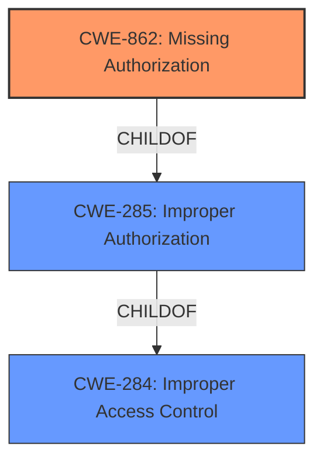

# Analysis Report for CVE-2022-30757

# Vulnerability Analysis Report: CVE-2022-30757

## Description


## Analysis (with Relationship Data)

# Summary
| CWE ID | CWE Name | Confidence | CWE Abstraction Level | CWE Vulnerability Mapping Label | CWE-Vulnerability Mapping Notes |
|---|---|---|---|---|---|
| CWE-862 | Missing Authorization | 0.9 | Class | Primary | Allowed-with-Review |
| CWE-284 | Improper Access Control | 0.6 | Pillar | Secondary | Discouraged |
| CWE-285 | Improper Authorization | 0.5 | Class | Secondary | Discouraged |

## Evidence and Confidence

*   **Confidence Score:** 0.9
*   **Evidence Strength:** HIGH

## Relationship Analysis
The primary relationship influencing the CWE selection is the hierarchical structure. CWE-862 (Missing Authorization) is a child of CWE-285 (Improper Authorization), which in turn is a child of CWE-284 (Improper Access Control). Since the vulnerability description clearly indicates a **missing** authorization check, CWE-862 is more specific and thus more appropriate than its parents. The mapping guidance discourages the use of the parent CWEs when a more specific child CWE is available.



## Vulnerability Chain
The chain of events for this vulnerability is as follows:
1.  **Root Cause:** **Missing authorization** check in the `isemtelephony` service.
2.  **Weakness:** Allows unauthorized access to the Cellular ID (CID).
3.  **Impact:** An attacker can obtain the CID without the `ACCESS_FINE_LOCATION` permission, which can be used for location tracking or other malicious purposes.

## Summary of Analysis
The initial analysis strongly points to an authorization issue. The vulnerability description explicitly states "**Improper authorization**" and the CVE reference summary highlights the "**lack of proper authorization checks**". The Retriever results also list CWE-862 (Missing Authorization), CWE-863 (Incorrect Authorization) and CWE-285 (Improper Authorization) as top candidates.

However, the vulnerability description key phrases also show "**rootcause:** **Improper authorization**", and "**impact:** obtain CID without ACCESS_FINE_LOCATION permission".

Given the evidence, CWE-862 (Missing Authorization) is the most appropriate CWE because it directly reflects the **root cause** of the vulnerability, where an authorization check is absent. The other candidates, CWE-863 (Incorrect Authorization) and CWE-285 (Improper Authorization), imply that an authorization check exists but is flawed, which is not the case here. CWE-284 is a high-level pillar and should be avoided when a more specific CWE is available.

The selection of CWE-862 is at the optimal level of specificity because it accurately captures the absence of an authorization check, which is the **root cause** of the vulnerability.

Relevant CWE Information:
*   **CWE-862: Missing Authorization**
    *   **Description**: The product does not perform an authorization check when an actor attempts to access a resource or perform an action.
    *   This aligns directly with the vulnerability description, which states that the isemtelephony service allows access to the CID without proper permission checks.

*   **CWE-284: Improper Access Control**
    *   **Description**: The product does not restrict or incorrectly restricts access to a resource from an unauthorized actor.
    *   This is a more general category, and while applicable, CWE-862 is a more precise classification.

*   **CWE-285: Improper Authorization**
    *   **Description**: The product does not perform or incorrectly performs an authorization check when an actor attempts to access a resource or perform an action.
    *   This is a parent of CWE-862 and less specific.

I considered but did not use CWE-863 (Incorrect Authorization) because the vulnerability is not about an incorrect authorization check, but the complete absence of one. I also considered but did not use CWE-213 (Exposure of Sensitive Information Due to Incompatible Policies) because the core issue is the missing authorization, not necessarily the incompatibility of policies.


## CWE Relationship Analysis

Current CWEs represent these abstraction levels: .


### Vulnerability Chain Analysis

**Chain starting from CWE-862:**
- 862 (Missing Authorization) - ROOT


**Chain starting from CWE-284:**
- 284 (Improper Access Control) - ROOT


### CWE Relationship Diagram

```mermaid
graph TD
    classDef primary fill:#f96,stroke:#333,stroke-width:2px
    classDef secondary fill:#69f,stroke:#333
    classDef tertiary fill:#9e9,stroke:#333
```


*Report generated on 2025-03-30 23:16:26*
