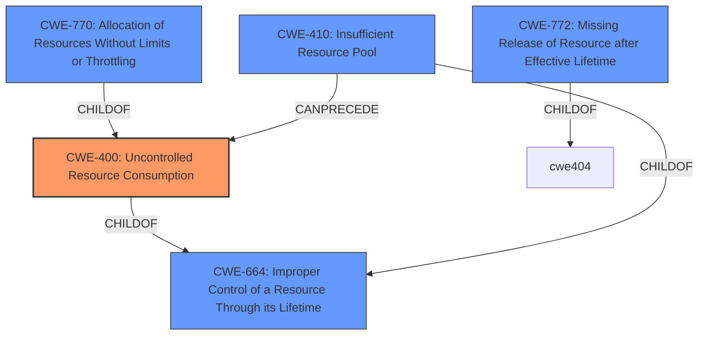

# Enhanced Analysis for CVE-2022-30791

# Summary
| CWE ID | CWE Name | Confidence | CWE Abstraction Level | CWE Vulnerability Mapping Label | CWE-Vulnerability Mapping Notes |
|---|---|---|---|---|---|
| CWE-400 | Uncontrolled Resource Consumption | 0.9 | Class | Primary | Discouraged, but most appropriate based on the provided information. |
| CWE-770 | Allocation of Resources Without Limits or Throttling | 0.7 | Base | Secondary Candidate | Allowed, but less descriptive than CWE-400 in this case. |
| CWE-410 | Insufficient Resource Pool | 0.6 | Base | Secondary Candidate | Allowed, but the problem is not necessarily the size of the pool, but the control of its consumption. |
| CWE-772 | Missing Release of Resource after Effective Lifetime | 0.5 | Base | Secondary Candidate | Allowed, but the description doesn't indicate a resource leak, but an uncontrolled consumption. |

## Evidence and Confidence

*   **Confidence Score:** 0.9
*   **Evidence Strength:** HIGH

## Relationship Analysis
The primary CWE is CWE-400, a Class-level weakness. While it's generally discouraged to map to Class-level CWEs, the description strongly suggests uncontrolled resource consumption as the root cause. Child CWEs like CWE-770, CWE-410, and CWE-772 were considered but found less fitting. CWE-400 has a parent CWE-664 (Improper Control of a Resource Through its Lifetime), which is too high-level. The analysis focused on finding the most specific CWE that describes the **uncontrolled resource consumption** that leads to the blocking of new TCP connections.



## Vulnerability Chain
The vulnerability chain starts with an **uncontrolled resource consumption** (CWE-400), leading to the exhaustion of available TCP connections, which ultimately blocks new connections.
- Root Cause: **Uncontrolled Resource Consumption** (CWE-400)
- Impact: Block new TCP connections

## Summary of Analysis
The analysis is primarily based on the vulnerability description and the CVE Reference Links Content Summary. The key phrase "uncontrolled resource consumption" directly points to CWE-400. The CVE Reference Links Content Summary confirms this, stating that the vulnerability is due to a lack of proper handling of connection limits, leading to **uncontrolled resource consumption**.

The graph relationships helped to narrow down the choices. While CWE-400 is a Class-level CWE and is generally discouraged, the alternatives (CWE-770, CWE-410, CWE-772) are less descriptive of the specific vulnerability.

The selection of CWE-400 is justified because it directly addresses the root cause described in the vulnerability: the product does not properly control the allocation and maintenance of a limited resource, leading to the exhaustion of available resources. This is supported by the vulnerability description key phrases and the CVE reference summary.

CWE-770 was considered because the system allocates resources without limits or throttling. However, the primary issue is not necessarily the lack of limits, but the **uncontrolled consumption** itself, making CWE-400 a better fit.

CWE-410 was considered, but it focuses on the resource pool size being insufficient, while the core problem is the **uncontrolled consumption**, not necessarily the pool's initial size.

CWE-772 was considered, but this CWE is related to the missing release of resources after their effective lifetime. This vulnerability is about the **uncontrolled consumption** of active resources, not leaked resources.

Relevant CWE Information:

# Enhanced Context (25 CWEs)
The following CWEs were identified as potentially relevant to this vulnerability:

## CWE-404: Improper Resource Shutdown or Release
**Abstraction Level**: Class
**Similarity Score**: 0.79
**Source**: dense

**Description**:
The product does not release or incorrectly releases a resource before it is made available for re-use.

**Mapping Guidance**:
- Usage: Allowed-with-Review
- Rationale: This CWE entry is a Class and might have Base-level children that would be more appropriate

## CWE-226: Sensitive Information in Resource Not Removed Before Reuse
**Abstraction Level**: Base
**Similarity Score**: 0.79
**Source**: dense

**Description**:
The product releases a resource such as memory or a file so that it can be made available for reuse, but it does not clear or "zeroize" the information contained in the resource before the product performs a critical state transition or makes the resource available for reuse by other entities.

**Mapping Guidance**:
- Usage: Allowed
- Rationale: This CWE entry is at the Base level of abstraction, which is a preferred level of abstraction for mapping to the root causes of vulnerabilities.

## CWE-405: Asymmetric Resource Consumption (Amplification)
**Abstraction Level**: Class
**Similarity Score**: 0.78
**Source**: dense

**Description**:
The product does not properly control situations in which an adversary can cause the product to consume or produce excessive resources without requiring the adversary to invest equivalent work or otherwise prove authorization, i.e., the adversary's influence is "asymmetric."

**Mapping Guidance**:
- Usage: Allowed-with-Review
- Rationale: This CWE entry is a Class and might have Base-level children that would be more appropriate

## CWE-664: Improper Control of a Resource Through its Lifetime
**Abstraction Level**: Pillar
**Similarity Score**: 0.78
**Source**: dense

**Description**:
The product does not maintain or incorrectly maintains control over a resource throughout its lifetime of creation, use, and release.

**Mapping Guidance**:
- Usage: Discouraged
- Rationale: This CWE entry is high-level when lower-level children are available.

## CWE-772: Missing Release of Resource after Effective Lifetime
**Abstraction Level**: Base
**Similarity Score**: 0.77
**Source**: dense

**Description**:
The product does not release a resource after its effective lifetime has ended, i.e., after the resource is no longer needed.

**Mapping Guidance**:
- Usage: Allowed
- Rationale: This CWE entry is at the Base level of abstraction, which is a preferred level of abstraction for mapping to the root causes of vulnerabilities.

## CWE-668: Exposure of Resource to Wrong Sphere
**Abstraction Level**: Class
**Similarity Score**: 0.76
**Source**: dense

**Description**:
The product exposes a resource to the wrong control sphere, providing unintended actors with inappropriate access to the resource.

**Mapping Guidance**:
- Usage: Discouraged
- Rationale: CWE-668 is high-level and is often misused as a catch-all when lower-level CWE IDs might be applicable. It is sometimes used for low-information vulnerability reports [REF-1287]. It is a level-1 Class (i.e., a child of a Pillar). It is not useful for trend analysis.

## CWE-799: Improper Control of Interaction Frequency
**Abstraction Level**: Class
**Similarity Score**: 0.76
**Source**: dense

**Description**:
The product does not properly limit the number or frequency of interactions that it has with an actor, such as the number of incoming requests.

**Mapping Guidance**:
- Usage: Allowed-with-Review
- Rationale: This CWE entry is a Class and might have Base-level children that would be more appropriate

## CWE-667: Improper Locking
**Abstraction Level**: Class
**Similarity Score**: 0.76
**Source**: dense

**Description**:
The product does not properly acquire or release a lock on a resource, leading to unexpected resource state changes and behaviors.

**Mapping Guidance**:
- Usage: Allowed-with-Review
- Rationale: This CWE entry is a Class and might have Base-level children that would be more appropriate

## CWE-789: Memory Allocation with Excessive Size Value
**Abstraction Level**: Variant
**Similarity Score**: 0.76
**Source**: dense

**Description**:
The product allocates memory based on an


## CWE Relationship Analysis

Current CWEs represent these abstraction levels: .


### Vulnerability Chain Analysis

**Chain starting from CWE-226:**
- 226 (Sensitive Information in Resource Not Removed Before Reuse) - ROOT


**Chain starting from CWE-400:**
- 400 (Uncontrolled Resource Consumption) - ROOT


### CWE Relationship Diagram

```mermaid
graph TD
    classDef primary fill:#f96,stroke:#333,stroke-width:2px
    classDef secondary fill:#69f,stroke:#333
    classDef tertiary fill:#9e9,stroke:#333
```