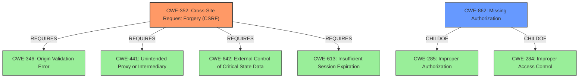

# Enhanced Analysis for CVE-2022-3082

# Summary
| CWE ID | CWE Name | Confidence | CWE Abstraction Level | CWE Vulnerability Mapping Label | CWE-Vulnerability Mapping Notes |
|---|---|---|---|---|---|
| CWE-352 | Cross-Site Request Forgery (CSRF) | 0.9 | Compound | Allowed | Primary CWE.  The vulnerability description explicitly mentions the absence of CSRF protection. |
| CWE-862 | Missing Authorization | 0.9 | Class | Allowed-with-Review | Secondary candidate. The vulnerability description explicitly mentions the absence of authorization. |

## Evidence and Confidence

*   **Confidence Score:** 0.9
*   **Evidence Strength:** HIGH

## Relationship Analysis
The primary CWEs are CWE-352 and CWE-862.
CWE-352 (Cross-Site Request Forgery) is a Compound CWE, and its relationships indicate it requires CWE-346 (Origin Validation Error), CWE-441 (Unintended Proxy or Intermediary), CWE-642 (External Control of Critical State Data), and CWE-613 (Insufficient Session Expiration).
CWE-862 (Missing Authorization) is a Class CWE and is a child of CWE-285 (Improper Authorization) and CWE-284 (Improper Access Control). The relationship analysis influenced the selection by identifying the need for both CSRF and authorization checks.



## Vulnerability Chain
The chain of root cause and weaknesses is as follows:
1.  **Root Cause:** **Missing authorization and CSRF check** in AJAX actions.
2.  **Weakness:** Any logged-in user can call these AJAX actions.
3.  **Impact:** Disable the app.

## Summary of Analysis
The vulnerability description clearly states the **missing authorisation and CSRF check** in AJAX actions, which allows any logged-in user to disable the app.
The vulnerability description key phrases also highlight the **missing authorisation and CSRF check** as the **rootcause**. The CVE Reference Links Content Summary confirms this by stating: "**Root cause of vulnerability**: The plugin lacks proper authorization and CSRF protection for certain AJAX actions."

The graph relationships show how CWE-352 requires other CWEs, highlighting the complexity of CSRF vulnerabilities. CWE-862 being a child of CWE-285 and CWE-284 indicates its role in broader access control issues.

CWE-352 and CWE-862 are at the optimal level of specificity, with CWE-352 being a Compound weakness and CWE-862 being a Class weakness. Further base level refinements could be done with further information but given the description they are sufficient.

Relevant CWE Information:

# Enhanced Context (25 CWEs)

## CWE-352: Cross-Site Request Forgery (CSRF)
**Abstraction:** Compound
**Status:** Stable

### Description
The web application does not, or can not, sufficiently verify whether a well-formed, valid, consistent request was intentionally provided by the user who submitted the request.

### Extended Description
When a web server is designed to receive a request from a client without any mechanism for verifying that it was intentionally sent, then it might be possible for an attacker to trick a client into making an unintentional request to the web server which will be treated as an authentic request. This can be done via a URL, image load, XMLHttpRequest, etc. and can result in exposure of data or unintended code execution.

## CWE-862: Missing Authorization
**Abstraction:** Class
**Status:** Incomplete

### Description
The product does not perform an authorization check when an actor attempts to access a resource or perform an action.


## CWE Relationship Analysis

Current CWEs represent these abstraction levels: .


### Vulnerability Chain Analysis

**Chain starting from CWE-862:**
- 862 (Missing Authorization) - ROOT


**Chain starting from CWE-352:**
- 352 (Cross-Site Request Forgery (CSRF)) - ROOT


### CWE Relationship Diagram

```mermaid
graph TD
    classDef primary fill:#f96,stroke:#333,stroke-width:2px
    classDef secondary fill:#69f,stroke:#333
    classDef tertiary fill:#9e9,stroke:#333
```