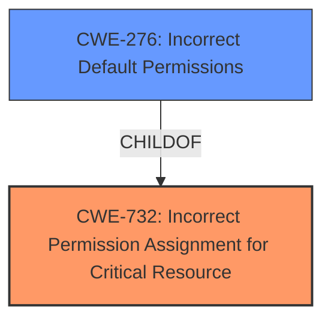

# Analysis for CVE-2022-30929

# Summary
| CWE ID | CWE Name | Confidence | CWE Abstraction Level | CWE Vulnerability Mapping Label | CWE-Vulnerability Mapping Notes |
|---|---|---|---|---|---|
| CWE-732 | Incorrect Permission Assignment for Critical Resource | 0.9 | Class | Allowed-with-Review | Primary CWE |
| CWE-276 | Incorrect Default Permissions | 0.7 | Base | Allowed | Secondary Candidate |

## Evidence and Confidence

*   **Confidence Score:** 0.8
*   **Evidence Strength:** MEDIUM

## Relationship Analysis
The primary relationship influencing the decision is that CWE-732 is a Class-level CWE, while some of its children (like CWE-276) are Base-level. CWE-732 is a parent of CWE-276. Since the description mentions **Insecure Permissions** without specifying whether it's during creation or inheritance, the parent class seems more appropriate. However, CWE-276 is considered as a secondary candidate because it represents a more specific scenario.

## Vulnerability Chain
The vulnerability chain here is simple:
1.  **Root Cause:** **Insecure Permissions** are assigned to a critical resource.
2.  **Impact:** Unauthorized actors can read or modify the resource.

## Summary of Analysis
The initial assessment identified **Insecure Permissions** as the root cause. The Retriever Results suggested CWE-732 (Incorrect Permission Assignment for Critical Resource) as the top candidate.

The final decision to select CWE-732 is based on the vulnerability description's mention of **Insecure Permissions** without specifying the exact context. The description clearly indicates that permissions are incorrectly set, aligning with CWE-732's description: "The product specifies permissions for a security-critical resource in a way that allows that resource to be read or modified by unintended actors." This aligns with the provided evidence: "**Insecure Permissions** via tomcat-embed-jasper".

CWE-276 was also considered because it covers the scenario where the **incorrect permissions** are set during installation. However, the description doesn't explicitly state that the permissions were set incorrectly *during installation*. Therefore, the more general CWE-732 is the better fit.

Relevant CWE Information:

# Enhanced Context (25 CWEs)
The following CWEs were identified as potentially relevant to this vulnerability:

## CWE-276: Incorrect Default Permissions
**Abstraction Level**: Base
**Similarity Score**: 0.77
**Source**: dense

**Description**:
During installation, installed file permissions are set to allow anyone to modify those files.

**Mapping Guidance**:
- Usage: Allowed
- Rationale: This CWE entry is at the Base level of abstraction, which is a preferred level of abstraction for mapping to the root causes of vulnerabilities.

## CWE-732: Incorrect Permission Assignment for Critical Resource
**Abstraction:** Class
**Status:** Draft

### Description
The product specifies permissions for a security-critical resource in a way that allows that resource to be read or modified by unintended actors.

### Extended Description
When a resource is given a permission setting that provides access to a wider range of actors than required, it could lead to the exposure of sensitive information, or the modification of that resource by unintended parties. This is especially dangerous when the resource is related to program configuration, execution, or sensitive user data. For example, consider a misconfigured storage account for the cloud that can be read or written by a public or anonymous user.

## CWE Details

### CWE-732: Incorrect Permission Assignment for Critical Resource
*   **How the vulnerability matches:** The vulnerability description explicitly mentions "**Insecure Permissions**," which directly relates to the incorrect assignment of permissions. The phrase "tomcat-embed-jasper" suggests this component requires specific permissions to function securely, and a misconfiguration leads to the vulnerability.
*   **Security implications:** Unauthorized access to critical resources can lead to information disclosure, data modification, or even complete system compromise.
*   **Relationship and Chain Patterns:** CWE-732 is a Class-level CWE. Child CWEs, like CWE-276 (Incorrect Default Permissions) and CWE-277 (Insecure Inherited Permissions), are more specific scenarios. Since the description doesn't provide enough information to pinpoint the exact scenario, CWE-732 serves as a suitable high-level classification.
*   **Mapping Guidance:** The MITRE mapping guidance allows CWE-732 "with review" because it can be misused for authorization weaknesses. However, in this case, the root cause is indeed related to incorrect permission assignment, not a lack of authorization checks.

### CWE-276: Incorrect Default Permissions
*   **Why it was considered but not used:** While CWE-276 (Incorrect Default Permissions) is a possible candidate, the vulnerability description lacks the specific detail that the **insecure permissions** were set during the initial installation of the software. The description uses the general term **"Insecure Permissions**", which could also cover scenarios such as **insecure inherited permissions**. Without more information to confirm the root cause, CWE-732 remains the more appropriate mapping.