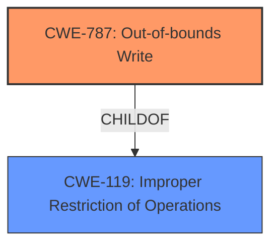

# Enhanced Analysis for CVE-2022-30938

# Summary
| CWE ID  | CWE Name                                                        | Confidence | CWE Abstraction Level | CWE Vulnerability Mapping Label | CWE-Vulnerability Mapping Notes |
| :-------- | :-------------------------------------------------------------- | :---------- | :-------------------- | :------------------------------ | :-------------------------------- |
| CWE-787 | Out-of-bounds Write                                           | 1          | Base                  | Allowed                       | Primary CWE                      |
| CWE-119 | Improper Restriction of Operations within the Bounds of a Memory Buffer | 0.7         | Class                 | Discouraged                   | Secondary Candidate              |

## Evidence and Confidence

*   **Confidence Score:** 0.9
*   **Evidence Strength:** HIGH

## Relationship Analysis
The primary weakness identified is CWE-787, Out-of-bounds Write, which is a base-level CWE. This is a child of CWE-119, Improper Restriction of Operations within the Bounds of a Memory Buffer, which is a class-level CWE. Since the vulnerability description specifically mentions **memory corruption** due to parsing specially crafted HTTP packets, the more specific CWE-787 is more appropriate.



## Vulnerability Chain
The vulnerability chain starts with the parsing of specially crafted HTTP packets to the `/txtrace` endpoint, which leads to **memory corruption** (CWE-787). The impact of this **memory corruption** is a denial of service condition.

## Summary of Analysis
The primary CWE is CWE-787, Out-of-bounds Write. This is based on the description of the vulnerability involving **memory corruption** when parsing specially crafted HTTP packets. The "CVE Reference Links Content Summary" section confirms this by stating that the vulnerability is classified as CWE-119, but also indicates that the software does not properly validate or restrict operations on memory buffers, leading to the possibility of **memory corruption**. CWE-787 is a more specific child of CWE-119 and accurately reflects the nature of the vulnerability. The retriever results also support CWE-787 as the top candidate.

Relevant CWE Information:

# Enhanced Context (25 CWEs)
The following CWEs were identified as potentially relevant to this vulnerability:

## CWE-170: Improper Null Termination
**Abstraction Level**: Base
**Similarity Score**: 0.81
**Source**: dense

**Description**:
The product does not terminate or incorrectly terminates a string or array with a null character or equivalent terminator.
*This CWE was considered but deemed not applicable as the description did not specify null termination issues*

## CWE-404: Improper Resource Shutdown or Release
**Abstraction Level**: Class
**Similarity Score**: 0.75
**Source**: dense

**Description**:
The product does not release or incorrectly releases a resource before it is made available for re-use.
*This CWE was considered but deemed not applicable as the description did not specify resource shutdown issues*

## CWE-197: Numeric Truncation Error
**Abstraction Level**: Base
**Similarity Score**: 0.75
**Source**: dense

**Description**:
Truncation errors occur when a primitive is cast to a primitive of a smaller size and data is lost in the conversion.
*This CWE was considered but deemed not applicable as the description did not specify numeric truncation issues*

## CWE-226: Sensitive Information in Resource Not Removed Before Reuse
**Abstraction Level**: Base
**Similarity Score**: 0.74
**Source**: dense

**Description**:
The product releases a resource such as memory or a file so that it can be made available for reuse, but it does not clear or "zeroize" the information contained in the resource before the product performs a critical state transition or makes the resource available for reuse by other entities.
*This CWE was considered but deemed not applicable as the description did not specify sensitive information reuse issues*

## CWE-131: Incorrect Calculation of Buffer Size
**Abstraction Level**: Base
**Similarity Score**: 0.74
**Source**: dense

**Description**:
The product does not correctly calculate the size to be used when allocating a buffer, which could lead to a buffer overflow.
*This CWE was considered but deemed not applicable as the description did not specify buffer size calculation issues*

## CWE-476: NULL Pointer Dereference
**Abstraction Level**: Base
**Similarity Score**: 0.74
**Source**: dense

**Description**:
The product dereferences a pointer that it expects to be valid but is NULL.
*This CWE was considered but deemed not applicable as the description did not specify null pointer issues*

## CWE-805: Buffer Access with Incorrect Length Value
**Abstraction Level**: Base
**Similarity Score**: 0.74
**Source**: dense

**Description**:
The product uses a sequential operation to read or write a buffer, but it uses an incorrect length value that causes it to access memory that is outside of the bounds of the buffer.
*This CWE was considered but deemed not applicable as the description did not specify buffer access length issues*

## CWE-191: Integer Underflow (Wrap or Wraparound)
**Abstraction Level**: Base
**Similarity Score**: 0.74
**Source**: dense

**Description**:
The product subtracts one value from another, such that the result is less than the minimum allowable integer value, which produces a value that is not equal to the correct result.
*This CWE was considered but deemed not applicable as the description did not specify integer underflow issues*

## CWE-824: Access of Uninitialized Pointer
**Abstraction Level**: Base
**Similarity Score**: 0.74
**Source**: dense

**Description**:
The product accesses or uses a pointer that has not been initialized.
*This CWE was considered but deemed not applicable as the description did not specify uninitialized pointer issues*

## CWE-667: Improper Locking
**Abstraction Level**: Class
**Similarity Score**: 0.74
**Source**: dense

**Description**:
The product does not properly acquire or release a lock on a resource, leading to unexpected resource state changes and behaviors.
*This CWE was considered but deemed not applicable as the description did not specify locking issues*

## CWE-190: Integer Overflow or Wraparound
**Abstraction Level**: Base
**Similarity Score**: 7383.05
**Source**: sparse

**Description**:
The product performs a calculation that can
         produce an integer overflow or wraparound when the logic
         assumes that the resulting value will always be larger than
         the original value. This occurs when an integer value is
         incremented to a value that is too large to store in the
         associated representation. When this occurs, the value may
         become a very small or negative number.
*This CWE was considered but deemed not applicable as the description did not specify integer overflow issues*

## CWE-125: Out-of-bounds Read
**Abstraction Level**: Base
**Similarity Score**: 7376.50
**Source**: sparse

**Description**:
The product reads data past the end, or before the beginning, of the intended buffer.
*This CWE was considered but deemed not applicable as the description specified a write*

## CWE-1284: Improper Validation of Specified Quantity in Input
**Abstraction Level**: Base
**Similarity Score**: 7331.41
**Source**: sparse

**Description**:
The product receives input that is expected to specify a quantity (such as size or length), but it does not validate or incorrectly validates that the quantity has the required properties.
*This CWE was considered but deemed not applicable as the description did not specify input validation issues*

## CWE-119: Improper Restriction of Operations within the Bounds of a Memory Buffer
**Abstraction Level**: Class
**Similarity Score**: 7328.21
**Source**: sparse

**Description**:
The product performs operations on a memory buffer, but it reads from or writes to a memory location outside the buffer's intended boundary. This may result in read or write operations on unexpected memory locations that could be linked to other variables, data structures, or internal program data.
*This CWE was considered but deemed not specific enough. The more specific CWE-787 (Out-of-bounds Write) is more appropriate.*

## CWE-789: Memory Allocation with Excessive Size Value
**Abstraction Level**: Variant
**Similarity Score**: 7187.71
**Source**: sparse

**Description**:
The product allocates memory based on an untrusted, large size value, but it does not ensure that the size is within expected limits, allowing arbitrary amounts of memory to be allocated.
*This CWE was considered but deemed not applicable as the description did not specify excessive memory allocation issues*

## CWE-41: Improper Resolution of Path Equivalence
**Abstraction Level**: base
**Similarity Score**: 5.03
**Source**: graph

**


## CWE Relationship Analysis

Current CWEs represent these abstraction levels: .


### Vulnerability Chain Analysis

**Chain starting from CWE-131:**
- 131 (Incorrect Calculation of Buffer Size) - ROOT


**Chain starting from CWE-190:**
- 190 (Integer Overflow or Wraparound) - ROOT


### CWE Relationship Diagram

```mermaid
graph TD
    classDef primary fill:#f96,stroke:#333,stroke-width:2px
    classDef secondary fill:#69f,stroke:#333
    classDef tertiary fill:#9e9,stroke:#333
```