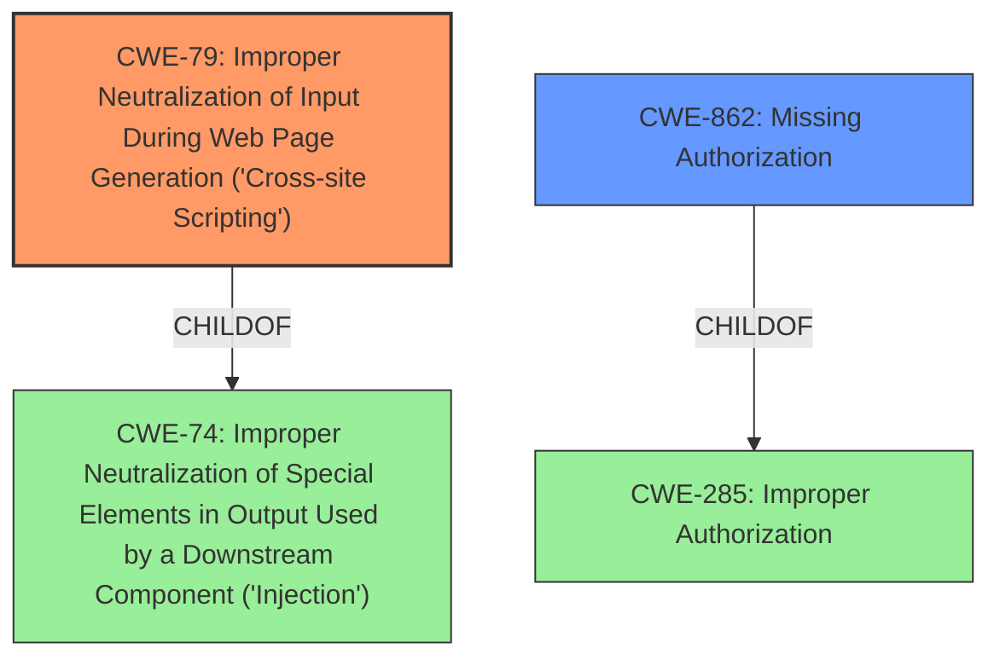

# Raw Analyzer Response for CVE-2022-3096

# Summary
| CWE ID | CWE Name | Confidence | CWE Abstraction Level | CWE Vulnerability Mapping Label | CWE-Vulnerability Mapping Notes |
|---|---|---|---|---|---|
| CWE-79 | Improper Neutralization of Input During Web Page Generation ('Cross-site Scripting') | 1.0 | Base | Allowed | Primary CWE |
| CWE-862 | Missing Authorization | 1.0 | Class | Allowed-with-Review | Secondary Candidate |

## Evidence and Confidence

*   **Confidence Score:** 1.0
*   **Evidence Strength:** HIGH

## Relationship Analysis
The primary weakness is CWE-79 [Improper Neutralization of Input During Web Page Generation ('Cross-site Scripting')], which occurs due to **lack of input sanitisation**. This is directly supported by the Vulnerability Description Key Phrases. A secondary weakness is CWE-862 [Missing Authorization], because low privilege users should not have access to modify plugin settings. CWE-862 is a child of CWE-285 [Improper Authorization], but CWE-862 is more specific, so it is the better fit. CWE-79 is a child of CWE-74 [Improper Neutralization of Special Elements in Output Used by a Downstream Component ('Injection')].

## Vulnerability Chain
The vulnerability chain is:
1.  **Broken Access Control**: Low-privileged users can modify plugin settings (CWE-862 [Missing Authorization]).
2.  **Lack of Input Sanitization**: The plugin does not sanitize user input when modifying settings.
3.  **Stored Cross-Site Scripting (XSS)**: Malicious script is injected and stored (CWE-79 [Improper Neutralization of Input During Web Page Generation ('Cross-site Scripting')]).
4.  **Impact**: The script executes when other users view the affected settings page.

## Summary of Analysis
The analysis identified two CWEs: CWE-79 [Improper Neutralization of Input During Web Page Generation ('Cross-site Scripting')] and CWE-862 [Missing Authorization]. The primary weakness, CWE-79 [Improper Neutralization of Input During Web Page Generation ('Cross-site Scripting')], directly stems from the **lack of input sanitisation** and escaping, as highlighted in the Vulnerability Description Key Phrases and CVE Reference Links Content Summary.

The CVE Reference Links Content Summary states that the plugin does not prevent low-privilege users from modifying settings, which leads to **Broken Access Control**. This aligns with CWE-862 [Missing Authorization], where the product lacks an authorization check.

The graph relationships show that CWE-79 [Improper Neutralization of Input During Web Page Generation ('Cross-site Scripting')] is a child of CWE-74 [Improper Neutralization of Special Elements in Output Used by a Downstream Component ('Injection')], representing a more specific type of injection. Similarly, CWE-862 [Missing Authorization] is a child of CWE-285 [Improper Authorization], but it's a more precise classification for the **missing** authorization check.

The selected CWEs are at the optimal level of specificity because they directly represent the root causes described in the vulnerability report. The evidence is strong, with both the vulnerability description and CVE reference summary clearly indicating the **lack of sanitisation** and **broken access control**.

Relevant CWE Information:

# Enhanced Context (25 CWEs)
The following CWEs were identified as potentially relevant to this vulnerability:

## CWE-74: Improper Neutralization of Special Elements in Output Used by a Downstream Component ('Injection')
**Abstraction Level**: Class
**Similarity Score**: 0.77
**Source**: dense

**Description**:
The product constructs all or part of a command, data structure, or record using externally-influenced input from an upstream component, but it does not neutralize or incorrectly neutralizes special elements that could modify how it is parsed or interpreted when it is sent to a downstream component.

**Mapping Guidance**:
- Usage: Discouraged
- Rationale: CWE-74 is high-level and often misused when lower-level weaknesses are more appropriate.

## CWE-80: Improper Neutralization of Script-Related HTML Tags in a Web Page (Basic XSS)
**Abstraction Level**: Variant
**Similarity Score**: 0.76
**Source**: dense

**Description**:
The product receives input from an upstream component, but it does not neutralize or incorrectly neutralizes special characters such as "<", ">", and "&" that could be interpreted as web-scripting elements when they are sent to a downstream component that processes web pages.

**Mapping Guidance**:
- Usage: Allowed
- Rationale: This CWE entry is at the Variant level of abstraction, which is a preferred level of abstraction for mapping to the root causes of vulnerabilities.

## CWE-1289: Improper Validation of Unsafe Equivalence in Input
**Abstraction Level**: Base
**Similarity Score**: 0.75
**Source**: dense

**Description**:
The product receives an input value that is used as a resource identifier or other type of reference, but it does not validate or incorrectly validates that the input is equivalent to a potentially-unsafe value.

**Mapping Guidance**:
- Usage: Allowed
- Rationale: This CWE entry is at the Base level of abstraction, which is a preferred level of abstraction for mapping to the root causes of vulnerabilities.

## CWE-472: External Control of Assumed-Immutable Web Parameter
**Abstraction Level**: Base
**Similarity Score**: 0.75
**Source**: dense

**Description**:
The web application does not sufficiently verify inputs that are assumed to be immutable but are actually externally controllable, such as hidden form fields.

**Mapping Guidance**:
- Usage: Allowed
- Rationale: This CWE entry is at the Base level of abstraction, which is a preferred level of abstraction for mapping to the root causes of vulnerabilities.

## CWE-184: Incomplete List of Disallowed Inputs
**Abstraction Level**: Base
**Similarity Score**: 0.75
**Source**: dense

**Description**:
The product implements a protection mechanism that relies on a list of inputs (or properties of inputs) that are not allowed by policy or otherwise require other action to neutralize before additional processing takes place, but the list is incomplete.

**Mapping Guidance**:
- Usage: Allowed
- Rationale: This CWE entry is at the Base level of abstraction, which is a preferred level of abstraction for mapping to the root causes of vulnerabilities.

## CWE-116: Improper Encoding or Escaping of Output
**Abstraction Level**: Class
**Similarity Score**: 0.74
**Source**: dense

**Description**:
The product prepares a structured message for communication with another component, but encoding or escaping of the data is either missing or done incorrectly. As a result, the intended structure of the message is not preserved.

**Mapping Guidance**:
- Usage: Allowed-with-Review
- Rationale: This CWE entry is a Class and might have Base-level children that would be more appropriate

## CWE-639: Authorization Bypass Through User-Controlled Key
**Abstraction Level**: Base
**Similarity Score**: 0.74
**Source**: dense

**Description**:
The system's authorization functionality does not prevent one user from gaining access to another user's data or record by modifying the key value identifying the data.

**Mapping Guidance**:
- Usage: Allowed
- Rationale: This CWE entry is at the Base level of abstraction, which is a preferred level of abstraction for mapping to the root causes of vulnerabilities.

## CWE-807: Reliance on Untrusted Inputs in a Security Decision
**Abstraction Level**: Base
**Similarity Score**: 0.74
**Source**: dense

**Description**:
The product uses a protection mechanism that relies on the existence or values of an input, but the input can be modified by an untrusted actor in a way that bypasses the protection mechanism.

**Mapping Guidance**:
- Usage: Allowed
- Rationale: This CWE entry is at the Base level of abstraction, which is a preferred level of abstraction for mapping to the root causes of vulnerabilities.

## CWE-138: Improper Neutralization of Special Elements
**Abstraction Level**: Class
**Similarity Score**: 0.74
**Source**: dense

**Description**:
The product receives input from an upstream component, but it does not neutralize or incorrectly neutralizes special elements that could be interpreted as control elements or syntactic markers when they are sent to a downstream