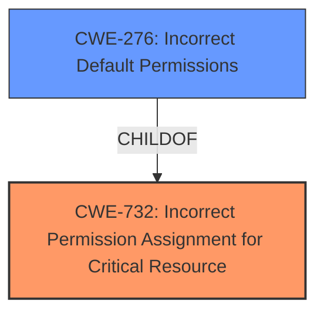

# Analysis for CVE-2022-30990

# Summary
| CWE ID | CWE Name | Confidence | CWE Abstraction Level | CWE Vulnerability Mapping Label | CWE-Vulnerability Mapping Notes |
|---|---|---|---|---|---|
| CWE-732 | Incorrect Permission Assignment for Critical Resource | 1.0 | Class | Allowed-with-Review | Primary CWE. While the name itself indicates an assignment of permissions for resources, this is often misused for vulnerabilities in which "permissions" are not checked. |
| CWE-276 | Incorrect Default Permissions | 0.75 | Base | Allowed | Secondary CWE. This CWE describes the scenario where file permissions are set incorrectly during installation, allowing unauthorized modification. |

## Evidence and Confidence

*   **Confidence Score:** 0.9
*   **Evidence Strength:** HIGH

## Relationship Analysis
The primary CWE is CWE-732, which is a class-level CWE. CWE-276, Incorrect Default Permissions, is a child of CWE-732, representing a more specific case of incorrect permission assignment during installation. This hierarchical relationship helps refine the classification, suggesting that if more details were available about the specific scenario, CWE-276 might be a better fit.

## Vulnerability Chain
The chain of events starts with the **insecure folder permissions** (root cause) which leads to sensitive information being accessible (impact).

## Summary of Analysis
The vulnerability description indicates that sensitive information disclosure occurs due to **insecure folder permissions**.

The primary CWE selection is CWE-732 (Incorrect Permission Assignment for Critical Resource). The vulnerability description explicitly mentions "insecure folder permissions," which directly aligns with CWE-732's description: "The product specifies permissions for a security-critical resource in a way that allows that resource to be read or modified by unintended actors." This CWE is a Class, and the mapping guidance suggests that lower-level CWEs might be more appropriate.

CWE-276 (Incorrect Default Permissions) was considered as a more specific Base CWE. It describes a scenario where file permissions are incorrectly set during installation. While the vulnerability description doesn't explicitly mention installation, it's a plausible scenario. Thus, it's a secondary candidate.

Other CWEs considered but not chosen:
*   CWE-61 and CWE-59: These involve symbolic links, which are not mentioned in the vulnerability description.
*   CWE-285: Improper Authorization is a high-level class, and CWE-732 is a more specific child.
*   CWE-522: Insufficiently Protected Credentials, while related to sensitive information, doesn't directly address the permission issue.
*   CWE-1272: Sensitive Information Uncleared Before Debug/Power State Transition is not relevant to the **insecure folder permissions**.
*   CWE-427: Uncontrolled Search Path Element is not relevant to the **insecure folder permissions**.
*   CWE-378 Creation of Temporary File With Insecure Permissions is not relevant to the **insecure folder permissions**.

The selection of CWE-732 is based on the direct mention of "insecure folder permissions" in the vulnerability description, making it the most appropriate initial classification. Further investigation might reveal if CWE-276 is applicable. The confidence level is high due to the clear alignment between the vulnerability description and the CWE definition.