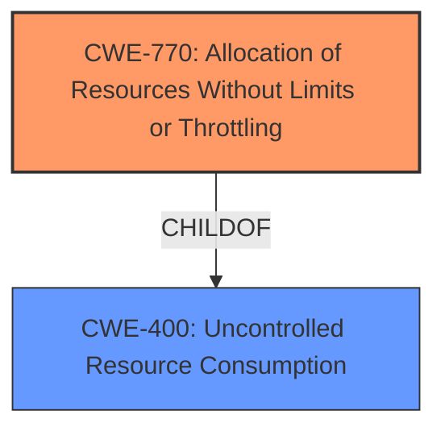

# Raw Analyzer Response for CVE-2022-31006

# Summary
| CWE ID | CWE Name | Confidence | CWE Abstraction Level | CWE Vulnerability Mapping Label | CWE-Vulnerability Mapping Notes |
|---|---|---|---|---|---|
| CWE-770 | Allocation of Resources Without Limits or Throttling | 0.9 | Base | Allowed | Primary CWE |
| CWE-400 | Uncontrolled Resource Consumption | 0.7 | Class | Discouraged | Secondary Candidate |

## Evidence and Confidence

*   **Confidence Score:** 0.9
*   **Evidence Strength:** HIGH

## Relationship Analysis
The primary CWE selected is CWE-770 (Base), which is a child of CWE-400 (Class). While CWE-400 is a broader classification, CWE-770 provides a more specific description of the vulnerability: the product allocates resources without limits or throttling. The relationship influenced the selection by favoring the more specific Base level CWE.

## Vulnerability Chain
The vulnerability chain starts with the **lack of resource limits or throttling** (CWE-770), leading to **uncontrolled resource consumption** and ultimately a **denial of service**. The root cause is the **missing or insufficient configuration of firewall rules**, and the final impact is the ledger becoming unusable due to maxed-out client connections.

## Summary of Analysis
The initial analysis considered CWE-400 due to the denial of service impact. However, the evidence clearly points to the **root cause** being the **allocation of resources without limits or throttling** (CWE-770).

The vulnerability description and CVE Reference Links Content Summary provide strong evidence:
*   "an attacker can max out the number of client connections allowed by the ledger, leaving the ledger unable to be used for its intended purpose."
*   "The vulnerability stems from insufficient default configuration of firewall rules...specifically regarding the limit on simultaneous client connections."
*   "The default settings allowed for a relatively low-cost Denial-of-Service (DoS) attack."
*   "Insufficient Firewall Rules: The default iptables rules, or lack thereof, failed to adequately limit the number of simultaneous client connections to the indy-node client port."

CWE-770's description aligns perfectly: "The product allocates a reusable resource or group of resources on behalf of an actor without imposing any restrictions on the size or number of resources that can be allocated, in violation of the intended security policy for that actor."

CWE-400 is a Class-level CWE and the Mapping Guidance discourages it due to frequent misuse and the availability of more precise mappings. CWE-770 provides a more specific and accurate mapping.

The selection of CWE-770 is at the optimal level of specificity because it directly addresses the **root cause** of the vulnerability, which is the **lack of limits on resource allocation**, rather than the broader consequence of resource exhaustion. The high confidence score reflects the strong evidence and clear alignment with the CWE description.

Relevant CWE Information:

# Enhanced Context (25 CWEs)
The following CWEs were identified as potentially relevant to this vulnerability:

## CWE-404: Improper Resource Shutdown or Release
**Abstraction Level**: Class
**Similarity Score**: 0.78
**Source**: dense

**Description**:
The product does not release or incorrectly releases a resource before it is made available for re-use.

**Mapping Guidance**:
- Usage: Allowed-with-Review
- Rationale: This CWE entry is a Class and might have Base-level children that would be more appropriate

*Not Selected:* This vulnerability is not about failing to release resources, but rather about failing to limit their initial allocation.

## CWE-405: Asymmetric Resource Consumption (Amplification)
**Abstraction Level**: Class
**Similarity Score**: 0.78
**Source**: dense

**Description**:
The product does not properly control situations in which an adversary can cause the product to consume or produce excessive resources without requiring the adversary to invest equivalent work or otherwise prove authorization, i.e., the adversary's influence is "asymmetric."

**Mapping Guidance**:
- Usage: Allowed-with-Review
- Rationale: This CWE entry is a Class and might have Base-level children that would be more appropriate

*Not Selected:* While there is an element of amplification in the attack's effectiveness, the core issue is the lack of initial resource limits.

## CWE-789: Memory Allocation with Excessive Size Value
**Abstraction Level**: Variant
**Similarity Score**: 0.77
**Source**: dense

**Description**:
The product allocates memory based on an untrusted, large size value, but it does not ensure that the size is within expected limits, allowing arbitrary amounts of memory to be allocated.

**Mapping Guidance**:
- Usage: Allowed
- Rationale: This CWE entry is at the Variant level of abstraction, which is a preferred level of abstraction for mapping to the root causes of vulnerabilities.

*Not Selected:* The vulnerability is not specifically about memory allocation with an excessive size, but rather about a general lack of limits on client connections.

## CWE-668: Exposure of Resource to Wrong Sphere
**Abstraction Level**: Class
**Similarity Score**: 0.77
**Source**: dense

**Description**:
The product exposes a resource to the wrong control sphere, providing unintended actors with inappropriate access to the resource.

**Mapping Guidance**:
- Usage: Discouraged
- Rationale: CWE-668 is high-level and is often misused as a catch-all when lower-level CWE IDs might be applicable. It is sometimes used for low-information vulnerability reports [REF-1287]. It is a level-1 Class (i.e., a child of a Pillar). It is not useful for trend analysis.

*Not Selected:* This is too broad. The issue is not about exposing a resource to the wrong sphere, but rather about not limiting resource allocation.

## CWE-664: Improper Control of a Resource Through its Lifetime
**Abstraction Level**: Pillar
**Similarity Score**: 0.77
**Source**: dense

**Description**:
The product does not maintain or incorrectly maintains control over a resource throughout its lifetime of creation, use, and release.

**Mapping Guidance**:
- Usage: Discouraged
- Rationale: This CWE entry is high-level when lower-level children are available.

*Not Selected:* Too broad; CWE-770 is more specific.

## CWE-799: Improper Control of Interaction Frequency
**Abstraction Level**: Class
**Similarity Score**: 0.76
**Source**: dense

**Description**:
The product does not properly limit the number or frequency of interactions that it has with an actor, such as the number of incoming requests.

**Mapping Guidance**:
- Usage: Allowed-with-Review
- Rationale: This CWE entry is a Class and might have Base-level children that would be more appropriate

*Not Selected:* Close, but CWE-770 more directly addresses the allocation aspect, rather than just interaction frequency.

## CWE-226: Sensitive Information in Resource Not Removed Before Reuse
**Abstraction Level**: Base
**Similarity Score**: 0.76
**Source**: dense

**Description**:
The product releases a resource such as memory or a file so that it can be made available for reuse, but it does not clear or "zeroize" the information contained in the resource before the product performs a critical state transition or makes the resource available for reuse by other entities.

**Mapping Guidance**:
- Usage: Allowed
- Rationale: This CWE entry is at the Base level of abstraction, which is a preferred level of abstraction for mapping to the root causes of vulnerabilities.

*Not Selected:* Irrelevant to the described vulnerability.

## CWE-400: Uncontrolled Resource Consumption
**Abstraction Level**: Class
**Similarity Score**: 0.76
**Source**: dense

**Description**:
The product does not properly control the allocation and maintenance of a limited resource, thereby enabling an actor to influence the amount of resources consumed, eventually leading to the exhaustion of available resources.

**Mapping Guidance**:
- Usage: Discouraged
- Rationale: CWE-400 is intended for incorrect behaviors in which the product is expected to track and restrict how many resources it consumes, but CWE-400 is often misused because it is conflated with the "technical impact" of vulnerabilities in which resource consumption occurs. It is sometimes used for low-information vulnerability reports. It is a level-1 Class (i.e., a child of a Pillar).

*Considered but not selected as Primary:* While this describes the impact, CWE-770 more accurately describes the root cause.

## CWE-770: Allocation of Resources Without Limits or Throttling
**Abstraction Level**: Base
**Similarity Score**: 0.76
**Source**: dense

**Description**:
The product allocates a reusable resource or group of resources on behalf of