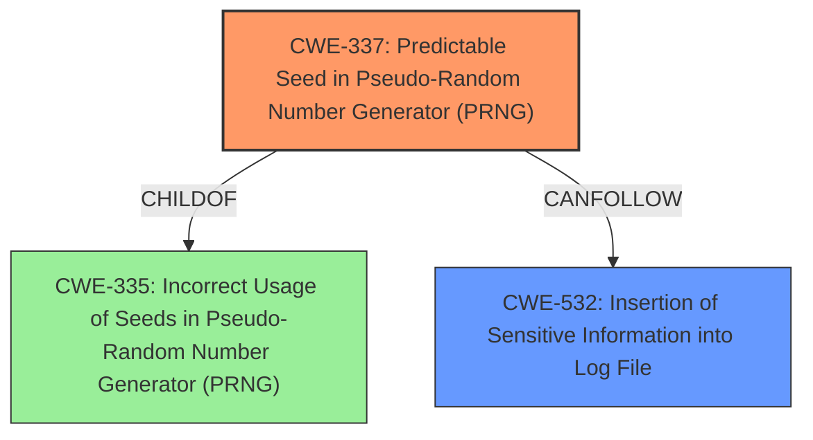

# Raw Analyzer Response for CVE-2022-31008

# Summary
| CWE ID    | CWE Name                                                                  | Confidence | CWE Abstraction Level | CWE Vulnerability Mapping Label | CWE-Vulnerability Mapping Notes |
| :-------- | :------------------------------------------------------------------------ | :--------- | :-------------------- | :------------------------------ | :------------------------------ |
| CWE-337   | Predictable Seed in Pseudo-Random Number Generator (PRNG)                 | 0.9        | Variant               | Primary                         | Allowed                       |
| CWE-532   | Insertion of Sensitive Information into Log File                        | 0.7        | Base                  | Secondary                       | Allowed                       |

## Evidence and Confidence

*   **Confidence Score:** 0.8
*   **Evidence Strength:** HIGH

## Relationship Analysis
The primary CWE is CWE-337, which is a Variant of CWE-335 (Incorrect Usage of Seeds in Pseudo-Random Number Generator (PRNG)), indicating a more specific type of seed-related issue within PRNGs. CWE-337 can lead to vulnerabilities where the generated "random" numbers are predictable, negating their intended security function. The secondary CWE, CWE-532 (Insertion of Sensitive Information into Log File), is a Base-level CWE that describes the exposure of sensitive information due to logging, often following from an earlier vulnerability. This illustrates a vulnerability chain.

## Vulnerability Chain
The vulnerability chain starts with a **predictable secret for URI encryption** (CWE-337). This predictable seed is used in a Pseudo-Random Number Generator, weakening the URI obfuscation. When exceptions occur, the deobfuscatable data, which may contain sensitive information, is written to the node log (CWE-532), leading to potential information disclosure.
  - CWE-337: **Predictable Seed in Pseudo-Random Number Generator (PRNG)**
  - CWE-532: Insertion of Sensitive Information into Log File

## Summary of Analysis
The primary weakness is the use of a **predictable secret for URI encryption**, making the obfuscation weak. The root cause of the vulnerability aligns closely with CWE-337, "Predictable Seed in Pseudo-Random Number Generator (PRNG)." The vulnerability description states, "The encryption key used to encrypt the URI was seeded with a **predictable secret**." The "CVE Reference Links Content Summary" confirms, "The Shovel and Federation plugins in RabbitMQ used a **predictable secret** to seed the encryption key for URI obfuscation, instead of a cluster-wide secret." The Retriever Results also list CWE-337 as the top candidate. Given the evidence, CWE-337 is the most appropriate primary CWE.

CWE-532, "Insertion of Sensitive Information into Log File," is also relevant because the deobfuscated URI, which could contain sensitive data, is written to the node log. The vulnerability description indicates, "reasonably easily deobfuscatable data could appear in the node log." The "CVE Reference Links Content Summary" also states, "Information disclosure of sensitive data in logs". Thus, CWE-532 is a secondary weakness, as it describes the consequence of the weak obfuscation: the potential exposure of sensitive information in the logs.

I considered CWE-330 (Use of Insufficiently Random Values) but chose CWE-337 because the description explicitly mentioned the **predictable secret**. CWE-330 is a more general class, while CWE-337 is a specific variant that better fits the root cause.

Relevant CWE Information:

# Enhanced Context (25 CWEs)
The following CWEs were identified as potentially relevant to this vulnerability:

## CWE-1391: Use of Weak Credentials
**Abstraction Level**: Class
**Similarity Score**: 0.80
**Source**: dense

**Description**:
The product uses weak credentials (such as a default key or hard-coded password) that can be calculated, derived, reused, or guessed by an attacker.

**Mapping Guidance**:
- Usage: Allowed-with-Review
- Rationale: This CWE entry is a Class and might have Base-level children that would be more appropriate

## CWE-330: Use of Insufficiently Random Values
**Abstraction Level**: Class
**Similarity Score**: 0.80
**Source**: dense

**Description**:
The product uses insufficiently random numbers or values in a security context that depends on unpredictable numbers.

**Mapping Guidance**:
- Usage: Discouraged
- Rationale: This CWE entry is a level-1 Class (i.e., a child of a Pillar). It might have lower-level children that would be more appropriate

## CWE-319: Cleartext Transmission of Sensitive Information
**Abstraction Level**: Base
**Similarity Score**: 0.79
**Source**: dense

**Description**:
The product transmits sensitive or security-critical data in cleartext in a communication channel that can be sniffed by unauthorized actors.

**Mapping Guidance**:
- Usage: Allowed
- Rationale: This CWE entry is at the Base level of abstraction, which is a preferred level of abstraction for mapping to the root causes of vulnerabilities.

## CWE-345: Insufficient Verification of Data Authenticity
**Abstraction Level**: Class
**Similarity Score**: 0.79
**Source**: dense

**Description**:
The product does not sufficiently verify the origin or authenticity of data, in a way that causes it to accept invalid data.

**Mapping Guidance**:
- Usage: Discouraged
- Rationale: This CWE entry is a level-1 Class (i.e., a child of a Pillar). It might have lower-level children that would be more appropriate

## CWE-328: Use of Weak Hash
**Abstraction Level**: Base
**Similarity Score**: 0.79
**Source**: dense

**Description**:
The product uses an algorithm that produces a digest (output value) that does not meet security expectations for a hash function that allows an adversary to reasonably determine the original input (preimage attack), find another input that can produce the same hash (2nd preimage attack), or find multiple inputs that evaluate to the same hash (birthday attack).

**Mapping Guidance**:
- Usage: Allowed
- Rationale: This CWE entry is at the Base level of abstraction, which is a preferred level of abstraction for mapping to the root causes of vulnerabilities.

## CWE-1240: Use of a Cryptographic Primitive with a Risky Implementation
**Abstraction Level**: Base
**Similarity Score**: 0.79
**Source**: dense

**Description**:
To fulfill the need for a cryptographic primitive, the product implements a cryptographic algorithm using a non-standard, unproven, or disallowed/non-compliant cryptographic implementation.

**Mapping Guidance**:
- Usage: Allowed
- Rationale: This CWE entry is at the Base level of abstraction, which is a preferred level of abstraction for mapping to the root causes of vulnerabilities.

## CWE-208: Observable Timing Discrepancy
**Abstraction Level**: Base
**Similarity Score**: 0.79
**Source**: dense

**Description**:
Two separate operations in a product require different amounts of time to complete, in a way that is observable to an actor and reveals security-relevant information about the state of the product, such as whether a particular operation was successful or not.

**Mapping Guidance**:
- Usage: Allowed
- Rationale: This CWE entry is at the Base level of abstraction, which is a preferred level of abstraction for mapping to the root causes of vulnerabilities.

## CWE-203: Observable Discrepancy
**Abstraction Level**: Base
**Similarity Score**: 0.78
**Source**: dense

**Description**:
The product behaves differently or sends different responses under different circumstances in a way that is observable to an unauthorized actor, which exposes security-relevant information about the state of the product, such as whether a particular operation was successful or not.

**Mapping Guidance**:
- Usage: Allowed
- Rationale: This CWE entry is at the Base level of abstraction, which is a preferred level of abstraction for mapping to the root causes of vulnerabilities.

## CWE-312: Cleartext Storage of Sensitive Information
**Abstraction Level**: Base
**Similarity Score**: 0.78
**Source**: dense

**Description**:
The product stores sensitive information in cleartext within a resource that might be accessible to another control sphere.

**Mapping Guidance**:
- Usage: Allowed
- Rationale: This CWE entry is at the Base level of abstraction, which is a preferred level of abstraction for mapping to the root causes of vulnerabilities.

## CWE-