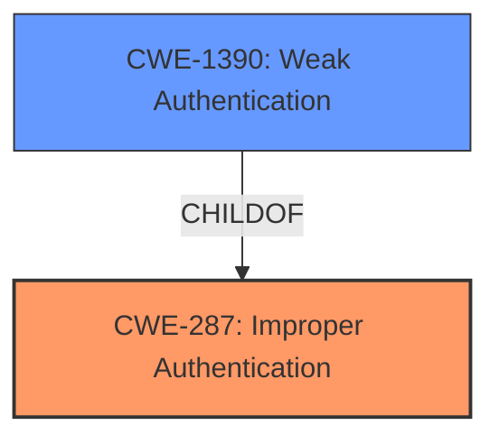

# Raw Analyzer Response for CVE-2022-31013

# Summary

| CWE ID | CWE Name | Confidence | CWE Abstraction Level | CWE Vulnerability Mapping Label | CWE-Vulnerability Mapping Notes |
|---|---|---|---|---|---|
| CWE-287 | Improper Authentication | 0.8 | Class | Primary CWE | Usage: Discouraged |
| CWE-1390 | Weak Authentication | 0.7 | Class | Secondary Candidate CWE | Usage: Allowed-with-Review |

## Evidence and Confidence

*   **Confidence Score:** 0.8
*   **Evidence Strength:** HIGH

## Relationship Analysis

The primary CWE selected is CWE-287, Improper Authentication, which is a Class-level CWE. CWE-1390, Weak Authentication, is a child of CWE-287 and was considered as a more specific option, but the evidence suggests that the authentication mechanism was fundamentally flawed due to the **incorrect asynchronous handling**, which justifies the broader classification of Improper Authentication.

## Vulnerability Chain

The vulnerability chain begins with the **incorrect use of asynchronous functions** (specifically, the lack of `await`), leading to the authentication bypass.

*   **Root Cause:** Incorrect asynchronous handling (**not using await to wait for the verification result**)
*   **Weakness:** Improper Authentication (CWE-287) or Weak Authentication (CWE-1390)
*   **Impact:** Authentication Bypass

## Summary of Analysis

The analysis is based on the provided vulnerability description and the supporting CVE reference. The key piece of evidence is the statement that the `verifyAccessKey` function, an async function, was **not using await to wait for the verification result**, leading to authentication bypass.

The selection of CWE-287 is primarily driven by the root cause described, which clearly indicates a failure in the authentication process. While CWE-1390 (Weak Authentication) is a more specific child of CWE-287, the lack of proper handling of the asynchronous function suggests a more fundamental flaw in the authentication process itself. Therefore, CWE-287 is deemed more appropriate.

The retriever results also support the selection of CWE-287 and CWE-1390. The "Mapping Guidance" for CWE-287 suggests considering children like CWE-1390, which was considered. However, the core issue isn't just a weak mechanism, but a broken one due to the asynchronous handling.

Relevant CWE Information:

# Enhanced Context (25 CWEs)

## CWE-345: Insufficient Verification of Data Authenticity
**Abstraction Level**: Class
**Similarity Score**: 0.78
**Source**: dense

**Description**:
The product does not sufficiently verify the origin or authenticity of data, in a way that causes it to accept invalid data.

**Mapping Guidance**:
- Usage: Discouraged
- Rationale: This CWE entry is a level-1 Class (i.e., a child of a Pillar). It might have lower-level children that would be more appropriate
I did not select CWE-345 because this is more specifically related to the origin of the data.

## CWE-303: Incorrect Implementation of Authentication Algorithm
**Abstraction Level**: Base
**Similarity Score**: 0.78
**Source**: dense

**Description**:
The requirements for the product dictate the use of an established authentication algorithm, but the implementation of the algorithm is incorrect.

**Mapping Guidance**:
- Usage: Allowed
- Rationale: This CWE entry is at the Base level of abstraction, which is a preferred level of abstraction for mapping to the root causes of vulnerabilities.
I did not select CWE-303 because there is no evidence of this vulnerability using authentication algorithms or an incorrect implementation of one.

## CWE-1390: Weak Authentication
**Abstraction Level**: Class
**Similarity Score**: 0.78
**Source**: dense

**Description**:
The product uses an authentication mechanism to restrict access to specific users or identities, but the mechanism does not sufficiently prove that the claimed identity is correct.

**Mapping Guidance**:
- Usage: Allowed-with-Review
- Rationale: This CWE entry is a Class and might have Base-level children that would be more appropriate
I selected CWE-1390 as a secondary candidate since the authentication does not sufficiently prove the claimed identity is correct.

## CWE-212: Improper Removal of Sensitive Information Before Storage or Transfer
**Abstraction Level**: Base
**Similarity Score**: 0.78
**Source**: dense

**Description**:
The product stores, transfers, or shares a resource that contains sensitive information, but it does not properly remove that information before the product makes the resource available to unauthorized actors.

**Mapping Guidance**:
- Usage: Allowed
- Rationale: This CWE entry is at the Base level of abstraction, which is a preferred level of abstraction for mapping to the root causes of vulnerabilities.
I did not select CWE-212 because there is no evidence about sensitive information being inappropriately stored or transferred.

## CWE-668: Exposure of Resource to Wrong Sphere
**Abstraction Level**: Class
**Similarity Score**: 0.77
**Source**: dense

**Description**:
The product exposes a resource to the wrong control sphere, providing unintended actors with inappropriate access to the resource.

**Mapping Guidance**:
- Usage: Discouraged
- Rationale: CWE-668 is high-level and is often misused as a catch-all when lower-level CWE IDs might be applicable. It is sometimes used for low-information vulnerability reports [REF-1287]. It is a level-1 Class (i.e., a child of a Pillar). It is not useful for trend analysis.
I did not select CWE-668 because it is too high-level.

## CWE-538: Insertion of Sensitive Information into Externally-Accessible File or Directory
**Abstraction Level**: Base
**Similarity Score**: 0.77
**Source**: dense

**Description**:
The product places sensitive information into files or directories that are accessible to actors who are allowed to have access to the files, but not to the sensitive information.

**Mapping Guidance**:
- Usage: Allowed
- Rationale: This CWE entry is at the Base level of abstraction, which is a preferred level of abstraction for mapping to the root causes of vulnerabilities.
I did not select CWE-538 because there is no mention of sensitive information into externally accessible files or directories.

## CWE-807: Reliance on Untrusted Inputs in a Security Decision
**Abstraction Level**: Base
**Similarity Score**: 0.77
**Source**: dense

**Description**:
The product uses a protection mechanism that relies on the existence or values of an input, but the input can be modified by an untrusted actor in a way that bypasses the protection mechanism.

**Mapping Guidance**:
- Usage: Allowed
- Rationale: This CWE entry is at the Base level of abstraction, which is a preferred level of abstraction for mapping to the root causes of vulnerabilities.
I did not select CWE-807 because there is no evidence on the reliance of untrusted inputs.

## CWE-319: Cleartext Transmission of Sensitive Information
**Abstraction Level**: Base
**Similarity Score**: 0.77
**Source**: dense

**Description**:
The product transmits sensitive or security-critical data in cleartext in a communication channel that can be sniffed by unauthorized actors.

**Mapping Guidance**:
- Usage: Allowed
- Rationale: This CWE entry is at the Base level of abstraction, which is a preferred level of abstraction for mapping to the root causes of vulnerabilities.
I did not select CWE-319 because there is no evidence on the transmission of sensitive data in cleartext.

## CWE-1391: Use of Weak Credentials
**Abstraction Level**: Class
**Similarity Score**: 0.77
**Source**: dense

**Description**:
The product uses weak credentials (such as a default key or hard-coded password) that can be calculated, derived, reused, or guessed by an attacker.

**Mapping Guidance**:
- Usage: Allowed-with-Review
- Rationale: This CWE entry is a Class and might have Base-level children that would be more appropriate
I did not select CWE-1391 because the vulnerability is about how the credentials were validated.

## CWE-203: Observable Discrepancy
**Abstraction Level**: Base
**Similarity Score**: 0.77
**Source**: dense

**Description**:
The product behaves differently or sends different responses under different circumstances in a way that is observable to an unauthorized actor, which exposes security-relevant information about the state of the product, such as whether a particular operation was successful or not.

**Mapping Guidance**:
- Usage: Allowed
- Rationale: This CWE entry is at the Base level of abstraction, which is a preferred level of abstraction for mapping to the root causes of vulnerabilities.
I did not select CWE-203