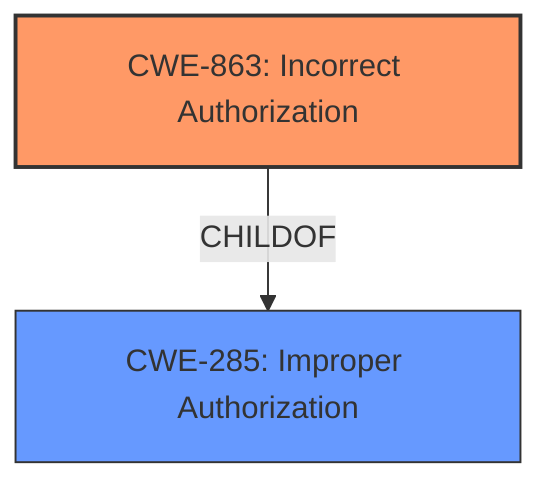

# Raw Analyzer Response for CVE-2022-31025

# Summary
| CWE ID | CWE Name | Confidence | CWE Abstraction Level | CWE Vulnerability Mapping Label | CWE-Vulnerability Mapping Notes |
|---|---|---|---|---|---|
| CWE-863 | Incorrect Authorization | 0.9 | Class | Primary | Allowed-with-Review |
| CWE-285 | Improper Authorization | 0.7 | Class | Secondary | Discouraged |

## Evidence and Confidence

*   **Confidence Score:** 0.9
*   **Evidence Strength:** HIGH

## Relationship Analysis
The primary CWE identified is CWE-863 (Incorrect Authorization), which is a child of CWE-285 (Improper Authorization). This hierarchical relationship indicates that CWE-863 is a more specific case of authorization failure. The vulnerability description describes a scenario where the authorization check (`must_approve_users`) is performed, but incorrectly, which aligns well with CWE-863. The alternative, CWE-285, is broader and less specific, covering cases where authorization is either missing or incorrect. Given the evidence, CWE-863 is the more appropriate choice.

## Vulnerability Chain
The vulnerability chain involves an initial **weakness** in the authorization logic (`must_approve_users` check), leading to the **bypass** of user approval requirements, and ultimately resulting in unauthorized user access.

## Summary of Analysis
The initial analysis focused on identifying the core **weakness** in the vulnerability description, which is the **bypass** of the `must_approve_users` check. The CVE Reference Links Content Summary clearly indicates that the system was not consistently enforcing this setting, particularly for users logging in via SSO with an invite and staff invites.

The Retriever Results suggested CWE-1390 (Weak Authentication) and CWE-79 (Improper Neutralization of Input During Web Page Generation ('Cross-site Scripting')) among others. However, these did not directly address the root cause. The issue isn't fundamentally about weak authentication mechanisms or XSS, but rather an authorization **bypass** due to incorrect checks.

CWE-863 (Incorrect Authorization) and its parent CWE-285 (Improper Authorization) emerged as more suitable candidates. The hierarchical relationship between these CWEs guided the selection towards CWE-863, as it provides a more specific characterization of the vulnerability.

The evidence from the CVE Reference Links Content Summary supports this decision:

-   "The system was not consistently enforcing the `must_approve_users` setting for invited users."
-   "Invites generated by staff users were automatically approved, which also circumvented the `must_approve_users` setting."

These statements directly indicate an incorrect authorization check.

The selection of CWE-863 is based on its optimal level of specificity, representing the precise **weakness** of an incorrect authorization check, as opposed to a broader category like CWE-285.

Relevant CWE Information:

# Enhanced Context (25 CWEs)

## CWE-863: Incorrect Authorization
**Abstraction:** Class
**Status:** Incomplete

### Description
The product performs an authorization check when an actor attempts to access a resource or perform an action, but it does not correctly perform the check.