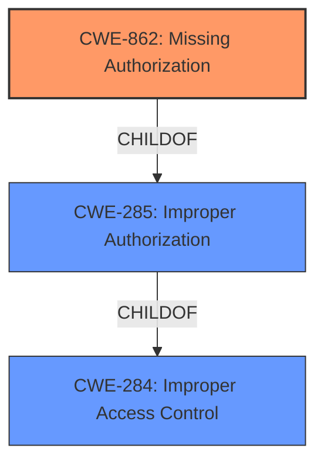

# Enhanced Analysis for CVE-2022-31032

# Summary
| CWE ID  | CWE Name                       | Confidence | CWE Abstraction Level | CWE Vulnerability Mapping Label | CWE-Vulnerability Mapping Notes |
| ------- | ------------------------------ | ---------- | --------------------- | ------------------------------- | ------------------------------- |
| CWE-862 | Missing Authorization          | 0.9        | Class                 | Primary                         | Allowed-with-Review            |
| CWE-285 | Improper Authorization         | 0.7        | Class                 | Secondary                       | Discouraged                    |
| CWE-284 | Improper Access Control        | 0.5        | Pillar                | Secondary                       | Discouraged                    |

## Evidence and Confidence

*   **Confidence Score:** 0.9
*   **Evidence Strength:** HIGH

## Relationship Analysis

The primary relationship influencing the CWE selection is the hierarchical structure. CWE-862 **Missing Authorization** is a child of CWE-285 **Improper Authorization**, which in turn is a child of CWE-284 **Improper Access Control**. While the description indicates that **authorizations are not properly verified**, the more specific CWE-862 is selected as the authorization check is entirely missing, indicating a lack of any authorization mechanism. CWE-285 and CWE-284 are considered, but are higher-level and less descriptive than CWE-862.



## Vulnerability Chain

The vulnerability chain starts with the **missing authorization** check when creating projects or trackers from template projects, leading to unauthorized access to information in those projects.

Root Cause: **Missing Authorization** (CWE-862)
Impact: Unauthorized Access to Information

## Summary of Analysis

The initial assessment focused on the **root cause** "authorizations are not properly verified". The primary CWE selected is CWE-862 **Missing Authorization**. This selection is based on the CVE description, which states that "Authorizations are not properly verified when creating projects or trackers from projects marked as templates." The phrase "**authorizations are not properly verified**" from the Vulnerability Description Key Phrases points to a failure in the authorization process. The CVE Reference Links Content Summary reinforces this by stating, "The permission model was not properly enforced when creating projects or trackers from projects marked as templates." The retriever results also support this, with CWE-862 and CWE-285 being highly ranked.

CWE-285 **Improper Authorization** was considered because the description mentions that authorization is not properly verified. However, CWE-862 **Missing Authorization** is a more precise fit, as the vulnerability involves a complete absence of authorization checks rather than an incorrect implementation. CWE-284 **Improper Access Control** is a higher-level categorization that encompasses authorization and other forms of access control. While applicable, it is less specific than CWE-862.

The final decision to map to CWE-862 is based on the specific evidence from the vulnerability description and the hierarchical relationships between the CWEs. CWE-862 is at the optimal level of specificity, providing a clear and accurate representation of the weakness.

Relevant CWE Information:

# Enhanced Context (25 CWEs)
The following CWEs were identified as potentially relevant to this vulnerability:

## CWE-668: Exposure of Resource to Wrong Sphere
**Abstraction Level**: Class
**Similarity Score**: 0.75
**Source**: dense

**Description**:
The product exposes a resource to the wrong control sphere, providing unintended actors with inappropriate access to the resource.

**Mapping Guidance**:
- Usage: Discouraged
- Rationale: CWE-668 is high-level and is often misused as a catch-all when lower-level CWE IDs might be applicable. It is sometimes used for low-information vulnerability reports [REF-1287]. It is a level-1 Class (i.e., a child of a Pillar). It is not useful for trend analysis.

*Not Selected:* This CWE is too generic and focuses on the impact rather than the root cause.

## CWE-538: Insertion of Sensitive Information into Externally-Accessible File or Directory
**Abstraction Level**: Base
**Similarity Score**: 0.74
**Source**: dense

**Description**:
The product places sensitive information into files or directories that are accessible to actors who are allowed to have access to the files, but not to the sensitive information.

**Mapping Guidance**:
- Usage: Allowed
- Rationale: This CWE entry is at the Base level of abstraction, which is a preferred level of abstraction for mapping to the root causes of vulnerabilities.

*Not Selected:* This CWE is related to sensitive information exposure, but the described vulnerability is about missing authorization.

## CWE-74: Improper Neutralization of Special Elements in Output Used by a Downstream Component ('Injection')
**Abstraction Level**: Class
**Similarity Score**: 0.74
**Source**: dense

**Description**:
The product constructs all or part of a command, data structure, or record using externally-influenced input from an upstream component, but it does not neutralize or incorrectly neutralizes special elements that could modify how it is parsed or interpreted when it is sent to a downstream component.

**Mapping Guidance**:
- Usage: Discouraged
- Rationale: CWE-74 is high-level and often misused when lower-level weaknesses are more appropriate.

*Not Selected:* This CWE is related to injection vulnerabilities, which is not the case here.

## CWE-226: Sensitive Information in Resource Not Removed Before Reuse
**Abstraction Level**: Base
**Similarity Score**: 0.74
**Source**: dense

**Description**:
The product releases a resource such as memory or a file so that it can be made available for reuse, but it does not clear or "zeroize" the information contained in the resource before the product performs a critical state transition or makes the resource available for reuse by other entities.

**Mapping Guidance**:
- Usage: Allowed
- Rationale: This CWE entry is at the Base level of abstraction, which is a preferred level of abstraction for mapping to the root causes of vulnerabilities.

*Not Selected:* This CWE is related to sensitive information not being removed, which is not the case here.

## CWE-212: Improper Removal of Sensitive Information Before Storage or Transfer
**Abstraction Level**: Base
**Similarity Score**: 0.74
**Source**: dense

**Description**:
The product stores, transfers, or shares a resource that contains sensitive information, but it does not properly remove that information before the product makes the resource available to unauthorized actors.

**Mapping Guidance**:
- Usage: Allowed
- Rationale: This CWE entry is at the Base level of abstraction, which is a preferred level of abstraction for mapping to the root causes of vulnerabilities.

*Not Selected:* This CWE is related to sensitive information not being removed, which is not the case here.

## CWE-639: Authorization Bypass Through User-Controlled Key
**Abstraction Level**: Base
**Similarity Score**: 0.74
**Source**: dense

**Description**:
The system's authorization functionality does not prevent one user from gaining access to another user's data or record by modifying the key value identifying the data.

**Mapping Guidance**:
- Usage: Allowed
- Rationale: This CWE entry is at the Base level of abstraction, which is a preferred level of abstraction for mapping to the root causes of vulnerabilities.

*Not Selected:* While this is related to authorization bypass, the vulnerability description doesn't mention user-controlled keys. The issue is a general lack of authorization.

## CWE-404: Improper Resource Shutdown or Release
**Abstraction Level**: Class
**Similarity Score**: 0.73
**Source**: dense

**Description**:
The product does not release or incorrectly releases a resource before it is made available for re-use.

**Mapping Guidance**:
- Usage: Allowed-with-Review
- Rationale: This CWE entry is a Class and might have Base-level children that would be more appropriate

*Not Selected:* This CWE is related to resource management, which is not the case here.

## CWE-41: Improper Resolution of Path Equivalence
**Abstraction Level**: Base
**Similarity Score**: 0.73
**Source**: dense

**Description**:
The product is vulnerable to file system contents disclosure through path equivalence. Path equivalence involves the use of special characters in file and directory names. The associated manipulations are intended to generate multiple names for the same object.

**Mapping Guidance**:
- Usage: Allowed
- Rationale: This CWE entry is at the Base level of abstraction, which is a preferred level of abstraction for mapping to the root causes of vulnerabilities.

*Not Selected:* This CWE is related to path traversal, which is not the case


## CWE Relationship Analysis

Current CWEs represent these abstraction levels: .


### Vulnerability Chain Analysis

**Chain starting from CWE-862:**
- 862 (Missing Authorization) - ROOT


**Chain starting from CWE-212:**
- 212 (Improper Removal of Sensitive Information Before Storage or Transfer) - ROOT


### CWE Relationship Diagram

```mermaid
graph TD
    classDef primary fill:#f96,stroke:#333,stroke-width:2px
    classDef secondary fill:#69f,stroke:#333
    classDef tertiary fill:#9e9,stroke:#333
```