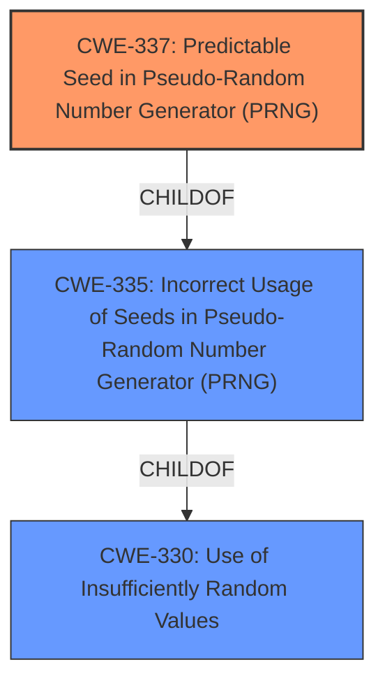

# Analysis Report for CVE-2022-31034

# Vulnerability Analysis Report: CVE-2022-31034

## Description


## Analysis (with Relationship Data)

# Summary
| CWE ID | CWE Name | Confidence | CWE Abstraction Level | CWE Vulnerability Mapping Label | CWE-Vulnerability Mapping Notes |
|---|---|---|---|---|---|
| **CWE-337** | **Predictable Seed in Pseudo-Random Number Generator (PRNG)** | 0.9 | Variant | Primary | Allowed |
| CWE-330 | Use of Insufficiently Random Values | 0.7 | Class | Secondary | Discouraged |
| CWE-335 | Incorrect Usage of Seeds in Pseudo-Random Number Generator (PRNG) | 0.6 | Base | Secondary | Allowed |

## Evidence and Confidence

*   **Confidence Score:** 0.9
*   **Evidence Strength:** HIGH

## Relationship Analysis
The primary CWE is CWE-337 (Variant) because the vulnerability description explicitly mentions a predictable seed. CWE-337 is a child of CWE-335, which in turn is a child of CWE-330. While CWE-330 is more general, CWE-337 provides a more specific description of the **root cause**. CWE-335 is more general than CWE-337 but more specific than CWE-330.



## Vulnerability Chain
The vulnerability chain starts with the **insufficiently random values** due to a **predictable seed** in the PRNG (CWE-337), which leads to potential compromise of the Oauth2/OIDC login flows, ultimately granting an attacker admin access.

## Summary of Analysis
The primary CWE is CWE-337 because the vulnerability description and CVE reference summary point towards a **predictable seed** being the main issue. This is further supported by the retriever results, where CWE-337 has the highest score. The other CWEs, CWE-330 and CWE-335, are related but represent higher levels of abstraction.

The vulnerability description key phrases includes:
- **rootcause:** **insufficiently random values in parameters in Oauth2/OIDC login flows**

The CVE Reference Links Content Summary includes:
- **Insufficient Randomness:** The `state` parameter in Oauth2 login flows (both CLI and UI initiated) and the `code_verifier` parameter in Oauth2+PKCE logins used a weak random number generator, making them predictable.
- **Short Parameter Length:** The generated `state` and `nonce` parameters were also too short.

# Relevant CWE Information:

## CWE-337: Predictable Seed in Pseudo-Random Number Generator (PRNG)
**Abstraction:** Variant

### Description
A Pseudo-Random Number Generator (PRNG) is initialized from a predictable seed, such as the process ID or system time.

**Mapping Guidance:**
- Usage: Allowed
- Rationale: This CWE entry is at the Variant level of abstraction, which is a preferred level of abstraction for mapping to the root causes of vulnerabilities.

This CWE directly addresses the **root cause** described in the vulnerability description, namely the use of a predictable seed in a PRNG.

## CWE-330: Use of Insufficiently Random Values
**Abstraction:** Class

### Description
The product uses insufficiently random numbers or values in a security context that depends on unpredictable numbers.

**Mapping Guidance:**
- Usage: Discouraged
- Rationale: This CWE entry is a level-1 Class (i.e., a child of a Pillar). It might have lower-level children that would be more appropriate

This CWE is a more general categorization of the problem. The description mentions the use of insufficiently random numbers, which aligns with the vulnerability, but it is less specific than CWE-337.

## CWE-335: Incorrect Usage of Seeds in Pseudo-Random Number Generator (PRNG)
**Abstraction:** Base

### Description
The product uses a Pseudo-Random Number Generator (PRNG) but does not correctly manage seeds.

**Mapping Guidance:**
- Usage: Allowed
- Rationale: This CWE entry is at the Base level of abstraction, which is a preferred level of abstraction for mapping to the root causes of vulnerabilities.

CWE-335 is more specific than CWE-330 as it mentions the incorrect usage of seeds. However, CWE-337 is still a better fit because it is at the Variant level and specifically talks about predictable seeds.


## CWE Relationship Analysis

Current CWEs represent these abstraction levels: .


### Vulnerability Chain Analysis

**Chain starting from CWE-337:**
- 337 (Predictable Seed in Pseudo-Random Number Generator (PRNG)) - ROOT


**Chain starting from CWE-335:**
- 335 (Incorrect Usage of Seeds in Pseudo-Random Number Generator (PRNG)) - ROOT


### CWE Relationship Diagram

```mermaid
graph TD
    classDef primary fill:#f96,stroke:#333,stroke-width:2px
    classDef secondary fill:#69f,stroke:#333
    classDef tertiary fill:#9e9,stroke:#333
```


*Report generated on 2025-03-31 04:16:40*
