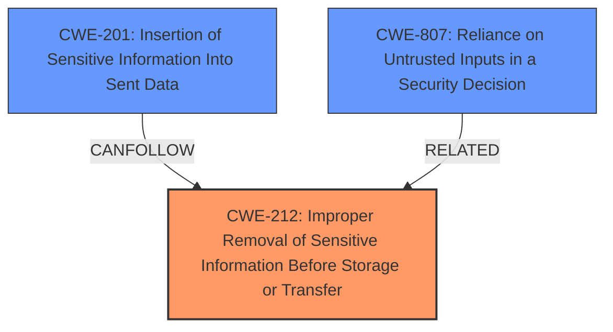

# Enhanced Analysis for CVE-2022-31043

# Summary
| CWE ID    | CWE Name                                                                 | Confidence | CWE Abstraction Level | CWE Vulnerability Mapping Label | CWE-Vulnerability Mapping Notes |
| :-------- | :----------------------------------------------------------------------- | :--------- | :-------------------- | :------------------------------ | :------------------------------ |
| CWE-212   | Improper Removal of Sensitive Information Before Storage or Transfer     | 0.9        | Base                  | Primary                         | Allowed                       |
| CWE-201   | Insertion of Sensitive Information Into Sent Data                        | 0.7        | Base                  | Secondary                       | Allowed                       |
| CWE-807   | Reliance on Untrusted Inputs in a Security Decision                      | 0.6        | Base                  | Secondary                       | Allowed                       |

## Evidence and Confidence

*   **Confidence Score:** 0.8
*   **Evidence Strength:** HIGH

## Relationship Analysis
The primary CWE is CWE-212, which deals with the improper removal of sensitive information. CWE-201 (Insertion of Sensitive Information Into Sent Data) is a related CWE, as sensitive data is being sent when it shouldn't be. CWE-807 (Reliance on Untrusted Inputs in a Security Decision) may be present because the redirect URL could be considered an untrusted input that the application is relying on to make a security decision about forwarding the Authorization header.



## Vulnerability Chain
The vulnerability chain starts with the **improper redirect handling**. This leads to the **failure to remove the Authorization header** when redirecting from HTTPS to HTTP, resulting in **sensitive information (Authorization header) being forwarded** over an insecure HTTP connection.

## Summary of Analysis
The analysis is based on the vulnerability description and the CVE reference. The key point is that the `Authorization` header is being sent over HTTP after a redirect from HTTPS, which is a clear case of **improper handling of sensitive information**.

The provided evidence states: "The vulnerability stems from a failure to remove the `Authorization` header when redirecting from an `https` URI to an `http` URI. The Guzzle library was incorrectly forwarding sensitive `Authorization` headers during HTTP downgrades, which could lead to exposure of credentials."

CWE-212 accurately captures this **failure to remove sensitive information before transfer**.

CWE-201 is considered as the sensitive `Authorization` header is inserted into the sent data.

CWE-807 is considered as the application relies on the redirect URI to determine if the `Authorization` header should be forwarded. If the redirect URI is to HTTP, the header should not be forwarded.

The selected CWEs are at the optimal level of specificity because they directly address the root cause and the immediate consequence of the vulnerability. More general CWEs would not capture the specific nature of the **improper handling of the Authorization header** during redirects.

Relevant CWE Information:

# Enhanced Context (25 CWEs)
The following CWEs were identified as potentially relevant to this vulnerability:

## CWE-212: Improper Removal of Sensitive Information Before Storage or Transfer
**Abstraction Level**: Base
**Similarity Score**: 6793.25
**Source**: sparse

**Description**:
The product stores, transfers, or shares a resource that contains sensitive information, but it does not properly remove that information before the product makes the resource available to unauthorized actors.

**Mapping Guidance**:
- Usage: Allowed
- Rationale: This CWE entry is at the Base level of abstraction, which is a preferred level of abstraction for mapping to the root causes of vulnerabilities.

## CWE-201: Insertion of Sensitive Information Into Sent Data
**Abstraction Level**: base
**Similarity Score**: 5.03
**Source**: graph

**Description**:
CWE-201: Insertion of Sensitive Information Into Sent Data

**Mapping Guidance**:
- Usage: Allowed
- Rationale: This CWE entry is at the Base level of abstraction, which is a preferred level of abstraction for mapping to the root causes of vulnerabilities.

## CWE-807: Reliance on Untrusted Inputs in a Security Decision
**Abstraction Level**: Base
**Similarity Score**: 0.76
**Source**: dense

**Description**:
The product uses a protection mechanism that relies on the existence or values of an input, but the input can be modified by an untrusted actor in a way that bypasses the protection mechanism.

**Mapping Guidance**:
- Usage: Allowed
- Rationale: This CWE entry is at the Base level of abstraction, which is a preferred level of abstraction for mapping to the root causes of vulnerabilities.


## CWE Relationship Analysis

Current CWEs represent these abstraction levels: .


### Vulnerability Chain Analysis

**Chain starting from CWE-201:**
- 201 (Insertion of Sensitive Information Into Sent Data) - ROOT


**Chain starting from CWE-212:**
- 212 (Improper Removal of Sensitive Information Before Storage or Transfer) - ROOT


### CWE Relationship Diagram

```mermaid
graph TD
    classDef primary fill:#f96,stroke:#333,stroke-width:2px
    classDef secondary fill:#69f,stroke:#333
    classDef tertiary fill:#9e9,stroke:#333
```