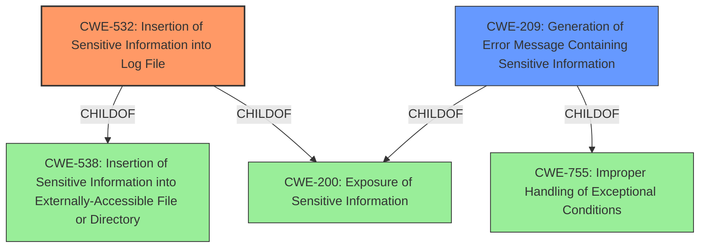

# Raw Analyzer Response for CVE-2022-31047

# Summary
| CWE ID | CWE Name | Confidence | CWE Abstraction Level | CWE Vulnerability Mapping Label | CWE-Vulnerability Mapping Notes |
|---|---|---|---|---|---|
| CWE-532 | Insertion of Sensitive Information into Log File | 1 | Base | Primary | Allowed |
| CWE-209 | Generation of Error Message Containing Sensitive Information | 0.75 | Base | Secondary | Allowed |

## Evidence and Confidence

*   **Confidence Score:** 0.85
*   **Evidence Strength:** HIGH

## Relationship Analysis
The primary relationship influencing the choice of CWE-532 is its direct relevance to the vulnerability description, specifically the **insertion of sensitive information into log files**. While CWE-209 (Generation of Error Message Containing Sensitive Information) is related, CWE-532 is a more precise fit. CWE-532 is a child of CWE-538 (Insertion of Sensitive Information into Externally-Accessible File or Directory) and CWE-200 (Exposure of Sensitive Information). CWE-209 is a child of CWE-200 and CWE-755 (Improper Handling of Exceptional Conditions). The choice of Base level CWEs is appropriate as it is the lowest level of abstraction that still accurately represents the weakness.

## Vulnerability Chain
The vulnerability chain begins with the **improper handling of exceptions**, leading to the logging of sensitive data:
  1. **Improper Exception Handling:** The application **fails to prevent** the logging of complete exception stack traces.
  2. **Sensitive Information Logging (CWE-532):** System credentials/keys are **inadvertently written** to log files.
  3. **Potential Information Disclosure:** An attacker gains access to the log files.

## Summary of Analysis
The initial analysis and final conclusion strongly align due to the clear evidence of sensitive information being written to log files. The "CVE Reference Links Content Summary" explicitly mentions "The vulnerability stems from the logging of complete exception stack traces by TYPO3's exception handlers. This process inadvertently included sensitive information like system-internal credentials or keys (e.g., database credentials) in plaintext within log files." and "CWE-532: This CWE (Insertion of Sensitive Information into Log File) is specifically cited."

The graph relationships reinforce the selection of CWE-532 as the primary weakness because it directly captures the core issue of sensitive information being logged. While CWE-209 is related, it's more general and less specific to the act of logging the sensitive data.

The selection of CWE-532 is at the optimal level of specificity because it is a Base-level CWE that accurately describes the vulnerability's root cause.
CWE-532 directly addresses the **insertion of sensitive information into log files**, which aligns perfectly with the vulnerability description, where system credentials are logged as plaintext in exception handlers.
CWE-209 is a secondary candidate because the **generation of an error message** is part of the process, but the core issue is the logging of sensitive data, not just the generation of the error message itself.

Relevant CWE Information:

# Enhanced Context (25 CWEs)

## CWE-538: Insertion of Sensitive Information into Externally-Accessible File or Directory
**Abstraction Level**: Base
**Similarity Score**: 0.78
**Source**: dense

**Description**:
The product places sensitive information into files or directories that are accessible to actors who are allowed to have access to the files, but not to the sensitive information.

**Mapping Guidance**:
- Usage: Allowed
- Rationale: This CWE entry is at the Base level of abstraction, which is a preferred level of abstraction for mapping to the root causes of vulnerabilities.

**Why Not Used**: This is a parent of CWE-532, but less specific. The description doesn't highlight the externally accessible portion.

## CWE-312: Cleartext Storage of Sensitive Information
**Abstraction Level**: Base
**Similarity Score**: 0.77
**Source**: dense

**Description**:
The product stores sensitive information in cleartext within a resource that might be accessible to another control sphere.

**Mapping Guidance**:
- Usage: Allowed
- Rationale: This CWE entry is at the Base level of abstraction, which is a preferred level of abstraction for mapping to the root causes of vulnerabilities.

**Why Not Used**: This CWE is close, however, storage isn't the root cause or the primary issue. The information is logged, so it is transient in nature.

## CWE-319: Cleartext Transmission of Sensitive Information
**Abstraction Level**: Base
**Similarity Score**: 0.76
**Source**: dense

**Description**:
The product transmits sensitive or security-critical data in cleartext in a communication channel that can be sniffed by unauthorized actors.

**Mapping Guidance**:
- Usage: Allowed
- Rationale: This CWE entry is at the Base level of abstraction, which is a preferred level of abstraction for mapping to the root causes of vulnerabilities.

**Why Not Used**: Transmission of data is not the weakness.

## CWE-212: Improper Removal of Sensitive Information Before Storage or Transfer
**Abstraction Level**: Base
**Similarity Score**: 0.76
**Source**: dense

**Description**:
The product stores, transfers, or shares a resource that contains sensitive information, but it does not properly remove that information before the product makes the resource available to unauthorized actors.

**Mapping Guidance**:
- Usage: Allowed
- Rationale: This CWE entry is at the Base level of abstraction, which is a preferred level of abstraction for mapping to the root causes of vulnerabilities.

**Why Not Used**: Removal of sensitive information is not the cause of the vulnerability, it is the logging of the sensitive information.

## CWE-1391: Use of Weak Credentials
**Abstraction Level**: Class
**Similarity Score**: 0.76
**Source**: dense

**Description**:
The product uses weak credentials (such as a default key or hard-coded password) that can be calculated, derived, reused, or guessed by an attacker.

**Mapping Guidance**:
- Usage: Allowed-with-Review
- Rationale: This CWE entry is a Class and might have Base-level children that would be more appropriate

**Why Not Used**: The credentials themselves are not weak, the problem is that the strong credentials are being logged.

## CWE-1390: Weak Authentication
**Abstraction Level**: Class
**Similarity Score**: 0.76
**Source**: dense

**Description**:
The product uses an authentication mechanism to restrict access to specific users or identities, but the mechanism does not sufficiently prove that the claimed identity is correct.

**Mapping Guidance**:
- Usage: Allowed-with-Review
- Rationale: This CWE entry is a Class and might have Base-level children that would be more appropriate

**Why Not Used**: Authentication is not the weakness, it is logging of credentials.

## CWE-303: Incorrect Implementation of Authentication Algorithm
**Abstraction Level**: Base
**Similarity Score**: 0.76
**Source**: dense

**Description**:
The requirements for the product dictate the use of an established authentication algorithm, but the implementation of the algorithm is incorrect.

**Mapping Guidance**:
- Usage: Allowed
- Rationale: This CWE entry is at the Base level of abstraction, which is a preferred level of abstraction for mapping to the root causes of vulnerabilities.

**Why Not Used**: Authentication is not the weakness.

## CWE-639: Authorization Bypass Through User-Controlled Key
**Abstraction Level**: Base
**Similarity Score**: 0.76
**Source**: dense

**Description**:
The system's authorization functionality does not prevent one user from gaining access to another user's data or record by modifying the key value identifying the data.

**Mapping Guidance**:
- Usage: Allowed
- Rationale: This CWE entry is at the Base level of abstraction, which is a preferred level of abstraction for mapping to the root causes of vulnerabilities.

**Why Not Used**: Authorization is not the weakness.

## CWE-209: Generation of Error Message Containing Sensitive Information
**Abstraction Level**: Base
**Similarity Score**: 0.76