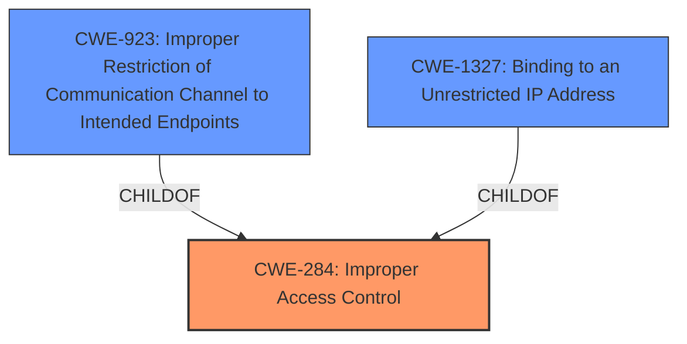

# Raw Analyzer Response for CVE-2022-31055

# Summary
| CWE ID | CWE Name | Confidence | CWE Abstraction Level | CWE Vulnerability Mapping Label | CWE-Vulnerability Mapping Notes |
|---|---|---|---|---|---|
| CWE-284 | Improper Access Control | 0.9 | Class | Primary | Allowed |
| CWE-923 | Improper Restriction of Communication Channel to Intended Endpoints | 0.7 | Class | Secondary | Allowed-with-Review |
| CWE-1327 | Binding to an Unrestricted IP Address | 0.6 | Base | Secondary | Allowed |

## Evidence and Confidence

*   **Confidence Score:** 0.8
*   **Evidence Strength:** HIGH

## Relationship Analysis
The primary CWE is CWE-284, **Improper Access Control**, which is a high-level class. CWE-923, **Improper Restriction of Communication Channel to Intended Endpoints**, is a child of CWE-284 and represents a more specific form of access control vulnerability related to communication channels. CWE-1327, **Binding to an Unrestricted IP Address**, is a base-level CWE that could be a potential cause. The selection of CWE-284 reflects the overall access control failure, while CWE-923 captures the specific weakness in restricting communication endpoints. CWE-1327 represents a more specific cause of the vulnerability.

## Vulnerability Chain
The vulnerability chain starts with the **broken set-src-ip-ranges** functionality, leading to **improper access control** where traffic from any IP was allowed.

## Summary of Analysis
The initial analysis identified the **broken set-src-ip-ranges** as the root cause, which directly resulted in **improper access control**. The CVE Reference Links Content Summary explicitly mentions **Improper Access Control (CWE-284)** as a weakness. This is further supported by the impact of allowing traffic from any IP. The primary selection of CWE-284 is based on the evidence and the CWE description aligning with the vulnerability's core issue. CWE-923 is considered as a secondary mapping due to the communication channel aspect, but the core problem is the general **improper access control**. CWE-1327 is also considered as a secondary mapping because the unrestricted IP address could be a cause.

Relevant CWE Information:

*   **CWE-284 Improper Access Control:** The vulnerability description clearly states that the "kctf cluster set-src-ip-ranges was broken and allowed traffic from any IP". The CVE Reference Links Content Summary also mentions **Improper Access Control (CWE-284)**. This aligns directly with the CWE-284 description, indicating a failure to properly restrict access.

*   **CWE-923 Improper Restriction of Communication Channel to Intended Endpoints:** The vulnerability involves a failure to restrict the communication channel to intended endpoints, as the cluster allowed traffic from any IP address. The retriever results identify CWE-923 as the top combined result.

*   **CWE-1327 Binding to an Unrestricted IP Address:** The product assigns the address 0.0.0.0 for a database server, a cloud service/instance, or any computing resource that communicates remotely.

The final selection emphasizes the **improper access control** at the network level, making CWE-284 the primary CWE. CWE-923 is a secondary CWE that specifies the communication channel aspect, and CWE-1327 specifies the unrestricted IP address aspect.