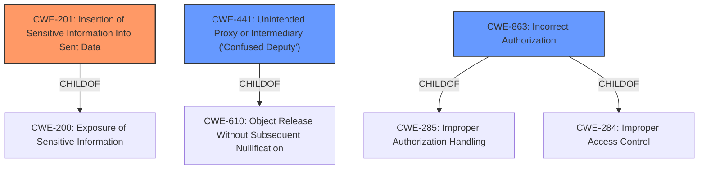

# Enhanced Analysis for CVE-2022-31069

# Summary
| CWE ID | CWE Name | Confidence | CWE Abstraction Level | CWE Vulnerability Mapping Label | CWE-Vulnerability Mapping Notes |
|---|---|---|---|---|---|
| CWE-201 | Insertion of Sensitive Information Into Sent Data | 0.9 | Base | Allowed | Primary CWE |
| CWE-441 | Unintended Proxy or Intermediary ('Confused Deputy') | 0.7 | Class | Allowed-with-Review | Secondary Candidate |
| CWE-863 | Incorrect Authorization | 0.6 | Class | Allowed-with-Review | Secondary Candidate |

## Evidence and Confidence

*   **Confidence Score:** 0.8
*   **Evidence Strength:** HIGH

## Relationship Analysis
The primary CWE, CWE-201, is related to the exposure of sensitive information. CWE-441 is a Class-level weakness describing an unintended proxy or intermediary, which relates to the architecture of the vulnerable system. CWE-863 describes a failure to correctly perform authorization checks.



## Vulnerability Chain
The vulnerability chain begins with the **lack of control** over the forwarding of Authorization headers. This **results** in the **insertion of sensitive information** into proxied requests, potentially leading to **unauthorized access**.
  - **Root Cause:** **Lack of control** over header forwarding.
  - **Weakness:** CWE-201 Insertion of Sensitive Information Into Sent Data.
  - **Impact:** Potential unauthorized access.

## Summary of Analysis
The initial analysis focused on identifying the root cause and resulting weakness. The vulnerability lies in the nestjs-proxy library's **inability to prevent the forwarding of sensitive Authorization headers** to backend services that should not receive them. This directly leads to the **potential exposure of sensitive information**, making CWE-201 (Insertion of Sensitive Information Into Sent Data) the most appropriate primary CWE.

The description states: "This could have resulted in **sensitive information such as OAuth bearer access tokens being inadvertently exposed** to such services that should not see them."

The analysis considered other CWEs such as CWE-441 (Unintended Proxy or Intermediary) and CWE-863 (Incorrect Authorization), but these were determined to be secondary. CWE-441 describes a situation where a product unintentionally acts as a proxy, but the primary issue here is the exposure of sensitive data, not the proxying itself. CWE-863 involves incorrect authorization checks, but the core problem is the uncontrolled forwarding of sensitive information, which can then lead to authorization bypasses.

The final decision to prioritize CWE-201 is based on its direct relevance to the vulnerability's core mechanism: the **insertion of sensitive information** into sent data due to the **lack of control over header forwarding**. The selected CWE is at the optimal level of specificity (Base) as it accurately captures the nature of the weakness.

Relevant CWE Information:

# Enhanced Context (25 CWEs)

## CWE-1391: Use of Weak Credentials
**Abstraction Level**: Class
**Similarity Score**: 0.77
**Source**: dense

**Description**:
The product uses weak credentials (such as a default key or hard-coded password) that can be calculated, derived, reused, or guessed by an attacker.

**Mapping Guidance**:
- Usage: Allowed-with-Review
- Rationale: This CWE entry is a Class and might have Base-level children that would be more appropriate

*Not Selected*: This CWE does not apply because the vulnerability does not involve the use of weak credentials.

## CWE-303: Incorrect Implementation of Authentication Algorithm
**Abstraction Level**: Base
**Similarity Score**: 0.77
**Source**: dense

**Description**:
The requirements for the product dictate the use of an established authentication algorithm, but the implementation of the algorithm is incorrect.

**Mapping Guidance**:
- Usage: Allowed
- Rationale: This CWE entry is at the Base level of abstraction, which is a preferred level of abstraction for mapping to the root causes of vulnerabilities.

*Not Selected*: This CWE does not apply because the vulnerability does not involve an incorrect implementation of an authentication algorithm.

## CWE-1390: Weak Authentication
**Abstraction Level**: Class
**Similarity Score**: 0.76
**Source**: dense

**Description**:
The product uses an authentication mechanism to restrict access to specific users or identities, but the mechanism does not sufficiently prove that the claimed identity is correct.

**Mapping Guidance**:
- Usage: Allowed-with-Review
- Rationale: This CWE entry is a Class and might have Base-level children that would be more appropriate

*Not Selected*: This CWE is not the primary issue, although the exposure of the Authorization header *could* lead to weak authentication downstream. The core problem is the information exposure.

## CWE-1240: Use of a Cryptographic Primitive with a Risky Implementation
**Abstraction Level**: Base
**Similarity Score**: 0.76
**Source**: dense

**Description**:
To fulfill the need for a cryptographic primitive, the product implements a cryptographic algorithm using a non-standard, unproven, or disallowed/non-compliant cryptographic implementation.

**Mapping Guidance**:
- Usage: Allowed
- Rationale: This CWE entry is at the Base level of abstraction, which is a preferred level of abstraction for mapping to the root causes of vulnerabilities.

*Not Selected*: This CWE does not apply because the vulnerability does not involve the use of a cryptographic primitive with a risky implementation.

## CWE-807: Reliance on Untrusted Inputs in a Security Decision
**Abstraction Level**: Base
**Similarity Score**: 0.76
**Source**: dense

**Description**:
The product uses a protection mechanism that relies on the existence or values of an input, but the input can be modified by an untrusted actor in a way that bypasses the protection mechanism.

**Mapping Guidance**:
- Usage: Allowed
- Rationale: This CWE entry is at the Base level of abstraction, which is a preferred level of abstraction for mapping to the root causes of vulnerabilities.

*Not Selected*: This CWE does not apply because the vulnerability is not directly related to relying on untrusted inputs in a security decision.

## CWE-639: Authorization Bypass Through User-Controlled Key
**Abstraction Level**: Base
**Similarity Score**: 0.76
**Source**: dense

**Description**:
The system's authorization functionality does not prevent one user from gaining access to another user's data or record by modifying the key value identifying the data.

**Mapping Guidance**:
- Usage: Allowed
- Rationale: This CWE entry is at the Base level of abstraction, which is a preferred level of abstraction for mapping to the root causes of vulnerabilities.

*Not Selected*: While the exposure of the Authorization header *could* lead to an authorization bypass, the core issue is the unintentional forwarding of the header itself.

## CWE-319: Cleartext Transmission of Sensitive Information
**Abstraction Level**: Base
**Similarity Score**: 0.76
**Source**: dense

**Description**:
The product transmits sensitive or security-critical data in cleartext in a communication channel that can be sniffed by unauthorized actors.

**Mapping Guidance**:
- Usage: Allowed
- Rationale: This CWE entry is at the Base level of abstraction, which is a preferred level of abstraction for mapping to the root causes of vulnerabilities.

*Not Selected*: This CWE does not apply because the vulnerability is not directly related to cleartext transmission of sensitive information, but rather the forwarding of a header to an unintended recipient.

## CWE-288: Authentication Bypass Using an Alternate Path or Channel
**Abstraction Level**: Base
**Similarity Score**: 0.75
**Source**: dense

**Description**:
The product requires authentication, but the product has an alternate path or channel that does not require authentication.

**Mapping Guidance**:
- Usage: Allowed
- Rationale: This CWE entry is at the Base level of abstraction, which is a preferred level of abstraction for mapping to the root causes of vulnerabilities.

*Not Selected*: This CWE does not apply because the vulnerability is not directly related to authentication bypass using an


## CWE Relationship Analysis

Current CWEs represent these abstraction levels: .


### Vulnerability Chain Analysis

**Chain starting from CWE-201:**
- 201 (Insertion of Sensitive Information Into Sent Data) - ROOT


**Chain starting from CWE-200:**
- 200 (Exposure of Sensitive Information to an Unauthorized Actor) - ROOT


### CWE Relationship Diagram

```mermaid
graph TD
    classDef primary fill:#f96,stroke:#333,stroke-width:2px
    classDef secondary fill:#69f,stroke:#333
    classDef tertiary fill:#9e9,stroke:#333
```