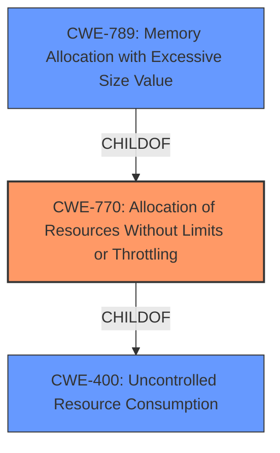

# Analysis for CVE-2022-31078

# Summary
| CWE ID | CWE Name | Confidence | CWE Abstraction Level | CWE Vulnerability Mapping Label | CWE-Vulnerability Mapping Notes |
|---|---|---|---|---|---|
| CWE-770 | Allocation of Resources Without Limits or Throttling | 1.0 | Base | Allowed | Primary CWE |
| CWE-789 | Memory Allocation with Excessive Size Value | 0.9 | Variant | Allowed | Secondary Candidate |
| CWE-400 | Uncontrolled Resource Consumption | 0.7 | Class | Discouraged | Secondary Candidate |

## Evidence and Confidence

*   **Confidence Score:** 0.9
*   **Evidence Strength:** HIGH

## Relationship Analysis
The primary CWE is CWE-770, which is a child of CWE-400. CWE-789 is a child of CWE-770. This shows a hierarchical relationship where CWE-400 is a more general case of uncontrolled resource consumption, while CWE-770 is more specific about allocating resources without limits. CWE-789 is even more specific, focusing on memory allocation with excessive size. The analysis favors CWE-770 as the most accurate base-level representation of the vulnerability.

## Vulnerability Chain
The vulnerability chain starts with the **lack of a size limit on responses** (CWE-770), which leads to **memory exhaustion** and ultimately a **denial of service**.

## Summary of Analysis
The initial analysis identified that the CloudCore Router in KubeEdge does not limit the size of HTTP responses, which can lead to memory exhaustion and DoS. The **root cause** is the **lack of a size limit on responses**, which directly relates to allocating resources (memory) without limits or throttling.

The evidence from the "CVE Reference Links Content Summary" supports this: "The CloudCore Router in KubeEdge does not limit the size of HTTP responses it handles... The handler's response, which lacks any size limitations, is read into memory... The primary weakness is the absence of a limit on the size of HTTP responses processed by the CloudCore Router... The unbounded reading of the response into memory can lead to memory exhaustion."

CWE-770 (Allocation of Resources Without Limits or Throttling) is selected as the primary CWE because it directly addresses the **root cause**: the CloudCore Router allocates memory for HTTP responses without imposing any size limits. This aligns perfectly with the CWE description: "The product allocates a reusable resource or group of resources on behalf of an actor without imposing any restrictions on the size or number of resources that can be allocated, in violation of the intended security policy for that actor."

CWE-789 (Memory Allocation with Excessive Size Value) is considered as a secondary CWE because it specifies that "The product allocates memory based on an untrusted, large size value, but it does not ensure that the size is within expected limits, allowing arbitrary amounts of memory to be allocated." While accurate, CWE-770 is broader and captures the **root cause** more precisely.

CWE-400 (Uncontrolled Resource Consumption) is also considered, but it is a class-level CWE and is discouraged when more specific CWEs are available. While the vulnerability does lead to uncontrolled resource consumption, CWE-770 and CWE-789 provide a more precise understanding of the **root cause**.

The selection of CWE-770 is at the optimal level of specificity because it directly describes the **lack of limits on resource allocation**, which is the **root cause** of the vulnerability.