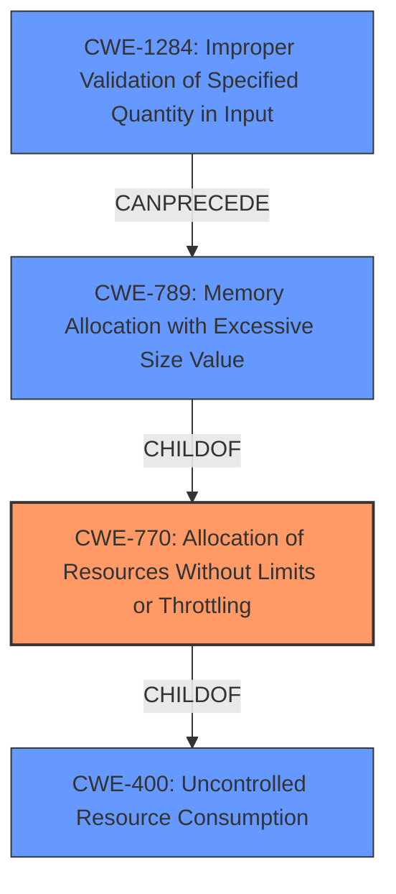

# Raw Analyzer Response for CVE-2022-31079

# Summary
| CWE ID  | CWE Name                                                   | Confidence | CWE Abstraction Level | CWE Vulnerability Mapping Label | CWE-Vulnerability Mapping Notes |
| ------- | ---------------------------------------------------------- | ---------- | --------------------- | ------------------------------- | ------------------------------- |
| CWE-770 | Allocation of Resources Without Limits or Throttling       | 0.9        | Base                  | Primary                         | Allowed                       |
| CWE-789 | Memory Allocation with Excessive Size Value               | 0.8        | Variant               | Secondary                       | Allowed                       |
| CWE-400 | Uncontrolled Resource Consumption                          | 0.6        | Class                 | Secondary                       | Discouraged                    |
| CWE-1284| Improper Validation of Specified Quantity in Input        | 0.7        | Base                  | Secondary                       | Allowed                       |

## Evidence and Confidence

*   **Confidence Score:** 0.8
*   **Evidence Strength:** HIGH

## Relationship Analysis
The primary weakness is CWE-770, Allocation of Resources Without Limits or Throttling, which is a Base level CWE. CWE-789, Memory Allocation with Excessive Size Value, is a Variant of CWE-770. CWE-400, Uncontrolled Resource Consumption is a Class level CWE and parent of CWE-770. CWE-1284, Improper Validation of Specified Quantity in Input, can precede CWE-789. Choosing CWE-770 provides a more specific classification than CWE-400 and captures the essence of allocating resources without limits. The relationships between these CWEs highlight a progression from a general resource consumption issue to a specific case of memory allocation without limits, further leading to excessive memory allocation.

## Vulnerability Chain
The vulnerability chain starts with **improper input validation (missing size limit)**, leading to **uncontrolled memory allocation**, which finally results in **denial of service (DoS)** due to memory exhaustion.

## Summary of Analysis
The initial assessment indicates a vulnerability due to the lack of input validation on message size, leading to uncontrolled memory allocation and a denial-of-service condition. The analysis is based on the provided vulnerability description and CVE reference links, which state that the Cloud Stream server and Edge Stream server **read the entire message into memory without imposing a limit on the size of this message**. This **weakness** allows an attacker to send a large message to exhaust memory.

The graph relationships reinforced the decision to prioritize CWE-770 because it directly addresses the **allocation of resources without limits**. CWE-789 is a variant that describes the allocation of memory with an excessive size, further describing the specific vulnerability.

The selected CWEs are at the optimal level of specificity because they precisely capture the root cause and mechanism of the vulnerability. CWE-770 identifies the lack of resource limits, while CWE-789 specifies that the resource is memory and the allocation size is excessive. CWE-1284 highlights the lack of input validation, which allows an attacker to specify the excessive size.

Relevant CWE Information:

# Enhanced Context (25 CWEs)
The following CWEs were identified as potentially relevant to this vulnerability:

## CWE-226: Sensitive Information in Resource Not Removed Before Reuse
**Abstraction Level**: Base
**Similarity Score**: 0.79
**Source**: dense

**Description**:
The product releases a resource such as memory or a file so that it can be made available for reuse, but it does not clear or "zeroize" the information contained in the resource before the product performs a critical state transition or makes the resource available for reuse by other entities.

**Mapping Guidance**:
- Usage: Allowed
- Rationale: This CWE entry is at the Base level of abstraction, which is a preferred level of abstraction for mapping to the root causes of vulnerabilities.

*Not selected because* this CWE doesn't apply to the vulnerability description provided.

## CWE-404: Improper Resource Shutdown or Release
**Abstraction Level**: Class
**Similarity Score**: 0.78
**Source**: dense

**Description**:
The product does not release or incorrectly releases a resource before it is made available for re-use.

**Mapping Guidance**:
- Usage: Allowed-with-Review
- Rationale: This CWE entry is a Class and might have Base-level children that would be more appropriate

*Not selected because* the vulnerability is about the lack of limits of resource allocation, not the improper shutdown.

## CWE-789: Memory Allocation with Excessive Size Value
**Abstraction Level**: Variant
**Similarity Score**: 0.78
**Source**: dense

**Description**:
The product allocates memory based on an untrusted, large size value, but it does not ensure that the size is within expected limits, allowing arbitrary amounts of memory to be allocated.

**Mapping Guidance**:
- Usage: Allowed
- Rationale: This CWE entry is at the Variant level of abstraction, which is a preferred level of abstraction for mapping to the root causes of vulnerabilities.

*Selected because* this is a more specific variant of CWE-770 and accurately describes the vulnerability.

## CWE-1325: Improperly Controlled Sequential Memory Allocation
**Abstraction Level**: Base
**Similarity Score**: 0.77
**Source**: dense

**Description**:
The product manages a group of objects or resources and performs a separate memory allocation for each object, but it does not properly limit the total amount of memory that is consumed by all of the combined objects.

**Mapping Guidance**:
- Usage: Allowed
- Rationale: This CWE entry is at the Base level of abstraction, which is a preferred level of abstraction for mapping to the root causes of vulnerabilities.

*Not selected because* the vulnerability is not related to sequential memory allocation, but a single large allocation.

## CWE-664: Improper Control of a Resource Through its Lifetime
**Abstraction Level**: Pillar
**Similarity Score**: 0.76
**Source**: dense

**Description**:
The product does not maintain or incorrectly maintains control over a resource throughout its lifetime of creation, use, and release.

**Mapping Guidance**:
- Usage: Discouraged
- Rationale: This CWE entry is high-level when lower-level children are available.

*Not selected because* this is a high-level CWE and more specific CWEs are available.

## CWE-772: Missing Release of Resource after Effective Lifetime
**Abstraction Level**: Base
**Similarity Score**: 0.76
**Source**: dense

**Description**:
The product does not release a resource after its effective lifetime has ended, i.e., after the resource is no longer needed.

**Mapping Guidance**:
- Usage: Allowed
- Rationale: This CWE entry is at the Base level of abstraction, which is a preferred level of abstraction for mapping to the root causes of vulnerabilities.

*Not selected because* the vulnerability is about allocating without limits and not about releasing resources.

## CWE-667: Improper Locking
**Abstraction Level**: Class
**Similarity Score**: 0.75
**Source**: dense

**Description**:
The product does not properly acquire or release a lock on a resource, leading to unexpected resource state changes and behaviors.

**Mapping Guidance**:
- Usage: Allowed-with-Review
- Rationale: This CWE entry is a Class and might have Base-level children that would be more appropriate

*Not selected because* the vulnerability is not related to locking mechanisms.

## CWE-405: Asymmetric Resource Consumption (Amplification)
**Abstraction Level**: Class
**Similarity Score**: 0.75
**Source**: dense

**Description**:
The product does not properly control situations in which an adversary can cause the product to consume or produce excessive resources without requiring the adversary to invest equivalent work or otherwise prove authorization, i.e., the adversary's influence is "asymmetric."

**Mapping Guidance**:
- Usage: Allowed-with-Review
- Rationale: This CWE entry is a Class and might have Base-level children that would be more appropriate

*Not selected because* although this is resource consumption, the root cause is the lack of limits on the resource being allocated.

## CWE-909: Missing Initialization of Resource
**Abstraction Level**: Class
**Similarity Score**: 0.75
**Source**: dense

**Description**:
The product does not initialize a critical resource.

**Mapping Guidance**:
- Usage: Allowed-