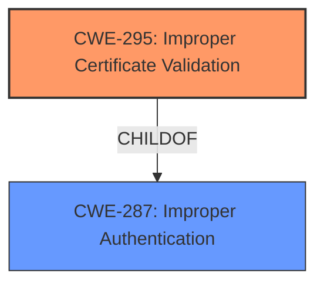

# Raw Analyzer Response for CVE-2022-31083

# Summary
| CWE ID | CWE Name | Confidence | CWE Abstraction Level | CWE Vulnerability Mapping Label | CWE-Vulnerability Mapping Notes |
|---|---|---|---|---|---|
| CWE-295 | Improper Certificate Validation | 1.0 | Base | Allowed | Primary CWE |

## Evidence and Confidence

*   **Confidence Score:** 1.0
*   **Evidence Strength:** HIGH

## Relationship Analysis
The primary relationship considered was the ChildOf relationship between CWE-295 (Improper Certificate Validation) and its parent CWE-287 (Improper Authentication). While the vulnerability does result in an authentication bypass, the **root cause** is the **improper validation of the certificate**, making CWE-295 the more specific and appropriate choice.

## Vulnerability Chain
The chain of events for this vulnerability is as follows:
1.  **Root Cause:** **CWE-295: Improper Certificate Validation** - The Parse Server Apple Game Center auth adapter does not properly validate the certificate.
2.  **Impact:** Authentication Bypass - Due to the lack of proper certificate validation, an attacker can bypass the authentication mechanism.

## Summary of Analysis
The analysis is based on the provided vulnerability description and supporting evidence. The key factor in determining the appropriate CWE is the **root cause** of the vulnerability which is the **improper certificate validation**. The "CVE Reference Links Content Summary" section clearly states that the Apple Game Center authentication adapter in `parse-server` did not properly validate the certificate, specifically failing to verify the root certificate issuer.

> **Root cause:**
> The Apple Game Center authentication adapter in `parse-server` did not properly validate the certificate used for authentication. Specifically, it did not verify the root certificate issuer, which could be spoofed.

The retriever results also support this conclusion, with CWE-295 (Improper Certificate Validation) being the top-ranked CWE.

The choice of CWE-295 is at the optimal level of specificity. It is a Base CWE, which is preferred for mapping to the root causes of vulnerabilities according to MITRE's mapping guidance. While CWE-287 (Improper Authentication) is also relevant due to the authentication bypass, it is a Class CWE and represents a higher level of abstraction. The more specific CWE-295 directly addresses the **certificate validation issue**, making it the more accurate and preferred mapping.

Relevant CWE Information:

# Enhanced Context (25 CWEs)
The following CWEs were identified as potentially relevant to this vulnerability:

## CWE-295: Improper Certificate Validation
**Abstraction Level**: Base
**Similarity Score**: 0.76
**Source**: dense

**Description**:
The product does not validate, or incorrectly validates, a certificate.

**Mapping Guidance**:
- Usage: Allowed
- Rationale: This CWE entry is at the Base level of abstraction, which is a preferred level of abstraction for mapping to the root causes of vulnerabilities.

## CWE-1390: Weak Authentication
**Abstraction Level**: Class
**Similarity Score**: 0.76
**Source**: dense

**Description**:
The product uses an authentication mechanism to restrict access to specific users or identities, but the mechanism does not sufficiently prove that the claimed identity is correct.

**Mapping Guidance**:
- Usage: Allowed-with-Review
- Rationale: This CWE entry is a Class and might have Base-level children that would be more appropriate

## CWE-347: Improper Verification of Cryptographic Signature
**Abstraction Level**: Base
**Similarity Score**: 0.75
**Source**: dense

**Description**:
The product does not verify, or incorrectly verifies, the cryptographic signature for data.

**Mapping Guidance**:
- Usage: Discouraged
- Rationale: This CWE entry is a level-1 Class (i.e., a child of a Pillar). It might have lower-level children that would be more appropriate

I considered CWE-1390 (Weak Authentication), CWE-347 (Improper Verification of Cryptographic Signature), CWE-306 (Missing Authentication for Critical Function), and CWE-639 (Authorization Bypass Through User-Controlled Key), but they are less precise than CWE-295. The vulnerability is fundamentally about **incorrect certificate handling** rather than a general weakness in authentication or authorization.