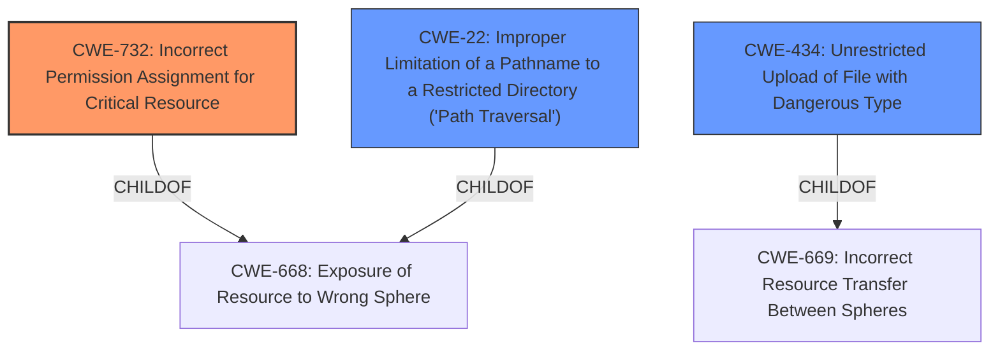

# Analysis Report for CVE-2022-31087

# Vulnerability Analysis Report: CVE-2022-31087

## Description


## Analysis (with Relationship Data)

# Summary
| CWE ID | CWE Name | Confidence | CWE Abstraction Level | CWE Vulnerability Mapping Label | CWE-Vulnerability Mapping Notes |
|---|---|---|---|---|---|
| CWE-732 | Incorrect Permission Assignment for Critical Resource | 0.8 | Class | Primary | Allowed-with-Review |
| CWE-434 | Unrestricted Upload of File with Dangerous Type | 0.7 | Base | Secondary | Allowed |
| CWE-22 | Improper Limitation of a Pathname to a Restricted Directory ('Path Traversal') | 0.6 | Base | Secondary | Allowed |

## Evidence and Confidence

*   **Confidence Score:** 0.8
*   **Evidence Strength:** HIGH

## Relationship Analysis
The primary CWE is CWE-732, representing the **incorrect permission assignment** for the `/tmp` directory which allowed unintended access and execution. CWE-434 is a secondary CWE because the vulnerability allows the **unrestricted upload of a file with dangerous type** (PHP). CWE-22 is a secondary CWE because the **improper limitation of a pathname to a restricted directory** allowed an attacker to potentially traverse the file system.



## Vulnerability Chain
The chain of events is:
1.  **Incorrect permission assignment (CWE-732)** to the `/tmp` directory.
2.  This allows **unrestricted upload of file with dangerous type (CWE-434)**.
3.  Potentially leads to **improper limitation of a pathname to a restricted directory ('Path Traversal') (CWE-22)** if combined with path manipulation.
4.  Ultimately resulting in remote code execution.

## Summary of Analysis
The analysis is based on the provided evidence. The vulnerability description highlights the **improper access control** on the `/lam/tmp/` directory, allowing interpretation of PHP files. The CVE reference summary further clarifies that the **root cause** is due to insufficient restrictions on the `/tmp` directory, permitting the execution of PHP files. This allows attackers with write access to achieve remote code execution.

The primary CWE selected is CWE-732 (Incorrect Permission Assignment for Critical Resource) because the core issue is that the `/tmp` directory had permissions that were too permissive, allowing unauthorized execution of PHP scripts. The CVE description states, "The `/tmp` directory had insufficient restrictions, allowing PHP files to be executed."

CWE-434 (Unrestricted Upload of File with Dangerous Type) is included as a secondary CWE because the ability to execute PHP files in the `/tmp` directory allows attackers to upload and execute arbitrary code.

CWE-22 (Improper Limitation of a Pathname to a Restricted Directory ('Path Traversal')) is included as a secondary CWE because, in conjunction with external control of a filename, an attacker might attempt path traversal techniques.

Other CWEs Considered:

*   CWE-23 (Relative Path Traversal): Considered but not selected as the primary issue is the incorrect permission, and path traversal is only a potential secondary issue.
*   CWE-73 (External Control of File Name or Path): Considered but not selected as the primary issue is the incorrect permission, not the direct external control of the filename.
*   CWE-379 (Creation of Temporary File in Directory with Insecure Permissions): This is very close but the description is more focused on the visibility of the file. Here, the ability to execute scripts is more important.

The selected CWEs are at the optimal level of specificity because they directly address the **root cause** (CWE-732) and potential consequences (CWE-434, CWE-22) of the vulnerability based on the provided evidence.


## CWE Relationship Analysis

Current CWEs represent these abstraction levels: .


### Vulnerability Chain Analysis

**Chain starting from CWE-434:**
- 434 (Unrestricted Upload of File with Dangerous Type) - ROOT


**Chain starting from CWE-669:**
- 669 (Incorrect Resource Transfer Between Spheres) - ROOT


### CWE Relationship Diagram

```mermaid
graph TD
    classDef primary fill:#f96,stroke:#333,stroke-width:2px
    classDef secondary fill:#69f,stroke:#333
    classDef tertiary fill:#9e9,stroke:#333
```


*Report generated on 2025-03-31 10:44:53*
