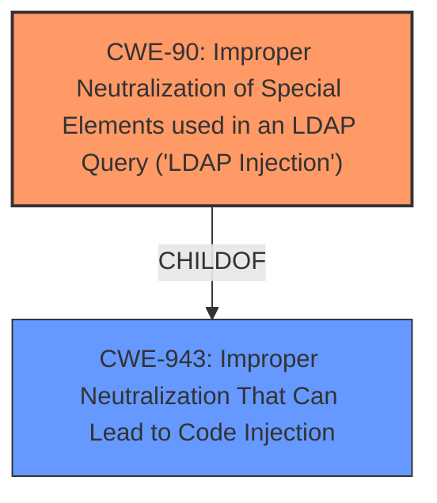

# Raw Analyzer Response for CVE-2022-31088

# Summary
| CWE ID | CWE Name | Confidence | CWE Abstraction Level | CWE Vulnerability Mapping Label | CWE-Vulnerability Mapping Notes |
|---|---|---|---|---|---|
| CWE-90 | Improper Neutralization of Special Elements used in an LDAP Query ('LDAP Injection') | 1.0 | Base | Allowed | Primary CWE |

## Evidence and Confidence

*   **Confidence Score:** 1.0
*   **Evidence Strength:** HIGH

## Relationship Analysis
The primary relationship that influenced the decision was the ChildOf relationship between CWE-90 and CWE-943 (Improper Neutralization That Can Lead to Code Injection). This indicates that LDAP injection is a specific type of code injection that occurs within LDAP queries.

## Vulnerability Chain
The vulnerability chain starts with the **improper handling of user input** in the user name field at login, leading to **LDAP Injection (CWE-90)**, which allows an attacker to **enumerate LDAP data**, resulting in **information disclosure**.

## Summary of Analysis
The initial assessment strongly points towards CWE-90 as the primary weakness. The vulnerability description explicitly states that the user name field at login could be used to **enumerate LDAP data** due to the **improper handling of special elements in an LDAP query**. The CVE Reference Links Content Summary confirms this, stating that the **root cause** is "The user name field at login could be used to enumerate LDAP data" and identifying "LDAP Injection" as a weakness.

The analysis is based on the provided evidence, specifically:

*   Vulnerability Description: "the user name field at login could be used to enumerate LDAP data."
*   CVE Reference Links Content Summary: **root_cause**: "The user name field at login could be used to enumerate LDAP data.", **weaknesses**: \["LDAP Injection"]

CWE-90 is at the optimal level of specificity because it directly addresses the **improper neutralization** within LDAP queries, which is the **root cause** of the vulnerability.

Other CWEs Considered:

*   CWE-256 (Plaintext Storage of a Password): While information disclosure is a concern, the primary issue is not the storage of passwords in plaintext, but rather the ability to enumerate LDAP data through injection.
*   CWE-863 (Incorrect Authorization): The vulnerability allows enumeration of data, but doesn't appear to be related to authorization, so this is not the correct fit.
*   CWE-540 (Inclusion of Sensitive Information in Source Code): The description doesn't mention the exposure of sensitive information in source code, so this CWE is not relevant.
*   CWE-303 (Incorrect Implementation of Authentication Algorithm): This CWE doesn't fit the **root cause** of the LDAP injection vulnerability.
*   CWE-1249 (Application-Level Admin Tool with Inconsistent View of Underlying Operating System): This vulnerability isn't about inconsistent views of the operating system.
*   CWE-620 (Unverified Password Change): This vulnerability isn't about unverified password changes.
*   CWE-1390 (Weak Authentication): Authentication is not the primary issue here, which is the ability to inject LDAP queries.
*   CWE-287 (Improper Authentication): While related to security, the core issue is the injection vulnerability, not the authentication mechanism itself.
*   CWE-201 (Insertion of Sensitive Information Into Sent Data): While sensitive information is disclosed, the mechanism is through injection, not direct insertion.

Relevant CWE Information:

# Enhanced Context (25 CWEs)

## CWE-538: Insertion of Sensitive Information into Externally-Accessible File or Directory
**Abstraction Level**: Base
**Similarity Score**: 0.79
**Source**: dense

**Description**:
The product places sensitive information into files or directories that are accessible to actors who are allowed to have access to the files, but not to the sensitive information.

**Mapping Guidance**:
- Usage: Allowed
- Rationale: This CWE entry is at the Base level of abstraction, which is a preferred level of abstraction for mapping to the root causes of vulnerabilities.

## CWE-212: Improper Removal of Sensitive Information Before Storage or Transfer
**Abstraction Level**: Base
**Similarity Score**: 0.77
**Source**: dense

**Description**:
The product stores, transfers, or shares a resource that contains sensitive information, but it does not properly remove that information before the product makes the resource available to unauthorized actors.

**Mapping Guidance**:
- Usage: Allowed
- Rationale: This CWE entry is at the Base level of abstraction, which is a preferred level of abstraction for mapping to the root causes of vulnerabilities.

## CWE-303: Incorrect Implementation of Authentication Algorithm
**Abstraction Level**: Base
**Similarity Score**: 0.77
**Source**: dense

**Description**:
The requirements for the product dictate the use of an established authentication algorithm, but the implementation of the algorithm is incorrect.

**Mapping Guidance**:
- Usage: Allowed
- Rationale: This CWE entry is at the Base level of abstraction, which is a preferred level of abstraction for mapping to the root causes of vulnerabilities.

## CWE-807: Reliance on Untrusted Inputs in a Security Decision
**Abstraction Level**: Base
**Similarity Score**: 0.77
**Source**: dense

**Description**:
The product uses a protection mechanism that relies on the existence or values of an input, but the input can be modified by an untrusted actor in a way that bypasses the protection mechanism.

**Mapping Guidance**:
- Usage: Allowed
- Rationale: This CWE entry is at the Base level of abstraction, which is a preferred level of abstraction for mapping to the root causes of vulnerabilities.

## CWE-204: Observable Response Discrepancy
**Abstraction Level**: Base
**Similarity Score**: 0.77
**Source**: dense

**Description**:
The product provides different responses to incoming requests in a way that reveals internal state information to an unauthorized actor outside of the intended control sphere.

**Mapping Guidance**:
- Usage: Allowed
- Rationale: This CWE entry is at the Base level of abstraction, which is a preferred level of abstraction for mapping to the root causes of vulnerabilities.

## CWE-1391: Use of Weak Credentials
**Abstraction Level**: Class
**Similarity Score**: 0.76
**Source**: dense

**Description**:
The product uses weak credentials (such as a default key or hard-coded password) that can be calculated, derived, reused, or guessed by an attacker.

**Mapping Guidance**:
- Usage: Allowed-with-Review
- Rationale: This CWE entry is a Class and might have Base-level children that would be more appropriate

## CWE-1390: Weak Authentication
**Abstraction Level**: Class
**Similarity Score**: 0.76
**Source**: dense

**Description**:
The product uses an authentication mechanism to restrict access to specific users or identities, but the mechanism does not sufficiently prove that the claimed identity is correct.

**Mapping Guidance**:
- Usage: Allowed-with-Review
- Rationale: This CWE entry is a Class and might have Base-level children that would be more appropriate

## CWE-74: Improper Neutralization of Special Elements in Output Used by a Downstream Component ('Injection')
**Abstraction Level**: Class
**Similarity Score**: 0.76
**Source**: dense

**Description**:
The product constructs all or part of a command, data structure, or record using externally-influenced input from an upstream component, but it does not neutralize or incorrectly neutralizes special elements that could modify how it is parsed or interpreted when it is sent to a downstream component.

**Mapping Guidance**:
- Usage: Discouraged
- Rationale: CWE-74 is high-level and often misused when lower-level weaknesses are more appropriate.

## CWE-319: Cleartext Transmission of Sensitive Information
**Abstraction Level**: Base
**Similarity Score**: 0.76
**Source**: dense

**Description**:
The product transmits sensitive or security-critical data in cleartext in a communication channel that can be sniffed by unauthorized actors.

**Mapping Guidance**:
- Usage: Allowed
- Rationale: This CWE entry is at the Base level of abstraction, which is a preferred level of abstraction for mapping to the root causes of vulnerabilities.

## CWE-639: Authorization Bypass Through User-Controlled Key
**Abstraction Level**: Base
**Similarity Score**: 0.76
**Source**: dense

**Description**:
The system's authorization functionality does not prevent one user from gaining access to another user's data or record by modifying the key value identifying the data.

**Mapping Guidance**:
- Usage: Allowed
- Rationale: This CWE entry is at the Base level of abstraction, which is a preferred level of abstraction for mapping