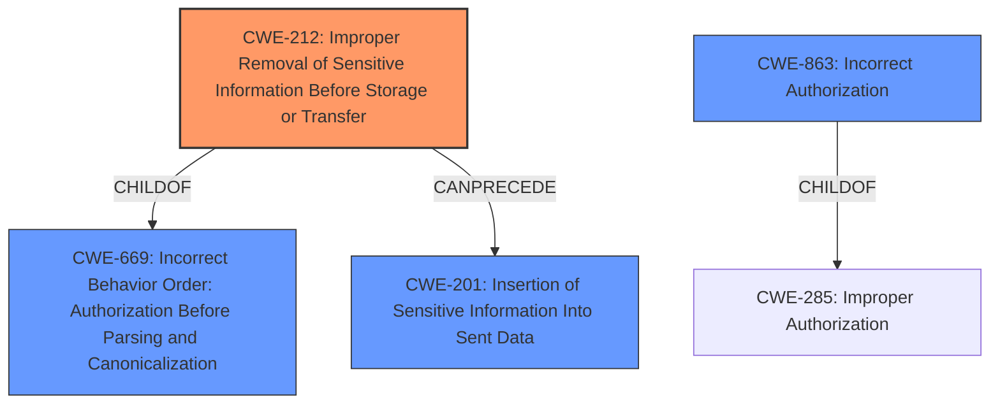

# Analysis for CVE-2022-31090

# Summary
| CWE ID  | CWE Name                                                                    | Confidence | CWE Abstraction Level | CWE Vulnerability Mapping Label | CWE-Vulnerability Mapping Notes |
| :-------- | :-------------------------------------------------------------------------- | :---------- | :---------------------- | :------------------------------ | :-------------------------------- |
| CWE-212   | Improper Removal of Sensitive Information Before Storage or Transfer        | 0.9         | Base                    | Primary CWE                    | Allowed                           |
| CWE-863   | Incorrect Authorization                                                     | 0.7         | Class                   | Secondary Candidate             | Allowed-with-Review             |
| CWE-201   | Insertion of Sensitive Information Into Sent Data                           | 0.6         | Base                    | Secondary Candidate             | Allowed                           |

## Evidence and Confidence

*   **Confidence Score:** 0.8
*   **Evidence Strength:** HIGH

## Relationship Analysis
The primary CWE is CWE-212, which reflects the **improper handling** of sensitive information (Authorization headers) during redirects. CWE-212 has a parent-child relationship with CWE-669 (Improper Neutralization of Special Elements). While CWE-201 is related, it is more about the insertion of sensitive data, whereas CWE-212 focuses on the failure to remove it. CWE-863 (Incorrect Authorization) is higher level but captures the authorization bypass aspect.

## Vulnerability Chain
The vulnerability chain starts with the application's use of `CURLOPT_HTTPAUTH` to specify an `Authorization` header. Upon a redirect to a different origin, the **failure to remove** this header leads to the **insertion of sensitive information** into the redirected request. This constitutes an **improper authorization**, as the header is sent to an unintended domain.
  - Root Cause: **Improper handling of redirects** (**failure to remove** the Authorization header).
  - Weakness: Insertion of Sensitive Information into Sent Data.
  - Impact: Sensitive authorization headers are sent to unintended domains.

## Summary of Analysis
The initial assessment identified several candidate CWEs, including CWE-212, CWE-863, and CWE-201. The final decision emphasizes CWE-212 as the primary weakness because the core issue is the **improper removal** of the `Authorization` header during redirects. The other CWEs capture related aspects, such as the resulting insertion of sensitive data (CWE-201) and the incorrect authorization context (CWE-863).

The evidence supporting this decision is derived from the "CVE Reference Links Content Summary," which states: "The `CURLOPT_HTTPAUTH` and `CURLOPT_USERPWD` options were not being cleared when a redirect occurred to a different origin... This could result in the client sending authorization headers to an unintended domain during a redirect." The "Vulnerability Description Key Phrases" also highlights the "improper handling of redirects."

CWE-212 is at the Base level of abstraction, which aligns with the goal of identifying the specific coding error.

Relevant CWE Information:

# Enhanced Context (25 CWEs)
The following CWEs were identified as potentially relevant to this vulnerability:

## CWE-212: Improper Removal of Sensitive Information Before Storage or Transfer
**Abstraction Level**: Base
**Similarity Score**: 0.77
**Source**: dense

**Description**:
The product stores, transfers, or shares a resource that contains sensitive information, but it **does not properly remove** that information before the product makes the resource available to unauthorized actors.

**Mapping Guidance**:
- Usage: Allowed
- Rationale: This CWE entry is at the Base level of abstraction, which is a preferred level of abstraction for mapping to the root causes of vulnerabilities.

## CWE-807: Reliance on Untrusted Inputs in a Security Decision
**Abstraction Level**: Base
**Similarity Score**: 0.77
**Source**: dense

**Description**:
The product uses a protection mechanism that relies on the existence or values of an input, but the input can be modified by an untrusted actor in a way that bypasses the protection mechanism.

**Mapping Guidance**:
- Usage: Allowed
- Rationale: This CWE entry is at the Base level of abstraction, which is a preferred level of abstraction for mapping to the root causes of vulnerabilities.

## CWE-639: Authorization Bypass Through User-Controlled Key
**Abstraction Level**: Base
**Similarity Score**: 0.76
**Source**: dense

**Description**:
The system's authorization functionality does not prevent one user from gaining access to another user's data or record by modifying the key value identifying the data.

**Mapping Guidance**:
- Usage: Allowed
- Rationale: This CWE entry is at the Base level of abstraction, which is a preferred level of abstraction for mapping to the root causes of vulnerabilities.

## CWE-274: Improper Handling of Insufficient Privileges
**Abstraction Level**: Base
**Similarity Score**: 0.76
**Source**: dense

**Description**:
The product does not handle or incorrectly handles when it has insufficient privileges to perform an operation, leading to resultant weaknesses.

**Mapping Guidance**:
- Usage: Discouraged
- Rationale: This CWE entry could be deprecated in a future version of CWE.

## CWE-74: Improper Neutralization of Special Elements in Output Used by a Downstream Component ('Injection')
**Abstraction Level**: Class
**Similarity Score**: 0.76
**Source**: dense

**Description**:
The product constructs all or part of a command, data structure, or record using externally-influenced input from an upstream component, but it does not neutralize or incorrectly neutralizes special elements that could modify how it is parsed or interpreted when it is sent to a downstream component.

**Mapping Guidance**:
- Usage: Discouraged
- Rationale: CWE-74 is high-level and often misused when lower-level weaknesses are more appropriate.

## CWE-668: Exposure of Resource to Wrong Sphere
**Abstraction Level**: Class
**Similarity Score**: 0.76
**Source**: dense

**Description**:
The product exposes a resource to the wrong control sphere, providing unintended actors with inappropriate access to the resource.

**Mapping Guidance**:
- Usage: Discouraged
- Rationale: CWE-668 is high-level and is often misused as a catch-all when lower-level CWE IDs might be applicable. It is sometimes used for low-information vulnerability reports [REF-1287]. It is a level-1 Class (i.e., a child of a Pillar). It is not useful for trend analysis.

## CWE-1390: Weak Authentication
**Abstraction Level**: Class
**Similarity Score**: 0.76
**Source**: dense

**Description**:
The product uses an authentication mechanism to restrict access to specific users or identities, but the mechanism does not sufficiently prove that the claimed identity is correct.

**Mapping Guidance**:
- Usage: Allowed-with-Review
- Rationale: This CWE entry is a Class and might have Base-level children that would be more appropriate

## CWE-280: Improper Handling of Insufficient Permissions or Privileges
**Abstraction Level**: Base
**Similarity Score**: 0.75
**Source**: dense

**Description**:
The product does not handle or incorrectly handles when it has insufficient privileges to access resources or functionality as specified by their permissions. This may cause it to follow unexpected code paths that may leave the product in an invalid state.

**Mapping Guidance**:
- Usage: Allowed
- Rationale: This CWE entry is at the Base level of abstraction, which is a preferred level of abstraction for mapping to the root causes of vulnerabilities.

## CWE-1289: Improper Validation of Unsafe Equivalence in Input
**Abstraction Level**: Base
**Similarity Score**: 0.75
**Source**: dense

**Description**:
The product receives an input value that is used as a resource identifier or other type of reference, but it does not validate or incorrectly validates that the input is equivalent to a potentially-unsafe value.

**Mapping Guidance**:
- Usage: Allowed
- Rationale: This CWE entry is at the Base level of abstraction, which is a preferred level of abstraction for mapping to the root causes of vulnerabilities.

## CWE-472: External Control