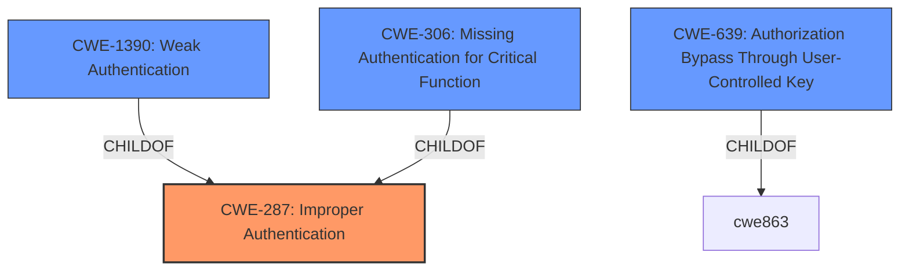

# Analysis for CVE-2022-31107

# Summary
| CWE ID  | CWE Name                                                                  | Confidence | CWE Abstraction Level | CWE Vulnerability Mapping Label | CWE-Vulnerability Mapping Notes |
| :-------- | :------------------------------------------------------------------------ | :--------- | :---------------------- | :------------------------------ | :------------------------------ |
| CWE-287   | Improper Authentication                                                   | 0.9        | Class                   | Primary                           | Discouraged                   |
| CWE-1390  | Weak Authentication                                                     | 0.8        | Class                   | Secondary                         | Allowed-with-Review           |
| CWE-639   | Authorization Bypass Through User-Controlled Key                        | 0.7        | Base                    | Secondary                         | Allowed                       |
| CWE-306   | Missing Authentication for Critical Function                            | 0.6        | Base                    | Secondary                         | Allowed                       |

## Evidence and Confidence

*   **Confidence Score:** 0.8
*   **Evidence Strength:** HIGH

## Relationship Analysis
The primary CWE is CWE-287 [Improper Authentication], a Class-level CWE that broadly covers situations where a product does not sufficiently prove a claimed identity. CWE-1390 [Weak Authentication] is a child of CWE-287 and is more specific, indicating that the authentication mechanism is insufficient. CWE-639 [Authorization Bypass Through User-Controlled Key] is related as it involves bypassing authorization by manipulating a user-controlled key. CWE-306 [Missing Authentication for Critical Function] is also a child of CWE-287 and indicates the complete absence of authentication for a critical function. The relationships suggest a progression from a general authentication failure to more specific types of bypass.

## Vulnerability Chain
The vulnerability chain starts with **improper account linking during OAuth login**. This leads to a scenario where a malicious user can assume the identity of another user, resulting in **account takeover**.

## Summary of Analysis
Initially, the primary issue appears to be an **improper account linking during OAuth login**, allowing an attacker to set their username in the OAuth provider to that of a target user and gain access to their Grafana account. This points to a problem with how Grafana authenticates users via OAuth.

Given the **rootcause** description and the conditions required for exploitation, **CWE-287 [Improper Authentication]** is the most appropriate primary CWE. While discouraged, it's a suitable starting point. The vulnerability description highlights that the product (Grafana) **does not properly prove** the claimed identity of the user when using OAuth, making it possible for an attacker to impersonate another user.

The secondary CWE, **CWE-1390 [Weak Authentication]**, is a child of CWE-287 and indicates that the authentication mechanism is insufficient.

**CWE-639 [Authorization Bypass Through User-Controlled Key]** is also considered. The vulnerability allows a malicious user to effectively bypass authorization checks by manipulating the username associated with their OAuth account. This manipulation allows them to access another user's account, which can be seen as a form of authorization bypass.

**CWE-306 [Missing Authentication for Critical Function]** is considered because the linking of external and internal user accounts during login **lacks proper authentication**, allowing a malicious user to take over another user's account.

The final decision is based heavily on the vulnerability description, which emphasizes the **improper** linking of external and internal user accounts. The relationships between the CWEs helped to narrow down the choices and provided a better understanding of the vulnerability's nature.

Relevant CWE Information:
*   **CWE-287 [Improper Authentication]**: This CWE covers cases where the product does not sufficiently prove that a claimed identity is correct. The Grafana vulnerability aligns with this, as the system **does not properly validate** the user's identity during OAuth login.
*   **CWE-1390 [Weak Authentication]**: This CWE highlights that the authentication mechanism is insufficient. In the Grafana case, the OAuth authentication process is **vulnerable to manipulation**, allowing an attacker to assume another user's identity.
*   **CWE-639 [Authorization Bypass Through User-Controlled Key]**: This CWE describes situations where authorization is bypassed by manipulating a user-controlled key. In the Grafana vulnerability, the attacker manipulates the username associated with their OAuth account to **bypass authorization checks**.
*   **CWE-306 [Missing Authentication for Critical Function]**: This CWE describes situations where there is no authentication for critical function. In the Grafana vulnerability, the linking of external and internal user accounts during login **lacks proper authentication**.