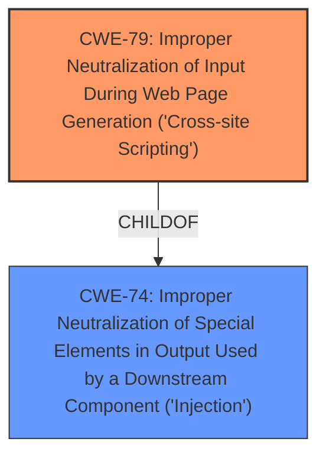

# Analysis for CVE-2022-31108

# Summary
| CWE ID | CWE Name | Confidence | CWE Abstraction Level | CWE Vulnerability Mapping Label | CWE-Vulnerability Mapping Notes |
|---|---|---|---|---|---|
| CWE-79 | Improper Neutralization of Input During Web Page Generation ('Cross-site Scripting') | 1.0 | Base | Primary | Allowed |

## Evidence and Confidence

*   **Confidence Score:** 1.0
*   **Evidence Strength:** HIGH

## Relationship Analysis
The primary relationship that influenced the decision was the ChildOf relationship between CWE-79 and CWE-74. While CWE-74 (Improper Neutralization of Special Elements in Output Used by a Downstream Component ('Injection')) is a broader class, CWE-79 is a more specific base case that directly aligns with the vulnerability description. The peer relationship of CWE-79 with CWE-352 (Cross-Site Request Forgery (CSRF)) was also considered, but CSRF is not applicable in this case because the attack does not involve tricking a user into making an unintentional request.

## Vulnerability Chain
The vulnerability chain involves the following sequence:
1.  **Root Cause:** **Improper input sanitization** of user-provided theme variables within the Mermaid library, specifically the `textColor`, `fontFamily` and `themeCSS` variables.
2.  **Weakness:** CSS Injection due to the lack of proper sanitization, allowing arbitrary CSS rules to be injected into the generated SVG.
3.  **Impact:** Information Disclosure via CSS selectors and functions able to generate HTTP requests, and UI manipulation leading to unintended actions.

## Summary of Analysis
The analysis is based on the detailed information provided in the vulnerability description and CVE reference links. The key phrase "**improper input sanitization**" and the description of how an attacker can inject arbitrary CSS to exfiltrate sensitive information strongly suggest CWE-79. The fact that the vulnerability involves generating a web page with user-controllable input that is not properly neutralized seals the classification.

The following evidence supports the selection of CWE-79:
*   **Vulnerability Description Key Phrases:** "**weakness:** **improper input sanitization**"
*   **CVE Reference Links Content Summary:** "The vulnerability stems from the lack of proper sanitization of user-provided theme variables...allowing for arbitrary CSS injection."
*   **CVE Reference Links Content Summary:** "Attackers could exfiltrate sensitive data by leveraging CSS selectors and functions that trigger HTTP requests."
*   **CVE Reference Links Content Summary:** "The fix implemented sanitization to ensure that user inputs are properly escaped before being embedded into CSS blocks."

The graph relationships influenced the final selection by highlighting the hierarchical structure, reinforcing the selection of the most specific and accurate CWE.

CWE-79 is the optimal level of specificity because it directly addresses the vulnerability of **improperly neutralizing input** before web page generation, leading to cross-site scripting. Other considered CWEs, like CWE-74, are broader and less precise.

Relevant CWE Information:

## CWE-79: Improper Neutralization of Input During Web Page Generation ('Cross-site Scripting')
**Technical Explanation:** The Mermaid library **fails to properly sanitize** user-provided theme variables (`textColor`, `fontFamily`, `themeCSS`) before embedding them into CSS blocks. This allows an attacker to inject arbitrary CSS rules into the generated SVG, effectively leading to cross-site scripting.
**Security Implications:** The primary security implication is the ability to **exfiltrate sensitive information** by leveraging CSS selectors and functions that can trigger HTTP requests. This can be used to steal data or perform other malicious actions. Additionally, attackers can manipulate the UI to trick users into performing unintended actions, such as clicking on malicious links.
**Relationships:** CWE-79 is a base CWE and a child of CWE-74 (Improper Neutralization of Special Elements in Output Used by a Downstream Component ('Injection')). It can also be related to CWE-352 (Cross-Site Request Forgery (CSRF)), although CSRF is not applicable in this specific scenario.
**MITRE Mapping Guidance:** The official MITRE mapping guidance allows for the use of CWE-79, as it is at the Base level of abstraction.

**Other CWEs Considered but Not Used:**
*   **CWE-74:** Considered but not selected because it is a broader, class-level CWE, while CWE-79 provides a more specific and accurate description of the vulnerability.
*   **CWE-138:** Considered but not selected because it is a class-level CWE that describes a general case of **improper neutralization** of special elements, while CWE-79 is more specific to web page generation.
*   **CWE-1336:** Considered but not selected because while the vulnerability involves CSS injection within a templating environment, the core issue is the lack of proper output neutralization, which is more directly addressed by CWE-79.
*   **CWE-89:** Considered but not selected because the vulnerability does not involve SQL injection.
*   **CWE-451:** Considered but not selected because while the vulnerability allows UI manipulation, the root cause is the lack of proper input neutralization, making CWE-79 a more appropriate choice.
*   **CWE-94:** Considered but not selected because the injection is not directly related to code execution but rather to CSS manipulation and information disclosure.