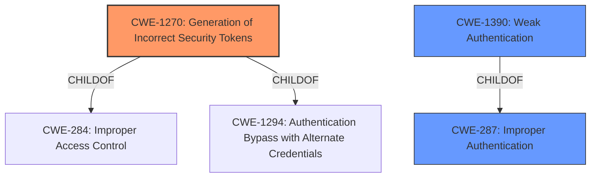

# Analysis Report for CVE-2022-31122

# Vulnerability Analysis Report: CVE-2022-31122

## Description


## Analysis (with Relationship Data)

# Summary
| CWE ID    | CWE Name                                                  | Confidence | CWE Abstraction Level | CWE Vulnerability Mapping Label | CWE-Vulnerability Mapping Notes |
| --------- | --------------------------------------------------------- | ---------- | --------------------- | ------------------------------- | ----------------------------- |
| CWE-1270  | Generation of Incorrect Security Tokens                   | 0.9        | Base                  | Primary                         | Allowed                       |
| CWE-287   | Improper Authentication                                   | 0.6        | Class                 | Secondary                       | Discouraged                   |
| CWE-1390  | Weak Authentication                                       | 0.6        | Class                 | Secondary                       | Allowed-with-Review         |

## Evidence and Confidence

*   **Confidence Score:** 0.8
*   **Evidence Strength:** HIGH

## Relationship Analysis
The primary relationship influencing the assessment is the child-of relationship between CWE-1390 and CWE-287, with CWE-1390 being a more specific case of improper authentication. CWE-1270, the selected primary, has child-of relationships with CWE-284 and CWE-1294, indicating its place within the broader context of improper access control and authentication mechanisms. However, due to the lack of specificity for the authentication bypass, CWE-1270 is preferred. The abstraction levels were carefully considered, and the base level of CWE-1270 was deemed most appropriate for the specific weakness described.



## Vulnerability Chain
The vulnerability chain starts with the **Token Recipient Confusion** due to insufficient validation of SAML IdP metadata. This leads to the ability to delete accounts, authenticate as a user, and create arbitrary accounts. The chain is:

1.  Insufficient SAML IdP metadata validation (**Token Recipient Confusion**)
2.  **Incorrect Security Token Generation** (CWE-1270)
3.  **Improper Authentication** (CWE-287) / **Weak Authentication** (CWE-1390)
4.  Unauthorized account deletion, authentication, and creation.

## Summary of Analysis
The initial assessment focused on the **Token Recipient Confusion**, which directly results in the generation of incorrect security tokens, making CWE-1270 the most relevant root cause. The retriever results also listed CWE-1270 as the top candidate. The vulnerability description key phrases highlighted the **rootcause** as **Token Recipient Confusion** and the impact as deleting and creating accounts. The CVE Reference Links Content Summary states the root cause as "insufficient validation of SAML IdP metadata."

The selection of CWE-1270 is based on the direct evidence of "insufficient validation of SAML IdP metadata" leading to **Token Recipient Confusion**. This confusion allows the attacker to manipulate the SAML SSO configuration, leading to the ability to authenticate and create arbitrary accounts. This aligns directly with the description of CWE-1270, where "Security Tokens generated in the system are incorrect."

CWE-287 (Improper Authentication) and CWE-1390 (Weak Authentication) were considered because the attacker can bypass authentication and create accounts. However, these are consequences of the **incorrect security token generation** rather than the root cause. The graph relationships confirm that CWE-1390 is a child of CWE-287, making CWE-287 a higher-level abstraction.

CWE-1270 is at the optimal level of specificity because it directly addresses the **incorrect generation of security tokens** as the root cause of the vulnerability. The other CWEs considered represent impacts or related issues rather than the fundamental flaw.

Relevant CWE Information:

# Enhanced Context (25 CWEs)

## CWE-1270: Generation of Incorrect Security Tokens
**Abstraction:** Base
**Similarity Score**: 5112.68
**Source**: sparse

**Description**:
The product implements a Security Token mechanism to differentiate what actions are allowed or disallowed when a transaction originates from an entity. However, the Security Tokens generated in the system are incorrect.

**Mapping Guidance**:
- Usage: Allowed
- Rationale: This CWE entry is at the Base level of abstraction, which is a preferred level of abstraction for mapping to the root causes of vulnerabilities.


## CWE Relationship Analysis

Current CWEs represent these abstraction levels: .


### Vulnerability Chain Analysis

**Chain starting from CWE-1390:**
- 1390 (Weak Authentication) - ROOT


**Chain starting from CWE-1270:**
- 1270 (Generation of Incorrect Security Tokens) - ROOT


### CWE Relationship Diagram

```mermaid
graph TD
    classDef primary fill:#f96,stroke:#333,stroke-width:2px
    classDef secondary fill:#69f,stroke:#333
    classDef tertiary fill:#9e9,stroke:#333
```


*Report generated on 2025-03-31 07:03:47*
