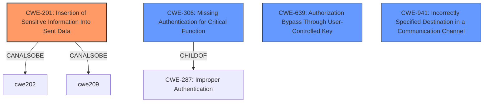

# Analysis for CVE-2022-31130

# Summary
| CWE ID    | CWE Name                                                     | Confidence | CWE Abstraction Level | CWE Vulnerability Mapping Label | CWE-Vulnerability Mapping Notes |
| :-------- | :----------------------------------------------------------- | :--------- | :---------------------- | :------------------------------ | :-------------------------------- |
| CWE-201   | Insertion of Sensitive Information Into Sent Data          | 0.9        | Base                    | Allowed                       | Primary CWE                       |
| CWE-306   | Missing Authentication for Critical Function                 | 0.6        | Base                    | Allowed                       | Secondary Candidate               |
| CWE-639   | Authorization Bypass Through User-Controlled Key           | 0.5        | Base                    | Allowed                       | Secondary Candidate               |
| CWE-941   | Incorrectly Specified Destination in a Communication Channel | 0.4        | Base                    | Allowed                       | Secondary Candidate               |

## Evidence and Confidence

*   **Confidence Score:** 0.9
*   **Evidence Strength:** HIGH

## Relationship Analysis
The primary CWE is CWE-201, indicating that sensitive information (authentication tokens) is being sent to an unintended recipient. CWE-201 has peer relationships with CWE-202 and CWE-209, which also deal with exposure of sensitive information but through different mechanisms. CWE-306 (Missing Authentication) is a possible secondary factor if the destination plugin should have been authenticated before receiving the token, and it is a child of CWE-287 (Improper Authentication). CWE-639 (Authorization Bypass) could be applicable if the plugin is able to access data belonging to other users by modifying the key value. CWE-941 (Incorrect Destination) relates to the communication channel being incorrectly specified, which could lead to sending the tokens to the wrong place.

## Vulnerability Chain
The vulnerability chain starts with Grafana's **improper handling of authentication tokens** when proxying requests. This leads to the **leakage of these tokens** to destination plugins (CWE-201). Depending on the specific context, **missing authentication** at the destination plugin (CWE-306), an **authorization bypass** (CWE-639), or an **incorrectly specified destination** (CWE-941) could also play a role. The final impact is the potential for **unauthorized access** due to the exposure of these tokens.

## Summary of Analysis
The primary weakness is the **leakage of authentication tokens**, making CWE-201 the most appropriate primary classification. The vulnerability description explicitly states that authentication tokens are being sent to destination plugins under certain conditions.

The evidence supporting CWE-201 includes:
*   Vulnerability Description Key Phrases: "**impact:** leak authentication tokens"
*   CVE Reference Links Content Summary: "**vulnerabilities:** Authentication token leakage"
*   CVE Reference Links Content Summary: "Grafana data source and plugin proxy endpoints were found to be leaking authentication tokens to some destination plugins. The destination plugin could receive a Grafana authentication token of the user."

Other CWEs were considered:
*   CWE-306, CWE-639 and CWE-941 are secondary candidates. While these might play a role in specific scenarios, the core issue is the unintentional sending of sensitive authentication tokens. These are lower confidence because the description doesn't provide explicit evidence these are happening.
*   CWE-863 (Incorrect Authorization), CWE-1390 (Weak Authentication), CWE-285 (Improper Authorization) are less appropriate as they describe issues with the authorization and authentication mechanisms themselves, rather than the leakage of tokens.
*   CWE-532 (Insertion of Sensitive Information into Log File) is not relevant because the tokens are being sent to a plugin, not logged.
*   CWE-613 (Insufficient Session Expiration) does not apply because the session itself isn't expiring, rather tokens are being leaked during an active session.

The final decision is based on the evidence, relationship analysis, and mapping guidance. CWE-201 is at the base level of abstraction and accurately represents the core weakness. The other CWEs considered either describe related but distinct issues or are at a higher level of abstraction.

Relevant CWE Information:
*   **CWE-201: Insertion of Sensitive Information Into Sent Data**: The code transmits data to another actor, but a portion of the data includes sensitive information that should not be accessible to that actor. The vulnerability's details match this CWE because Grafana is transmitting authentication tokens (sensitive information) to destination plugins (another actor), which should not have access to them under certain conditions. The security implication is unauthorized access to user accounts.