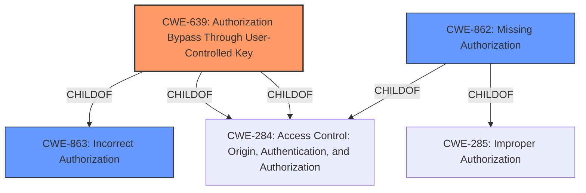

# Analysis for CVE-2022-31131

# Summary
| CWE ID | CWE Name | Confidence | CWE Abstraction Level | CWE Vulnerability Mapping Label | CWE-Vulnerability Mapping Notes |
|---|---|---|---|---|---|
| CWE-639 | Authorization Bypass Through User-Controlled Key | 0.9 | Base | Allowed | Primary CWE |
| CWE-862 | Missing Authorization | 0.7 | Class | Allowed-with-Review | Secondary Candidate |

## Evidence and Confidence

*   **Confidence Score:** 0.8
*   **Evidence Strength:** HIGH

## Relationship Analysis
The primary relationship that influenced the decision was the hierarchical relationship between CWE-639 (**Authorization Bypass Through User-Controlled Key**) and its parent CWE-863 (**Incorrect Authorization**). While CWE-862 (**Missing Authorization**) was also considered, the vulnerability description specifically mentioned missing user account ownership checks, which aligns more closely with the user-controlled key aspect of CWE-639.

## Vulnerability Chain
The vulnerability chain starts with the **missing user account ownership checks** (CWE-639) leading to the exposure of attachments to incorrect system users.

## Summary of Analysis
The initial analysis focused on identifying the root cause of the vulnerability, which was the **missing user account ownership checks** when performing tasks related to mail attachments. The "CVE Reference Links Content Summary" section highlights the root cause, stating that the application failed to properly validate the user's ownership of the attachments. This aligns perfectly with CWE-639 (**Authorization Bypass Through User-Controlled Key**), as the `local_message_id` was used without verifying user ownership.

The retriever results also strongly suggest CWE-639 as the primary candidate. CWE-862 (**Missing Authorization**) was considered but deemed less specific, as the vulnerability isn't simply a lack of authorization, but rather a bypass due to improper handling of user-controlled keys (in this case, the `local_message_id`).

The decision is heavily based on the provided evidence, particularly the "Vulnerability Description Key Phrases" and "CVE Reference Links Content Summary" sections. The choice of CWE-639 is at the optimal level of specificity as it captures the essence of the **weakness**: an authorization bypass achieved through manipulation of a user-controlled key.

Relevant CWE Information:

# Enhanced Context (25 CWEs)

## CWE-639: Authorization Bypass Through User-Controlled Key
**Abstraction Level**: Base
**Similarity Score**: 0.78
**Source**: dense

**Description**:
The system's authorization functionality does not prevent one user from gaining access to another user's data or record by modifying the key value identifying the data.

**Mapping Guidance**:
- Usage: Allowed
- Rationale: This CWE entry is at the Base level of abstraction, which is a preferred level of abstraction for mapping to the root causes of vulnerabilities.

## CWE-862: Missing Authorization
**Abstraction Level**: Class
**Status**: Incomplete

### Description
The product does not perform an authorization check when an actor attempts to access a resource or perform an action.

### Extended Description
Not provided

### Alternative Terms
AuthZ: "AuthZ" is typically used as an abbreviation of "authorization" within the web application security community. It is distinct from "AuthN" (or, sometimes, "AuthC") which is an abbreviation of "authentication." The use of "Auth" as an abbreviation is discouraged, since it could be used for either authentication or authorization.

### Relationships
ChildOf -> CWE-285
ChildOf -> CWE-284

### Mapping Guidance
**Usage:** Allowed-with-Review
**Rationale:** This CWE entry is a Class and might have Base-level children that would be more appropriate
**Comments:** Examine children of this entry to see if there is a better fit
**Reasons:**
- Abstraction

### Additional Notes
**[Terminology]** Assuming a user with a given identity, authorization is the process of determining whether that user can access a given resource, based on the user's privileges and any permissions or other access-control specifications that apply to the resource.

### Observed Examples
- **CVE-2022-24730:** Go-based continuous deployment product does not check that a user has certain privileges to update or create an app, allowing adversaries to read sensitive repository information
- **CVE-2009-3168:** Web application does not restrict access to admin scripts, allowing authenticated users to reset administrative passwords.
- **CVE-2009-3597:** Web application stores database file under the web root with insufficient access control (CWE-219), allowing direct request.