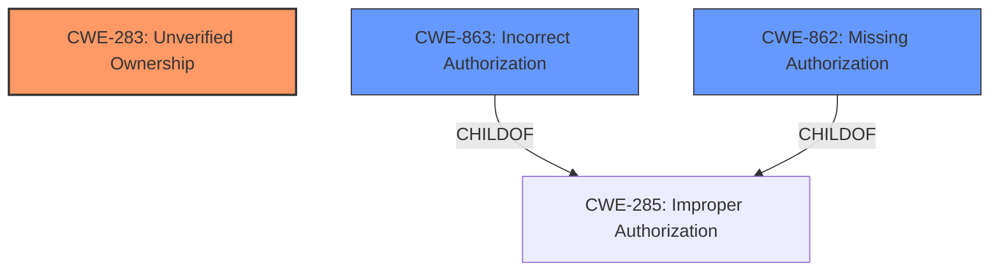

# Enhanced Analysis for CVE-2022-31154

# Summary
| CWE ID | CWE Name | Confidence | CWE Abstraction Level | CWE Vulnerability Mapping Label | CWE-Vulnerability Mapping Notes |
|---|---|---|---|---|---|
| CWE-283 | Unverified Ownership | 0.9 | Base | Allowed | Primary CWE |
| CWE-863 | Incorrect Authorization | 0.6 | Class | Allowed-with-Review | Secondary Candidate |
| CWE-862 | Missing Authorization | 0.5 | Class | Allowed-with-Review | Secondary Candidate |

## Evidence and Confidence

*   **Confidence Score:** 0.9
*   **Evidence Strength:** HIGH

## Relationship Analysis
The primary CWE selected is CWE-283 (Unverified Ownership), a Base level CWE, indicating a lack of proper validation of resource ownership. CWE-863 (Incorrect Authorization) and CWE-862 (Missing Authorization) are Class level CWEs that are parent to several more specific Base and Variant level CWEs. The vulnerability involves an authenticated user being able to edit Code Monitors owned by another user. This can stem from either an incorrect authorization check (CWE-863) or a complete lack of an authorization check (CWE-862), both of which are related to the root cause of unverified ownership (CWE-283).



## Vulnerability Chain
The vulnerability chain starts with the **lack of proper verification of ownership (CWE-283)**. This leads to either an **incorrect authorization (CWE-863)** or a **missing authorization check (CWE-862)**, which ultimately allows an attacker to **edit Code Monitors owned by other users**.

## Summary of Analysis
The initial analysis focused on the ability of an authenticated user to edit Code Monitors owned by other users, which suggests an authorization issue. The retriever results pointed to CWE-283 (Unverified Ownership), CWE-863 (Incorrect Authorization), and CWE-862 (Missing Authorization).

The vulnerability description states: "It is possible for an authenticated Sourcegraph user to edit the Code Monitors owned by any other Sourcegraph user." The key phrase here is "edit Code Monitors owned by any other Sourcegraph user." This indicates that the system **fails to properly verify if the user attempting to edit the Code Monitor is indeed the owner**.

CWE-283 (Unverified Ownership) directly addresses this issue. The description states: "The product does not properly verify that a critical resource is owned by the proper entity." This aligns perfectly with the vulnerability where the product (Sourcegraph) **does not properly verify that the user attempting to edit a Code Monitor is the owner of that Code Monitor**. Therefore, CWE-283 is the most accurate and specific CWE to represent the root cause of this vulnerability.

CWE-863 (Incorrect Authorization) and CWE-862 (Missing Authorization) are less specific. While they describe authorization issues, they don't pinpoint the root cause, which is the **failure to verify ownership before applying authorization checks**.

The final selection is based on the evidence provided in the vulnerability description and the definitions of the CWEs. CWE-283 is at the optimal level of specificity as it accurately represents the root cause, while CWE-863 and CWE-862 are more general classifications of the authorization issue. The retriever scores support this assessment, with CWE-283 being a strong candidate.


## CWE Relationship Analysis

Current CWEs represent these abstraction levels: .


### Vulnerability Chain Analysis

**Chain starting from CWE-862:**
- 862 (Missing Authorization) - ROOT


**Chain starting from CWE-285:**
- 285 (Improper Authorization) - ROOT


### CWE Relationship Diagram

```mermaid
graph TD
    classDef primary fill:#f96,stroke:#333,stroke-width:2px
    classDef secondary fill:#69f,stroke:#333
    classDef tertiary fill:#9e9,stroke:#333
```