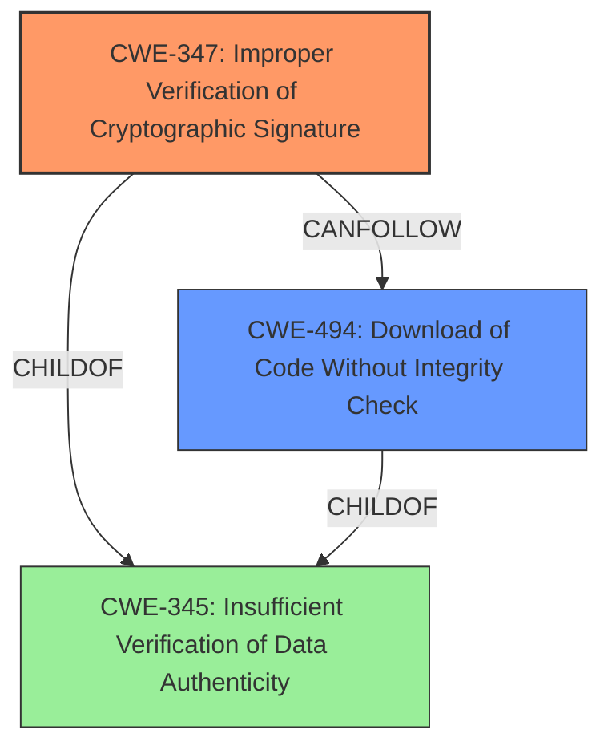

# Enhanced Analysis for CVE-2022-31156

# Summary
| CWE ID  | CWE Name                                                                 | Confidence | CWE Abstraction Level | CWE Vulnerability Mapping Label | CWE-Vulnerability Mapping Notes |
| :-------- | :----------------------------------------------------------------------- | :--------- | :---------------------- | :------------------------------ | :------------------------------ |
| CWE-347 | Improper Verification of Cryptographic Signature                     | 0.9        | Base                    | Primary                         | Allowed                       |
| CWE-494 | Download of Code Without Integrity Check                               | 0.7        | Base                    | Secondary                       | Allowed                       |

## Evidence and Confidence

*   **Confidence Score:** 0.8
*   **Evidence Strength:** HIGH

## Relationship Analysis
The primary CWE is CWE-347 (**Improper Verification of Cryptographic Signature**) which stems from the **rootcause** that Gradle skips checksum verification when signature verification fails or is disabled. The secondary CWE is CWE-494 (**Download of Code Without Integrity Check**) which can follow from a failure to verify data authenticity.



## Vulnerability Chain
The vulnerability chain starts with Gradle's **failure to properly verify dependencies** (**rootcause**). This leads to the **impact** of potentially downloading malicious code without proper integrity checks.

## Summary of Analysis
The initial analysis and resulting conclusion are based on the evidence provided in the vulnerability description and CVE reference links content summary. The primary weakness is the **improper verification of cryptographic signatures** (CWE-347), as Gradle skips checksum verification when signature verification fails or is disabled. This is further supported by the CVE reference which states: "The vulnerability stems from Gradle's dependency verification mechanism not enforcing checksum verification when signature verification fails or is disabled."

The graph relationships influenced the selection by highlighting the connection between signature verification (CWE-347), data authenticity (CWE-345), and the potential for downloading code without integrity checks (CWE-494). The selected CWEs are at the optimal level of specificity as they directly address the technical details of the vulnerability.

Relevant CWE Information:

# Enhanced Context (25 CWEs)
The following CWEs were identified as potentially relevant to this vulnerability:

## CWE-1289: Improper Validation of Unsafe Equivalence in Input
**Abstraction Level**: Base
**Similarity Score**: 0.76

This CWE was not selected because the vulnerability does not primarily involve validating equivalence of inputs.

## CWE-807: Reliance on Untrusted Inputs in a Security Decision
**Abstraction Level**: Base
**Similarity Score**: 0.75

This CWE was not selected because while untrusted inputs are involved, the core issue is the **lack of proper verification**, not the reliance on the input itself for a security decision.

## CWE-345: Insufficient Verification of Data Authenticity
**Abstraction Level**: Class
**Similarity Score**: 0.75

CWE-345 was considered, however, CWE-347 is a more specific child of this class and describes the specific issue of **improper cryptographic signature verification** in the vulnerability.

## CWE-204: Observable Response Discrepancy
**Abstraction Level**: Base
**Similarity Score**: 0.75

This CWE was not selected because the vulnerability does not primarily involve observable response discrepancies.

## CWE-303: Incorrect Implementation of Authentication Algorithm
**Abstraction Level**: Base
**Similarity Score**: 0.75

This CWE was not selected because the vulnerability isn't caused by an incorrect implementation of an authentication algorithm.

## CWE-1391: Use of Weak Credentials
**Abstraction Level**: Class
**Similarity Score**: 0.75

This CWE was not selected because the vulnerability does not involve the use of weak credentials.

## CWE-1390: Weak Authentication
**Abstraction Level**: Class
**Similarity Score**: 0.75

This CWE was not selected because the vulnerability is related to dependency verification and not user authentication.

## CWE-472: External Control of Assumed-Immutable Web Parameter
**Abstraction Level**: Base
**Similarity Score**: 0.74

This CWE was not selected because the vulnerability is not related to web parameters.

## CWE-319: Cleartext Transmission of Sensitive Information
**Abstraction Level**: Base
**Similarity Score**: 0.74

This CWE was not selected because the vulnerability does not involve transmitting sensitive information in cleartext.

## CWE-639: Authorization Bypass Through User-Controlled Key
**Abstraction Level**: Base
**Similarity Score**: 0.74

This CWE was not selected because the vulnerability does not involve authorization bypass.

## CWE-427: Uncontrolled Search Path Element
**Abstraction Level**: Base
**Similarity Score**: 8017.19

This CWE was considered because an attacker could potentially inject malicious binaries into a build process if the search path is not properly controlled and verified. However, the primary issue is that the integrity of the dependency is not properly verified before it is downloaded, thus CWE-347 and CWE-494 are better fits.

## CWE-347: Improper Verification of Cryptographic Signature
**Abstraction Level**: Base
**Similarity Score**: 7249.91

This is the primary CWE because the vulnerability stems from Gradle not enforcing checksum verification when signature verification fails or is disabled.

## CWE-79: Improper Neutralization of Input During Web Page Generation ('Cross-site Scripting')
**Abstraction Level**: Base
**Similarity Score**: 7128.76

This CWE was not selected because the vulnerability does not involve web page generation or cross-site scripting.

## CWE-61: UNIX Symbolic Link (Symlink) Following
**Abstraction Level**: Compound
**Similarity Score**: 7027.19

This CWE was not selected because the vulnerability does not involve symbolic links.

## CWE-88: Improper Neutralization of Argument Delimiters in a Command ('Argument Injection')
**Abstraction Level**: Base
**Similarity Score**: 7010.33

This CWE was not selected because the vulnerability does not involve argument injection.

## CWE-494: Download of Code Without Integrity Check
**Abstraction Level**: base
**Similarity Score**: 4.33

This is a secondary CWE because it describes the potential outcome of not verifying the signature or checksum.

## CWE-73: External Control of File Name or Path
**Abstraction Level**: base
**Similarity Score**: 2.87

This CWE was not selected because the vulnerability does not involve external control of file names or paths.


## CWE Relationship Analysis

Current CWEs represent these abstraction levels: .


### Vulnerability Chain Analysis

**Chain starting from CWE-472:**
- 472 (External Control of Assumed-Immutable Web Parameter) - ROOT


**Chain starting from CWE-319:**
- 319 (Cleartext Transmission of Sensitive Information) - ROOT


### CWE Relationship Diagram

```mermaid
graph TD
    classDef primary fill:#f96,stroke:#333,stroke-width:2px
    classDef secondary fill:#69f,stroke:#333
    classDef tertiary fill:#9e9,stroke:#333
```