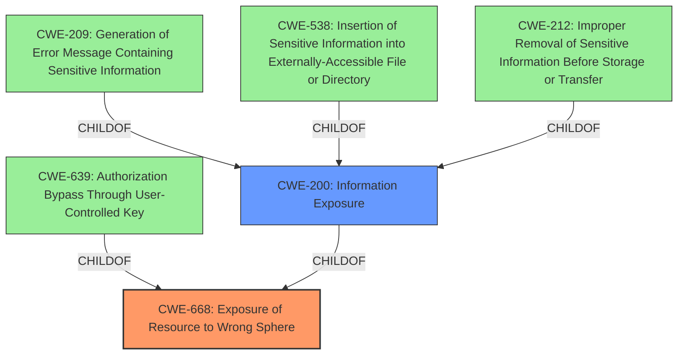

# Enhanced Analysis for CVE-2022-31176

# Summary
| CWE ID | CWE Name | Confidence | CWE Abstraction Level | CWE Vulnerability Mapping Label | CWE-Vulnerability Mapping Notes |
|---|---|---|---|---|---|
| CWE-668 | Exposure of Resource to Wrong Sphere | 0.8 | Class | Primary | Allowed |
| CWE-200 | Information Exposure | 0.6 | Class | Secondary | Allowed-with-Review |

## Evidence and Confidence

*   **Confidence Score:** 0.7
*   **Evidence Strength:** MEDIUM

## Relationship Analysis
The primary relationship influencing the selection was the parent-child relationship, with CWE-668 serving as a higher-level classification for the unauthorized file disclosure. This relationship guided the selection of a more generalized CWE to capture the overall issue of exposing a resource to the wrong sphere. The relationships with CWE-209, CWE-538, CWE-639, CWE-212 helped to eliminate them as specific instances.



## Vulnerability Chain
The vulnerability chain involves the following sequence:
1.  The Grafana Image Renderer plugin embeds a Chromium browser.
2.  The Chromium browser allows for printing of files.
3.  **Lack of proper access control** within the renderer leads to unauthorized file access.
4.  The files are rendered as PNG images, leading to **unauthorized file disclosure**.

Here, the **lack of access control** is the root cause, and the file disclosure is the impact.

## Summary of Analysis
Initially, the unauthorized file disclosure vulnerability pointed towards a more specific CWE like CWE-22 (Path Traversal) or CWE-73 (External Control of File Name or Path). However, upon further review, the core issue lies in the broader context of a resource being exposed to the wrong control sphere due to **lack of proper access control**. The "CVE Reference Links Content Summary" states: "The Grafana Image Renderer plugin, when using HTTP remote rendering, embeds a Chromium browser that allows for printing of files. This functionality can be exploited to disclose unauthorized files by rendering them as PNG images" and "Lack of proper access control: The renderer does not adequately restrict which files it can access and render."

Therefore, the primary CWE is CWE-668: Exposure of Resource to Wrong Sphere. This is because the Grafana Image Renderer, by allowing access to files it shouldn't, is exposing a resource (the file system) to an unintended sphere of control. This decision is influenced by the MITRE mapping guidance that discourages using CWE-668 as a catch-all but is appropriate here as it encapsulates the high-level issue.

CWE-200 (Information Exposure) is considered as a secondary candidate because the impact of the vulnerability is the disclosure of sensitive information, which aligns with the description of CWE-200. "The sensitive information may be valuable information on its own (such as a password), or it may be useful for launching other, more serious attacks."

The selected CWEs are at the optimal level of specificity because they accurately represent the root cause and impact of the vulnerability without being overly specific. CWE-668 captures the general issue of resource exposure, while CWE-200 highlights the information disclosure aspect.

Relevant CWE Information:

# Enhanced Context (25 CWEs)
The following CWEs were identified as potentially relevant to this vulnerability:

## CWE-209: Generation of Error Message Containing Sensitive Information
**Abstraction Level**: Base
**Similarity Score**: 0.79
**Source**: dense

**Description**:
The product generates an error message that includes sensitive information about its environment, users, or associated data.
**Not Used:** The vulnerability description doesn't mention error messages.

## CWE-538: Insertion of Sensitive Information into Externally-Accessible File or Directory
**Abstraction Level**: Base
**Similarity Score**: 0.79
**Source**: dense

**Description**:
The product places sensitive information into files or directories that are accessible to actors who are allowed to have access to the files, but not to the sensitive information.
**Not Used:** This is not the case, but a consequence of the **lack of access control**.

## CWE-668: Exposure of Resource to Wrong Sphere
**Abstraction Level**: Class
**Similarity Score**: 0.79
**Source**: dense

**Description**:
The product exposes a resource to the wrong control sphere, providing unintended actors with inappropriate access to the resource.
**Used:** The Grafana Image Renderer, by allowing access to files it shouldn't, is exposing a resource (the file system) to an unintended sphere of control.

## CWE-639: Authorization Bypass Through User-Controlled Key
**Abstraction Level**: Base
**Similarity Score**: 0.79
**Source**: dense

**Description**:
The system's authorization functionality does not prevent one user from gaining access to another user's data or record by modifying the key value identifying the data.
**Not Used:** The user is not modifying any key. It is a general problem of authorization.

## CWE-212: Improper Removal of Sensitive Information Before Storage or Transfer
**Abstraction Level**: Base
**Similarity Score**: 0.79
**Source**: dense

**Description**:
The product stores, transfers, or shares a resource that contains sensitive information, but it does not properly remove that information before the product makes the resource available to unauthorized actors.
**Not Used:** The sensitive information is not removed because it is not supposed to be accessed to begin with.

## CWE-74: Improper Neutralization of Special Elements in Output Used by a Downstream Component ('Injection')
**Abstraction Level**: Class
**Similarity Score**: 0.78
**Source**: dense

**Description**:
The product constructs all or part of a command, data structure, or record using externally-influenced input from an upstream component, but it does not neutralize or incorrectly neutralizes special elements that could modify how it is parsed or interpreted when it is sent to a downstream component.
**Not Used:** There is no Injection.

## CWE-451: User Interface (UI) Misrepresentation of Critical Information
**Abstraction Level**: Class
**Similarity Score**: 0.78
**Source**: dense

**Description**:
The user interface (UI) does not properly represent critical information to the user, allowing the information - or its source - to be obscured or spoofed. This is often a component in phishing attacks.
**Not Used:** There is no UI misrepresentation.

## CWE-807: Reliance on Untrusted Inputs in a Security Decision
**Abstraction Level**: Base
**Similarity Score**: 0.77
**Source**: dense

**Description**:
The product uses a protection mechanism that relies on the existence or values of an input, but the input can be modified by an untrusted actor in a way that bypasses the protection mechanism.
**Not Used:** This is not the case.

## CWE-41: Improper Resolution of Path Equivalence
**Abstraction Level**: Base
**Similarity Score**: 0.77
**Source**: dense

**Description**:
The product is vulnerable to file system contents disclosure through path equivalence. Path equivalence involves the use of special characters in file and directory names. The associated manipulations are intended to generate multiple names for the same object.
**Not Used:** There is no path equivalence issue.

## CWE-610: Externally Controlled Reference to a Resource in Another Sphere
**Abstraction Level**: Class
**Similarity Score**: 0.77
**Source**: dense

**Description**:
The product uses an externally controlled name or reference that resolves to a resource that is outside of the intended control sphere.
**Not Used:** There isn't any external control of a reference.

## CWE-79: Improper Neutralization of Input During Web Page Generation ('Cross-site Scripting')
**Abstraction Level**: Base
**Similarity Score**: 7355.95
**Source**: sparse

**Description**:
The product does


## CWE Relationship Analysis

Current CWEs represent these abstraction levels: .


### Vulnerability Chain Analysis

**Chain starting from CWE-200:**
- 200 (Exposure of Sensitive Information to an Unauthorized Actor) - ROOT


**Chain starting from CWE-209:**
- 209 (Generation of Error Message Containing Sensitive Information) - ROOT


### CWE Relationship Diagram

```mermaid
graph TD
    classDef primary fill:#f96,stroke:#333,stroke-width:2px
    classDef secondary fill:#69f,stroke:#333
    classDef tertiary fill:#9e9,stroke:#333
```