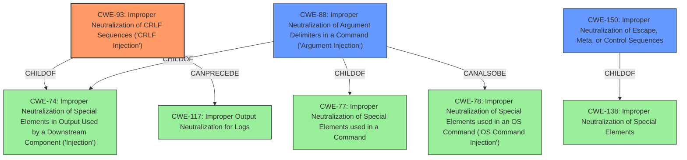

# Analysis Report for CVE-2022-31179

# Vulnerability Analysis Report: CVE-2022-31179

## Description


## Analysis (with Relationship Data)

# Summary
| CWE ID | CWE Name | Confidence | CWE Abstraction Level | CWE Vulnerability Mapping Label | CWE-Vulnerability Mapping Notes |
|---|---|---|---|---|---|
| CWE-93 | Improper Neutralization of CRLF Sequences ('CRLF Injection') | 0.85 | Base | Allowed | Primary CWE |
| CWE-88 | Improper Neutralization of Argument Delimiters in a Command ('Argument Injection') | 0.70 | Base | Allowed | Secondary Candidate |
| CWE-150 | Improper Neutralization of Escape, Meta, or Control Sequences | 0.65 | Variant | Allowed | Secondary Candidate |

## Evidence and Confidence

*   **Confidence Score:** 0.80
*   **Evidence Strength:** HIGH

## Relationship Analysis
The primary CWE, CWE-93, is a Base level weakness that focuses on the improper neutralization of CRLF sequences. It is related to CWE-74 (Improper Neutralization of Special Elements in Output Used by a Downstream Component ('Injection')) via a ChildOf relationship, indicating that CRLF injection is a specific type of injection. CWE-93 can also precede CWE-117 (Improper Output Neutralization for Logs), suggesting a chain where CRLF injection leads to log injection.

CWE-88, a secondary candidate, is also a Base level weakness related to improper neutralization of argument delimiters in commands. It is a child of CWE-77 (Improper Neutralization of Special Elements used in a Command), indicating it's a specific case of command injection. CWE-88 can also be related to CWE-78 (Improper Neutralization of Special Elements used in an OS Command ('OS Command Injection')), suggesting that argument injection can lead to OS command injection.

CWE-150, another secondary candidate, is a Variant level weakness focusing on improper neutralization of escape, meta, or control sequences. It's a child of CWE-138 (Improper Neutralization of Special Elements), indicating it's a specific type of improper neutralization.

The selection of CWE-93 as primary is based on its direct relevance to the vulnerability description, which explicitly mentions line feed characters (`\n`) being used to omit arguments. The other CWEs are considered as they represent related weaknesses that could contribute to or result from the primary weakness.



## Vulnerability Chain
The vulnerability chain starts with the **improper neutralization** of line feed characters in the Shescape package (CWE-93). This leads to **code injection**, allowing an attacker to omit subsequent arguments in cmd.exe on Windows. The chain can be summarized as:

1.  **Improper Neutralization of CRLF Sequences (CWE-93)**: The application fails to properly handle line feed characters in input.
2.  **Code Injection**: The un-neutralized line feed characters are interpreted as command separators, leading to the injection of malicious code.
3.  **Impact**: An attacker can omit arguments following their input, potentially executing arbitrary commands or disrupting the intended functionality.

## Summary of Analysis
The initial assessment considered the **code injection** vulnerability in the Shescape package, specifically the **improper neutralization** of line feed characters. The analysis focused on identifying the root cause and its immediate impact.

The evidence strongly supports the selection of CWE-93 (Improper Neutralization of CRLF Sequences ('CRLF Injection')) as the primary CWE. The vulnerability description explicitly mentions that including a line feed character (`\n`) in the payload allows an attacker to omit all arguments following their input. The "CVE Reference Links Content Summary" confirms that the root cause is "Insufficient escaping of line feed characters for cmd.exe on Windows". This aligns perfectly with the definition of CWE-93, which focuses on the **improper neutralization** of CRLF sequences.

The graph relationships further support this selection. CWE-93 is a child of CWE-74 (Improper Neutralization of Special Elements in Output Used by a Downstream Component ('Injection')), indicating that it's a specific type of injection vulnerability. It can also precede CWE-117 (Improper Output Neutralization for Logs), suggesting a potential chain where CRLF injection leads to log injection.

CWE-88 (Improper Neutralization of Argument Delimiters in a Command ('Argument Injection')) and CWE-150 (Improper Neutralization of Escape, Meta, or Control Sequences) were considered as secondary CWEs. While they are related to the vulnerability, they do not capture the specific nature of the weakness as accurately as CWE-93. CWE-88 focuses on argument delimiters, which is relevant but not as specific as CRLF sequences. CWE-150 is a more general weakness related to escape, meta, or control sequences, which is also relevant but not as precise as CWE-93.

The decision to select CWE-93 as the primary CWE is based on its direct relevance to the vulnerability description and the supporting evidence from the "CVE Reference Links Content Summary". The selected CWE is at the optimal level of specificity, as it captures the specific nature of the weakness (improper neutralization of CRLF sequences) without being too general or too narrow.


## CWE Relationship Analysis

Current CWEs represent these abstraction levels: .


### Vulnerability Chain Analysis

**Chain starting from CWE-150:**
- 150 (Improper Neutralization of Escape, Meta, or Control Sequences) - ROOT


**Chain starting from CWE-78:**
- 78 (Improper Neutralization of Special Elements used in an OS Command ('OS Command Injection')) - ROOT


### CWE Relationship Diagram

```mermaid
graph TD
    classDef primary fill:#f96,stroke:#333,stroke-width:2px
    classDef secondary fill:#69f,stroke:#333
    classDef tertiary fill:#9e9,stroke:#333
```


*Report generated on 2025-03-30 13:24:33*
