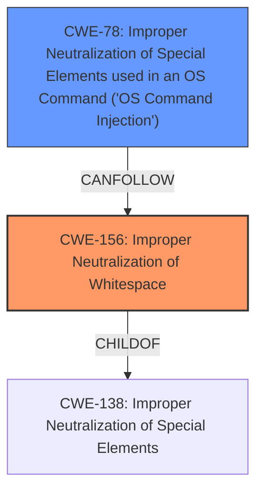

# Raw Analyzer Response for CVE-2022-31180

# Summary
| CWE ID | CWE Name | Confidence | CWE Abstraction Level | CWE Vulnerability Mapping Label | CWE-Vulnerability Mapping Notes |
|---|---|---|---|---|---|
| CWE-156 | Improper Neutralization of Whitespace | 0.9 | Variant | Primary | Allowed |
| CWE-78 | Improper Neutralization of Special Elements used in an OS Command ('OS Command Injection') | 0.7 | Base | Secondary | Allowed |

## Evidence and Confidence

*   **Confidence Score:** 0.8
*   **Evidence Strength:** HIGH

## Relationship Analysis
The primary CWE is CWE-156, which is a Variant of CWE-138 (Improper Neutralization of Special Elements). CWE-78 is related to OS command injection, which can be an impact of improper neutralization. This makes CWE-78 a possible secondary CWE, because the **insufficient escaping of white space** can lead to the injection of OS commands.

## Vulnerability Chain
The vulnerability chain starts with **insufficient escaping of white space** (CWE-156), which allows an attacker to inject shell-specific characters and commands, ultimately leading to arbitrary command execution (CWE-78).

## Summary of Analysis
The initial analysis focused on the **insufficient escaping of white space**, which is the root cause of the vulnerability. The description states, "Affected versions were found to have **insufficient escaping of white space** when interpolating output." This aligns directly with CWE-156, Improper Neutralization of Whitespace. The impact, as described, is that an attacker can "Invoke arbitrary commands by inserting a line feed character." This can be classified as CWE-78, Improper Neutralization of Special Elements used in an OS Command ('OS Command Injection'), as the attacker is able to inject OS commands due to the **insufficient escaping of white space**.

The retriever results also show that CWE-156 is a strong candidate with a high similarity score. The relationship analysis confirms that CWE-156 is a variant-level CWE, providing a specific classification for the weakness.

CWE-78 is considered as a secondary CWE because the **insufficient escaping of white space** can lead to the injection of OS commands. The evidence to support this is "Invoke shell-specific behaviour through shell-specific special characters inserted directly after whitespace" and "Invoke arbitrary commands by inserting a line feed character."

The selection of CWE-156 is at the optimal level of specificity because it directly addresses the root cause of the vulnerability which is **insufficient escaping of white space**. CWE-78 is also selected because it identifies the impact when the attacker is able to inject OS commands.

Relevant CWE Information:

# Enhanced Context (25 CWEs)
The following CWEs were identified as potentially relevant to this vulnerability:

## CWE-74: Improper Neutralization of Special Elements in Output Used by a Downstream Component ('Injection')
**Abstraction Level**: Class
**Similarity Score**: 0.79
**Source**: dense

**Description**:
The product constructs all or part of a command, data structure, or record using externally-influenced input from an upstream component, but it does not neutralize or incorrectly neutralizes special elements that could modify how it is parsed or interpreted when it is sent to a downstream component.

**Mapping Guidance**:
- Usage: Discouraged
- Rationale: CWE-74 is high-level and often misused when lower-level weaknesses are more appropriate.

*CWE-74 was considered but not selected because while this is injection, it's better classified as CWE-156.*

## CWE-184: Incomplete List of Disallowed Inputs
**Abstraction Level**: Base
**Similarity Score**: 0.77
**Source**: dense

**Description**:
The product implements a protection mechanism that relies on a list of inputs (or properties of inputs) that are not allowed by policy or otherwise require other action to neutralize before additional processing takes place, but the list is incomplete.

**Mapping Guidance**:
- Usage: Allowed
- Rationale: This CWE entry is at the Base level of abstraction, which is a preferred level of abstraction for mapping to the root causes of vulnerabilities.

*CWE-184 was considered but not selected because the **insufficient escaping of white space** is a more direct cause.*

## CWE-138: Improper Neutralization of Special Elements
**Abstraction Level**: Class
**Similarity Score**: 0.77
**Source**: dense

**Description**:
The product receives input from an upstream component, but it does not neutralize or incorrectly neutralizes special elements that could be interpreted as control elements or syntactic markers when they are sent to a downstream component.

**Mapping Guidance**:
- Usage: Discouraged
- Rationale: This CWE entry is a level-1 Class (i.e., a child of a Pillar). It might have lower-level children that would be more appropriate

*CWE-138 was considered but not selected because a more specific CWE is available, specifically CWE-156.*

## CWE-88: Improper Neutralization of Argument Delimiters in a Command ('Argument Injection')
**Abstraction Level**: Base
**Similarity Score**: 0.77
**Source**: dense

**Description**:
The product constructs a string for a command to be executed by a separate component
in another control sphere, but it does not properly delimit the
intended arguments, options, or switches within that command string.

**Mapping Guidance**:
- Usage: Allowed
- Rationale: This CWE entry is at the Base level of abstraction, which is a preferred level of abstraction for mapping to the root causes of vulnerabilities.

*CWE-88 was considered because the attacker is injecting arguments into a command, but it is not selected because the root cause is the **insufficient escaping of white space**.*

## CWE-150: Improper Neutralization of Escape, Meta, or Control Sequences
**Abstraction Level**: Variant
**Similarity Score**: 0.76
**Source**: dense

**Description**:
The product receives input from an upstream component, but it does not neutralize or incorrectly neutralizes special elements that could be interpreted as escape, meta, or control character sequences when they are sent to a downstream component.

**Mapping Guidance**:
- Usage: Allowed
- Rationale: This CWE entry is at the Variant level of abstraction, which is a preferred level of abstraction for mapping to the root causes of vulnerabilities.

*CWE-150 was considered, but CWE-156 is a better fit because it directly identifies the **insufficient escaping of white space** as the cause of the vulnerability.*

## CWE-917: Improper Neutralization of Special Elements used in an Expression Language Statement ('Expression Language Injection')
**Abstraction Level**: Base
**Similarity Score**: 0.76
**Source**: dense

**Description**:
The product constructs all or part of an expression language (EL) statement in a framework such as a Java Server Page (JSP) using externally-influenced input from an upstream component, but it does not neutralize or incorrectly neutralizes special elements that could modify the intended EL statement before it is executed.

**Mapping Guidance**:
- Usage: Allowed
- Rationale: This CWE entry is at the Base level of abstraction, which is a preferred level of abstraction for mapping to the root causes of vulnerabilities.

*CWE-917 was considered but not selected because it is specific to expression language injection, which is not the case here.*

## CWE-116: Improper Encoding or Escaping of Output
**Abstraction Level**: Class
**Similarity Score**: 0.76
**Source**: dense

**Description**:
The product prepares a structured message for communication with another component, but encoding or escaping of the data is either missing or done incorrectly. As a result, the intended structure of the message is not preserved.

**Mapping Guidance**:
- Usage: Allowed-with-Review
- Rationale: This CWE entry is a Class and might have Base-level children that would be more appropriate

*CWE-116 was considered but not selected because it is a class-level CWE and a more specific CWE is available (CWE-156).*

## CWE-80: Improper Neutralization of Script-Related HTML Tags in a Web Page (Basic XSS)
**Abstraction Level**: Variant
**Similarity Score**: 0.76
**Source**: dense

**Description**:
The product receives input from an upstream component, but it does not neutralize or incorrectly neutralizes special characters such as "<", ">", and "&" that could be interpreted as web-scripting elements when they are sent to a downstream component that processes web pages.

**Mapping Guidance**:
- Usage: Allowed
- Rationale: This