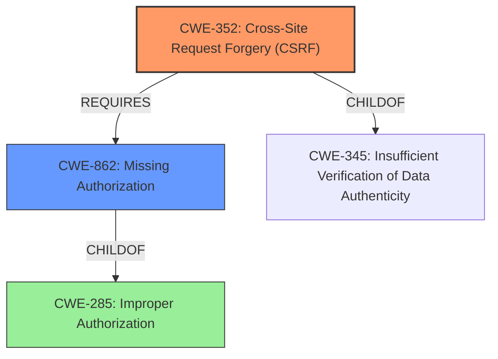

# Analysis for CVE-2022-3119

# Summary
| CWE ID | CWE Name | Confidence | CWE Abstraction Level | CWE Vulnerability Mapping Label | CWE-Vulnerability Mapping Notes |
|---|---|---|---|---|---|
| CWE-352 | Cross-Site Request Forgery (CSRF) | 1.0 | Compound | Allowed | Primary CWE |
| CWE-862 | Missing Authorization | 0.9 | Class | Allowed-with-Review | Secondary Candidate |

## Evidence and Confidence

*   **Confidence Score:** 0.95
*   **Evidence Strength:** HIGH

## Relationship Analysis
The primary relationship is between CWE-352 and CWE-345 (Parent). CWE-352 is a compound weakness composed of multiple contributing factors. CWE-862, Missing Authorization, is a class-level weakness which could be related, especially as a prerequisite for CSRF. Both CWE-352 and CWE-862 are children of CWE-285 (Improper Authorization).

## Vulnerability Chain
The vulnerability chain starts with the **lack of authorization and CSRF protection** when updating the plugin's settings. This **missing authorization** (CWE-862) allows unauthenticated attackers to attempt to update the settings. The **missing CSRF protection** (CWE-352) allows the attacker to successfully modify the settings if they can craft a valid request, leading to the ability to change the OAuth endpoints. The final impact is that the attacker can then authenticate as an administrator if they know the correct email address, leading to a complete compromise of the WordPress site.

## Summary of Analysis
The primary weakness is the **lack of authorization and CSRF protection**, allowing unauthenticated attackers to update the settings of the OAuth client Single Sign On WordPress plugin. The description states that the plugin "**does not have authorisation and CSRF when updating its settings**". This allows attackers to change the OAuth endpoints and potentially gain administrative access.

The analysis is based on the provided evidence, specifically the "Vulnerability Description Key Phrases" and the "CVE Reference Links Content Summary". The "CVE Reference Links Content Summary" explicitly states that the "**Root cause of vulnerability**" is that "The plugin lacks proper authorization and CSRF protection when updating its settings." The description explicitly mentions the **lack of authorization and CSRF protection**, making CWE-352 and CWE-862 appropriate choices.

CWE-352 (Cross-Site Request Forgery) is chosen as the primary CWE because the vulnerability description explicitly mentions the **lack of CSRF protection**. CWE-352 is a compound weakness that requires multiple conditions to be met, which aligns with the vulnerability description.

CWE-862 (Missing Authorization) is chosen as a secondary CWE because the vulnerability description also explicitly mentions the **lack of authorization**. While authentication is present, authorization to update the configuration is missing.

CWE-306 (Missing Authentication for Critical Function) was considered but deemed less appropriate because the description indicates that the vulnerability is primarily due to a **lack of authorization**, not a complete **lack of authentication**. Some form of authentication exists, but it does not properly restrict who can update the settings.

CWE-285 (Improper Authorization) was considered, but the children CWE-862 (Missing Authorization) is a better fit as it is more specific.

CWE-863 (Incorrect Authorization) was considered, but it's less appropriate than CWE-862, as there appears to be no authorization check at all.

The selected CWEs are at an optimal level of specificity. CWE-352 is a compound weakness that accurately describes the CSRF aspect of the vulnerability. CWE-862 is a class-level weakness that accurately describes the missing authorization aspect of the vulnerability.

Relevant CWE Information:

# Enhanced Context (25 CWEs)
The following CWEs were identified as potentially relevant to this vulnerability:

## CWE-472: External Control of Assumed-Immutable Web Parameter
**Abstraction Level**: Base
**Similarity Score**: 0.79
**Source**: dense

**Description**:
The web application does not sufficiently verify inputs that are assumed to be immutable but are actually externally controllable, such as hidden form fields.

**Mapping Guidance**:
- Usage: Allowed
- Rationale: This CWE entry is at the Base level of abstraction, which is a preferred level of abstraction for mapping to the root causes of vulnerabilities.

## CWE-434: Unrestricted Upload of File with Dangerous Type
**Abstraction Level**: Base
**Similarity Score**: 0.79
**Source**: dense

**Description**:
The product allows the upload or transfer of dangerous file types that are automatically processed within its environment.

**Mapping Guidance**:
- Usage: Allowed
- Rationale: This CWE entry is at the Base level of abstraction, which is a preferred level of abstraction for mapping to the root causes of vulnerabilities.

## CWE-1289: Improper Validation of Unsafe Equivalence in Input
**Abstraction Level**: Base
**Similarity Score**: 0.78
**Source**: dense

**Description**:
The product receives an input value that is used as a resource identifier or other type of reference, but it does not validate or incorrectly validates that the input is equivalent to a potentially-unsafe value.

**Mapping Guidance**:
- Usage: Allowed
- Rationale: This CWE entry is at the Base level of abstraction, which is a preferred level of abstraction for mapping to the root causes of vulnerabilities.

## CWE-552: Files or Directories Accessible to External Parties
**Abstraction Level**: Base
**Similarity Score**: 0.78
**Source**: dense

**Description**:
The product makes files or directories accessible to unauthorized actors, even though they should not be.

**Mapping Guidance**:
- Usage: Allowed
- Rationale: This CWE entry is at the Base level of abstraction, which is a preferred level of abstraction for mapping to the root causes of vulnerabilities.

## CWE-184: Incomplete List of Disallowed Inputs
**Abstraction Level**: Base
**Similarity Score**: 0.78
**Source**: dense

**Description**:
The product implements a protection mechanism that relies on a list of inputs (or properties of inputs) that are not allowed by policy or otherwise require other action to neutralize before additional processing takes place, but the list is incomplete.

**Mapping Guidance**:
- Usage: Allowed
- Rationale: This CWE entry is at the Base level of abstraction, which is a preferred level of abstraction for mapping to the root causes of vulnerabilities.

## CWE-807: Reliance on Untrusted Inputs in a Security Decision
**Abstraction Level**: Base
**Similarity Score**: 0.78
**Source**: dense

**Description**:
The product uses a protection mechanism that relies on the existence or values of an input, but the input can be modified by an untrusted actor in a way that bypasses the protection mechanism.

**Mapping Guidance**:
- Usage: Allowed
- Rationale: This CWE entry is at the Base level of abstraction, which is a preferred level of abstraction for mapping to the root causes of vulnerabilities.

## CWE-639: Authorization Bypass Through User-Controlled Key
**Abstraction Level**: Base
**Similarity Score**: 0.77
**Source**: dense

**Description**:
The system's authorization functionality does not prevent one user from gaining access to another user's data or record by modifying the key value identifying the data.

**Mapping Guidance**:
- Usage: Allowed
- Rationale: This CWE entry is at the Base level of abstraction, which is a preferred level of abstraction for mapping to the root causes of vulnerabilities.

## CWE-41: Improper Resolution of Path Equivalence
**Abstraction Level**: Base
**Similarity Score**: 0.77
**Source**: dense

**Description**:
The product is vulnerable to file system contents disclosure through path equivalence. Path equivalence involves the use of special characters in file and directory names. The associated manipulations are intended to generate multiple names for the same object.

**Mapping Guidance**:
- Usage: Allowed
- Rationale: This CWE entry is at the Base level of abstraction, which is a preferred level of abstraction for mapping to the root causes of vulnerabilities.

## CWE-425: Direct Request ('Forced Browsing')
**Abstraction Level**: Base
**Similarity Score**: 0.77
**Source**: dense

**Description**:
The web application does not adequately enforce appropriate authorization on all restricted URLs, scripts, or files.

**Mapping Guidance