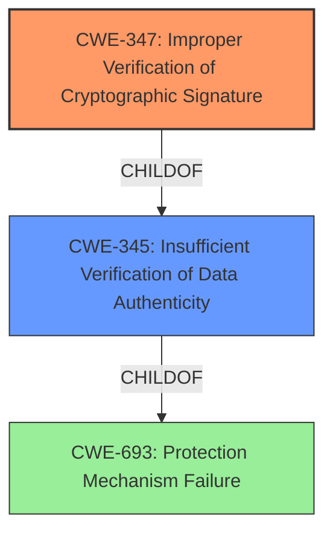

# Enhanced Analysis for CVE-2022-31206

# Summary

| CWE ID  | CWE Name                                                    | Confidence | CWE Abstraction Level | CWE Vulnerability Mapping Label | CWE-Vulnerability Mapping Notes |
| :-------- | :---------------------------------------------------------- | :---------- | :-------------------- | :------------------------------ | :------------------------------ |
| CWE-347   | Improper Verification of Cryptographic Signature           | 0.9         | Base                  | Primary CWE                     | Allowed                       |
| CWE-345   | Insufficient Verification of Data Authenticity            | 0.7         | Class                 | Secondary Candidate             | Discouraged                    |

## Evidence and Confidence

*   **Confidence Score:** 0.9
*   **Evidence Strength:** HIGH

## Relationship Analysis

The primary CWE is CWE-347, which is a `Base` level weakness. The secondary CWE is CWE-345 which is a `Class` level weakness and parent of CWE-347. The vulnerability description clearly indicates a **lack of cryptographic authentication**, aligning directly with CWE-347's focus on improper signature verification. While CWE-345 is a broader category, the specific **lack of cryptographic authentication** makes CWE-347 a more precise fit.



## Vulnerability Chain

The vulnerability chain begins with the **lack of cryptographic authentication** (CWE-347), which allows an attacker to **manipulate transmitted object code**. This manipulation leads to the **execution of arbitrary machine code** on the PLC's CPU module. The chain can be summarized as:

CWE-347 (Root Cause: **Lack of cryptographic authentication**) -> Manipulation of transmitted object code -> Execution of arbitrary machine code (Impact).

## Summary of Analysis

The initial analysis and subsequent refinement focused on identifying the most specific CWE that accurately reflects the root cause of the vulnerability. The vulnerability description and CVE summary clearly point to a **lack of cryptographic authentication** as the primary issue.

The evidence supporting this decision is:

*   **Vulnerability Description Key Phrases:** "**rootcause:** **lack of cryptographic authentication**"
*   **CVE Reference Links Content Summary:** "Insufficient verification of data authenticity during the download of logic to the PLC. Specifically, the transmitted object code is not cryptographically authenticated."

While CWE-345 (Insufficient Verification of Data Authenticity) is a related and more general category, CWE-347 (Improper Verification of Cryptographic Signature) provides a more precise description of the vulnerability's root cause. The graph relationships show that CWE-347 is a child of CWE-345, indicating a hierarchical relationship where CWE-347 is a more specific instance of the broader authentication issue.

The selection of CWE-347 as the primary CWE is based on its direct alignment with the documented **lack of cryptographic authentication**. This choice ensures the most accurate and detailed representation of the vulnerability's underlying weakness.

Relevant CWE Information:

# Enhanced Context (25 CWEs)

## CWE-347: Improper Verification of Cryptographic Signature
**Abstraction:** Base
**Status:** Draft

### Description
The product does not verify, or incorrectly verifies, the cryptographic signature for data.

### Extended Description
Not provided

### Alternative Terms
None

### Relationships
ChildOf -> CWE-345
ChildOf -> CWE-345

### Mapping Guidance
**Usage:** Allowed
**Rationale:** This CWE entry is at the Base level of abstraction, which is a preferred level of abstraction for mapping to the root causes of vulnerabilities.
**Comments:** Carefully read both the name and description to ensure that this mapping is an appropriate fit. Do not try to 'force' a mapping to a lower-level Base/Variant simply to comply with this preferred level of abstraction.
**Reasons:**
- Acceptable-Use

### Observed Examples
- **CVE-2002-1796:** Does not properly verify signatures for "trusted" entities.
- **CVE-2005-2181:** Insufficient verification allows spoofing.
- **CVE-2005-2182:** Insufficient verification allows spoofing.

## CWE-345: Insufficient Verification of Data Authenticity
**Abstraction:** Class
**Status:** Draft

### Description
The product does not sufficiently verify the origin or authenticity of data, in a way that causes it to accept invalid data.

### Extended Description
Not provided

### Alternative Terms
None

### Relationships
ChildOf -> CWE-693

### Mapping Guidance
**Usage:** Discouraged
**Rationale:** This CWE entry is a level-1 Class (i.e., a child of a Pillar). It might have lower-level children that would be more appropriate
**Comments:** Examine children of this entry to see if there is a better fit
**Reasons:**
- Abstraction

### Additional Notes
**[Relationship]** "origin validation" could fall under this.

**[Maintenance]** The specific ways in which the origin is not properly identified should be laid out as separate weaknesses. In some sense, this is more like a category.

### Observed Examples
- **CVE-2022-30260:** Distributed Control System (DCS) does not sign firmware images and only relies on insecure checksums for integrity checks
- **CVE-2022-30267:** Distributed Control System (DCS) does not sign firmware images and only relies on insecure checksums for integrity checks
- **CVE-2022-30272:** Remote Terminal Unit (RTU) does not use signatures for firmware images and relies on insecure checksums


## CWE Relationship Analysis

Current CWEs represent these abstraction levels: .


### Vulnerability Chain Analysis

**Chain starting from CWE-345:**
- 345 (Insufficient Verification of Data Authenticity) - ROOT


**Chain starting from CWE-693:**
- 693 (Protection Mechanism Failure) - ROOT


### CWE Relationship Diagram

```mermaid
graph TD
    classDef primary fill:#f96,stroke:#333,stroke-width:2px
    classDef secondary fill:#69f,stroke:#333
    classDef tertiary fill:#9e9,stroke:#333
```