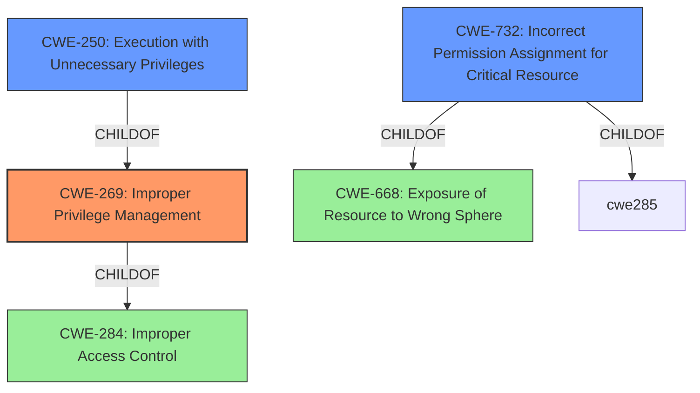

# Raw Analyzer Response for CVE-2022-31216

# Summary
| CWE ID | CWE Name | Confidence | CWE Abstraction Level | CWE Vulnerability Mapping Label | CWE-Vulnerability Mapping Notes |
|---|---|---|---|---|---|
| CWE-269 | Improper Privilege Management | 0.9 | Class | Primary | Discouraged |
| CWE-250 | Execution with Unnecessary Privileges | 0.7 | Base | Secondary | Allowed |
| CWE-732 | Incorrect Permission Assignment for Critical Resource | 0.6 | Class | Secondary | Allowed-with-Review |

## Evidence and Confidence

*   **Confidence Score:** 0.8
*   **Evidence Strength:** MEDIUM

## Relationship Analysis
The primary CWE, CWE-269, is a Class-level CWE that describes **improper privilege management**. It is the parent of CWE-250 and CWE-732. CWE-250, **execution with unnecessary privileges**, is a Base-level CWE and a child of CWE-269. CWE-732, **incorrect permission assignment for critical resource**, is a Class-level CWE and a child of CWE-285 and CWE-668.

## Vulnerability Chain
The vulnerability chain starts with the **improper access control** in the Drive Composer installer file, which allows a low-privileged user to run a repair operation. This leads to the ability to create and write to a file anywhere on the file system as SYSTEM with arbitrary content.

## Summary of Analysis
The initial analysis identified CWE-269 as the primary CWE, which aligns with the **improper access control** vulnerability description key phrase. The description indicates that a low-privileged user can perform actions with SYSTEM privileges, which suggests a privilege management issue.

The evidence for the primary CWE is: "**improper access control**" allows a low privileged attacker to create and write to a file anywhere on the file system as SYSTEM".

CWE-250 is a potential secondary CWE, as the low-privileged user is executing a repair operation with SYSTEM privileges.
CWE-732 is a potential secondary CWE, as the **incorrect permission assignment** on the file system.

CWE-269 is generally discouraged: "CWE-269 is commonly misused. It can be conflated with "privilege escalation," which is a technical impact that is listed in many low-information vulnerability reports [REF-1287]. It is not useful for trend analysis." However, the presence of the "**improper access control**" key phrase provides some support for its selection.

The selection of CWE-269 is at the optimal level of specificity because it directly addresses the **improper privilege management** issue. CWE-250 and CWE-732 are considered secondary because they provide a more granular view of the issue.