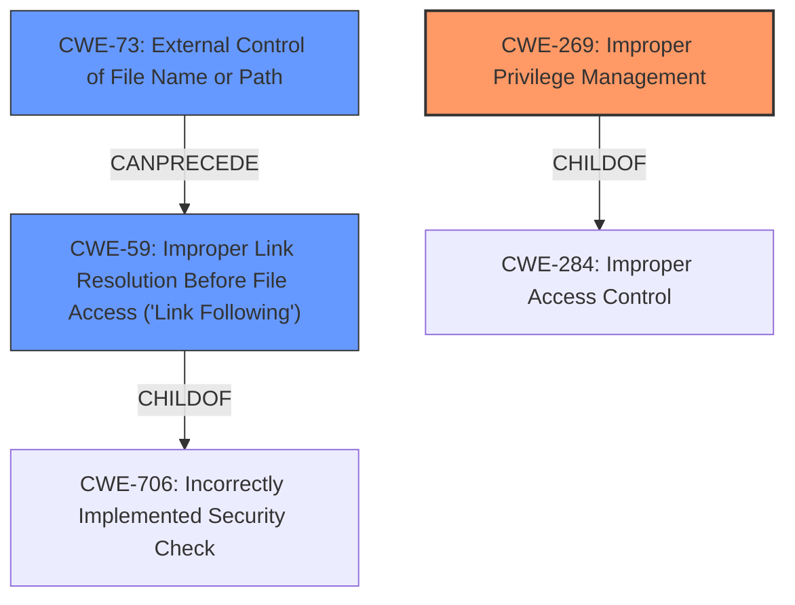

# Enhanced Analysis for CVE-2022-31218

# Summary
| CWE ID | CWE Name | Confidence | CWE Abstraction Level | CWE Vulnerability Mapping Label | CWE-Vulnerability Mapping Notes |
|---|---|---|---|---|---|
| CWE-269 | Improper Privilege Management | 0.8 | Class | Primary | Discouraged |
| CWE-73 | External Control of File Name or Path | 0.6 | Base | Secondary | Allowed |
| CWE-59 | Improper Link Resolution Before File Access ('Link Following') | 0.5 | Base | Secondary | Allowed |

## Evidence and Confidence

*   **Confidence Score:** 0.7
*   **Evidence Strength:** MEDIUM

## Relationship Analysis
The primary CWE selected is CWE-269, "Improper Privilege Management", which is a Class-level CWE. This has a child relationship to CWE-284, "Improper Access Control". The Retriever results suggest CWE-59, "Improper Link Resolution Before File Access ('Link Following')", and CWE-73, "External Control of File Name or Path", as potential candidates. CWE-59 has a child relationship to CWE-706, "Incorrectly Implemented Security Check". CWE-73 can precede CWE-59. These relationships, particularly the parent-child relationship involving CWE-269 and the potential chain involving CWE-73 and CWE-59, helped narrow down the selection.



## Vulnerability Chain
The vulnerability chain starts with a low-privileged attacker being able to trigger a repair operation. This leads to the ability to create and write to a file anywhere on the file system as SYSTEM, with arbitrary content, if the file does not already exist. This suggests an initial **improper privilege management** issue (CWE-269). The ability to write arbitrary content to arbitrary locations hints at potential **external control of file name or path** (CWE-73), which could lead to **improper link resolution** (CWE-59).

## Summary of Analysis
Initially, the vulnerability description points to a privilege management issue, where a low-privileged user can perform actions with SYSTEM privileges. The description states, "Vulnerabilities in the Drive Composer allow a low privileged attacker to create and write to a file anywhere on the file system as SYSTEM with arbitrary content as long as the file does not already exist." This is strong evidence of **improper privilege management**.

CWE-269 "Improper Privilege Management" is a Class-level CWE and marked as "Discouraged" due to frequent misuse. However, the description clearly indicates a problem with privilege management. The "CWE for similar CVE Descriptions" section lists CWE-269 as the Primary CWE Match. The discouragement is due to it being often misused, but in this case, it's a reasonable starting point given the direct evidence.

The retriever results suggest other CWEs, like CWE-59 "Improper Link Resolution Before File Access ('Link Following')" and CWE-73 "External Control of File Name or Path". These CWEs could be related if the attacker can manipulate file paths or create links to bypass security checks. The phrase "create and write to a file anywhere on the file system" supports the possibility of CWE-73. CWE-59 could be relevant if the repair operation involves following links.

The final decision is to include CWE-269 as the primary CWE due to the clear evidence of a low-privileged user gaining SYSTEM privileges. CWE-73 and CWE-59 are included as secondary CWEs due to the possibility of path manipulation and link following during the file creation process. These are at the Base level of abstraction, providing more specific details than CWE-269. Overall, the selected CWEs provide a good representation of the vulnerability, balancing the need for specificity with the evidence available.


## CWE Relationship Analysis

Current CWEs represent these abstraction levels: .


### Vulnerability Chain Analysis

**Chain starting from CWE-706:**
- 706 (Use of Incorrectly-Resolved Name or Reference) - ROOT


**Chain starting from CWE-73:**
- 73 (External Control of File Name or Path) - ROOT


### CWE Relationship Diagram

```mermaid
graph TD
    classDef primary fill:#f96,stroke:#333,stroke-width:2px
    classDef secondary fill:#69f,stroke:#333
    classDef tertiary fill:#9e9,stroke:#333
```