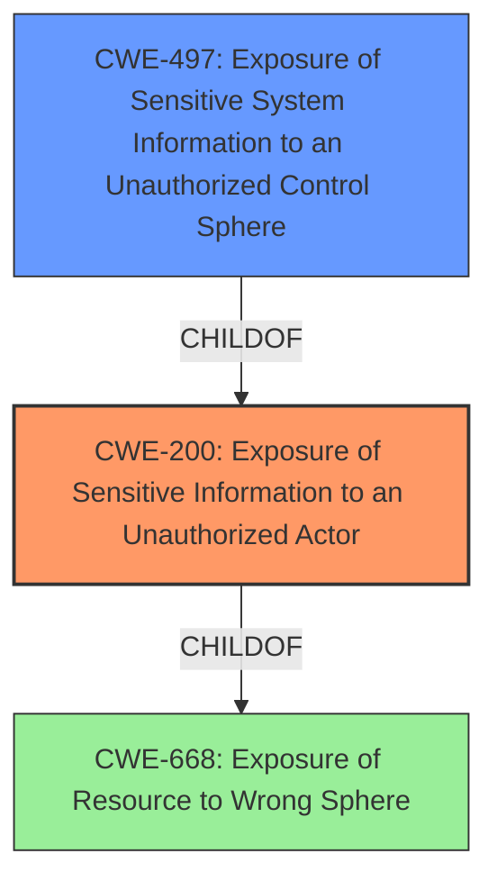

# Analysis for CVE-2022-31221

# Summary
| CWE ID  | CWE Name | Confidence | CWE Abstraction Level | CWE Vulnerability Mapping Label | CWE-Vulnerability Mapping Notes |
|-----------------|-----------------------------------------------------------------|-------------------|-------------------------|-----------------------------------|-------------------------------------------------------------------------------------------------------------|
| CWE-200 | Exposure of Sensitive Information to an Unauthorized Actor | 0.9 | Class | Primary | Discouraged: CWE-200 is commonly misused to represent the loss of confidentiality in a vulnerability, but confidentiality loss is a technical impact - not a root cause error. |
| CWE-497 | Exposure of Sensitive System Information to an Unauthorized Control Sphere | 0.7 | Base | Secondary | Allowed |

## Evidence and Confidence

*   **Confidence Score:** 0.8
*   **Evidence Strength:** HIGH

## Relationship Analysis
The primary CWE is CWE-200, which is a Class-level CWE. CWE-200 has a parent of CWE-668 (Exposure of Resource to Wrong Sphere), which is a higher level Class. CWE-497, a Base-level CWE, is a more specific type of CWE-200 that involves system information.

## Vulnerability Chain
The vulnerability chain involves **information exposure** in Dell BIOS versions, leading to a local authenticated administrator gaining access to sensitive state information.

## Summary of Analysis
The vulnerability is described as an **Information Exposure** vulnerability in Dell BIOS versions. A local authenticated administrator user can exploit this vulnerability to access sensitive state information on the system.

Based on the vulnerability description and the retriever results, CWE-200 (Exposure of Sensitive Information to an Unauthorized Actor) is the most appropriate primary CWE. The vulnerability involves the exposure of sensitive state information, which aligns with the description of CWE-200. However, CWE-200 is a Class-level CWE and is often misused.

CWE-497 (Exposure of Sensitive System Information to an Unauthorized Control Sphere) is a more specific Base-level CWE that is also relevant. Given the vulnerability occurs in the BIOS and allows access to "sensitive state information," it can be argued that system-level information is exposed, making CWE-497 a relevant secondary CWE.

The final selection of CWE-200 and CWE-497 is based on the evidence provided and the relationships between the CWEs. While the description uses "sensitive state information" and the CWE-497 description uses "sensitive system-level information," it can be argued that state information in the BIOS is considered system-level.