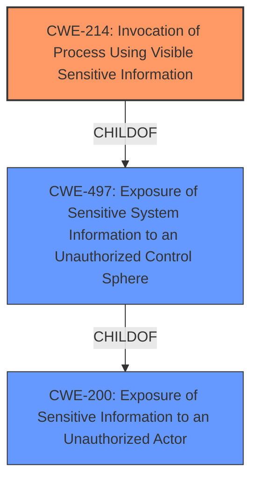

# Raw Analyzer Response for CVE-2022-31238

# Summary
| CWE ID    | CWE Name                                                              | Confidence | CWE Abstraction Level | CWE Vulnerability Mapping Label | CWE-Vulnerability Mapping Notes |
| :--------- | :-------------------------------------------------------------------- | :--------- | :-------------------- | :------------------------------ | :---------------------------- |
| CWE-214   | Invocation of Process Using Visible Sensitive Information           | 0.9        | Base                  | Primary CWE                    | Allowed                      |
| CWE-497   | Exposure of Sensitive System Information to an Unauthorized Control Sphere | 0.6        | Base                  | Secondary Candidate                  | Allowed                      |
| CWE-200   | Exposure of Sensitive Information to an Unauthorized Actor          | 0.4        | Class                  | Secondary Candidate                  | Discouraged                  |

## Evidence and Confidence

*   **Confidence Score:** 0.8
*   **Evidence Strength:** HIGH

## Relationship Analysis
The primary CWE is CWE-214 **Invocation of Process Using Visible Sensitive Information**, which is a base level CWE and a child of CWE-497 **Exposure of Sensitive System Information to an Unauthorized Control Sphere**. CWE-497 is a base level CWE. CWE-200 **Exposure of Sensitive Information to an Unauthorized Actor** is a class level CWE and a parent of CWE-497. The relationships helped in choosing the most specific CWE, which is CWE-214.

## Vulnerability Chain
The chain of events is as follows:
1.  A **process is invoked with sensitive information**. (CWE-214)
2.  A CLI user can access this **process invoked with sensitive information**.
3.  This leads to **information disclosure**.

## Summary of Analysis
The vulnerability description clearly states that a **process is invoked with sensitive information**, which a CLI user can exploit to achieve information disclosure. This aligns directly with CWE-214 **Invocation of Process Using Visible Sensitive Information**.

The evidence supporting this is:
*   "Dell PowerScale OneFS...contain a **process invoked with sensitive information** vulnerability."
*   "A CLI user may potentially exploit this vulnerability, leading to information disclosure."
*   "The vulnerability stems from a process being invoked with sensitive information within Dell PowerScale OneFS."
*   "The attacker needs to be a CLI user with low privileges to exploit the vulnerability."

CWE-214 is a Base level CWE, which is the preferred level of abstraction. The retriever also lists CWE-214 as the top result.

CWE-497 **Exposure of Sensitive System Information to an Unauthorized Control Sphere** was considered as a secondary CWE, since it is a parent of CWE-214 and the description mentions sensitive system information. This CWE was not selected as the primary because CWE-214 is more specific to the vulnerability.

CWE-200 **Exposure of Sensitive Information to an Unauthorized Actor** was also considered because the vulnerability leads to information disclosure. However, CWE-200 is a Class level CWE and is discouraged. Also, it represents the impact rather than the root cause.

The chosen CWEs are at the optimal level of specificity because CWE-214 directly addresses the **root cause** of the vulnerability and is a Base level CWE. CWE-497 is a base level CWE that is a parent of CWE-214.