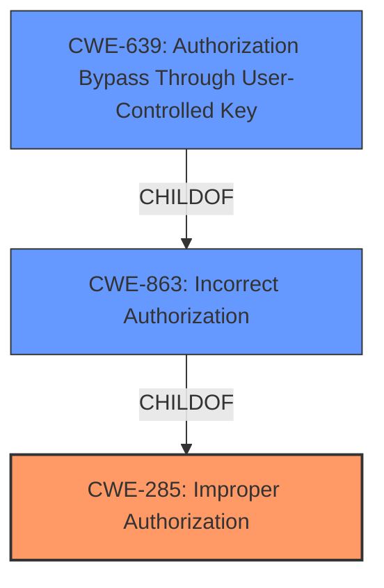

# Analysis Report for CVE-2022-31247

# Vulnerability Analysis Report: CVE-2022-31247

## Description


## Analysis (with Relationship Data)

# Summary
| CWE ID | CWE Name | Confidence | CWE Abstraction Level | CWE Vulnerability Mapping Label | CWE-Vulnerability Mapping Notes |
|---|---|---|---|---|---|
| CWE-285 | Improper Authorization | 1 | Class | Primary | Allowed-with-Review, Class-level, but direct match to **Improper Authorization** rootcause.|
| CWE-863 | Incorrect Authorization | 0.8 | Class | Secondary | Allowed-with-Review, a child of CWE-285, but the authorization check exists but is incorrect.|
| CWE-639 | Authorization Bypass Through User-Controlled Key | 0.7 | Base | Secondary | Allowed, user can modify key value identifying the data to gain access to another user's data, however, the key in this case is CRTB/PRTB.|

## Evidence and Confidence

*   **Confidence Score:** 0.8
*   **Evidence Strength:** HIGH

## Relationship Analysis
The primary CWE is CWE-285, with CWE-863 as a more specific child. CWE-639 is also a child of CWE-863 and represents the authorization bypass through user-controlled keys.



## Vulnerability Chain
The chain of events is as follows:
1.  **Root Cause:** **Improper Authorization** (CWE-285) in SUSE Rancher.
2.  **Mechanism:** User with permissions to create/edit cluster role template bindings or project role template bindings.
3.  **Vulnerability:** The system **does not properly validate** the relationship between the namespace and cluster name in CRTB/PRTB configurations.
4.  **Exploitation:** Modifying bindings to grant themselves elevated privileges.
5.  **Impact:** Gain owner permission in another project in the same cluster or in another project on a different downstream cluster.

## Summary of Analysis
The initial analysis was based on the **Improper Authorization** rootcause. The retriever results confirmed this direction, with CWE-285 being a top candidate.

The vulnerability description clearly indicates an authorization issue, as the root cause identified is "**Improper Authorization**". The vulnerability allows a user with specific permissions to elevate their privileges and gain unauthorized access to other projects.

The evidence includes:
- "An **Improper Authorization** vulnerability in SUSE Rancher"
- "allows any user who has permissions to create/edit cluster role template bindings or project role template bindings...to gain owner permission in another project"
- "The core issue is that the system does not properly validate the relationship between the namespace and cluster name in CRTB/PRTB configurations, allowing users to modify bindings to grant themselves elevated privileges in other clusters or projects."

CWE-285 (Improper Authorization) is a Class-level CWE, but it is the most direct match to the identified root cause. CWE-863 (Incorrect Authorization) is a child of CWE-285 and is also relevant, as the authorization check exists but is not correctly performed. CWE-639 (Authorization Bypass Through User-Controlled Key) provides a more specific description, as the user is able to modify the CRTB/PRTB which acts as a key to gain unauthorized access.

CWE-284 (Improper Access Control) was considered but deemed too general, as it is a Pillar-level CWE. Other CWEs like CWE-267 (Privilege Defined With Unsafe Actions) and CWE-862 (Missing Authorization) were also considered but were not as relevant as CWE-285, CWE-863 and CWE-639.


## CWE Relationship Analysis

Current CWEs represent these abstraction levels: .


### Vulnerability Chain Analysis

**Chain starting from CWE-862:**
- 862 (Missing Authorization) - ROOT


**Chain starting from CWE-267:**
- 267 (Privilege Defined With Unsafe Actions) - ROOT


### CWE Relationship Diagram

```mermaid
graph TD
    classDef primary fill:#f96,stroke:#333,stroke-width:2px
    classDef secondary fill:#69f,stroke:#333
    classDef tertiary fill:#9e9,stroke:#333
```


*Report generated on 2025-03-31 00:40:58*
