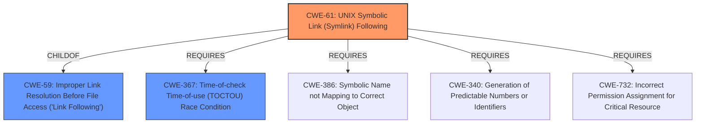

# Analysis for CVE-2022-31250

# Summary
| CWE ID | CWE Name | Confidence | CWE Abstraction Level | CWE Vulnerability Mapping Label | CWE-Vulnerability Mapping Notes |
|---|---|---|---|---|---|
| CWE-61 | UNIX Symbolic Link (Symlink) Following | 1.0 | Compound | Allowed | Primary CWE |
| CWE-59 | Improper Link Resolution Before File Access ('Link Following') | 0.7 | Base | Allowed | Secondary Candidate |
| CWE-367 | Time-of-check Time-of-use (TOCTOU) Race Condition | 0.6 | Base | Allowed | Secondary Candidate |

## Evidence and Confidence

*   **Confidence Score:** 0.9
*   **Evidence Strength:** HIGH

## Relationship Analysis
The primary CWE, CWE-61, is a compound weakness comprising multiple required elements. It is a child of CWE-59, Improper Link Resolution Before File Access, which is a more general base class. CWE-367, Time-of-check Time-of-use (TOCTOU) Race Condition, is related to CWE-61 because race conditions can enable link following. Selecting CWE-61 acknowledges the specific exploitation of symlinks in a UNIX environment.

## Vulnerability Chain
The vulnerability chain starts with the `keylime` user having write access to `/var/lib/keylime`. An attacker creates a symlink within this directory. The `%post` scriptlet then uses `chown` to change the ownership of the symlink's target, leading to potential privilege escalation to root.

Root Cause: **UNIX Symbolic Link (Symlink) Following**
Weakness: Insecure use of `chown` in the `%post` scriptlet.
Impact: Privilege escalation from `keylime` user to root.

## Summary of Analysis
The initial assessment identified **UNIX Symbolic Link (Symlink) Following** as the primary weakness. The analysis confirmed that the vulnerability involves the exploitation of symlinks to modify arbitrary files, leading to privilege escalation. The evidence from the CVE Reference Links Content Summary clearly supports this classification: "The `%post` scriptlet used `chown` on files and directories within `/var/lib/keylime`, a directory writable by the `keylime` user... The `chown` command in the script followed symbolic links, allowing the `keylime` user to change the ownership of arbitrary files."

CWE-61 is a compound weakness that accurately represents the vulnerability, as it involves multiple contributing factors, including insecure permissions, the presence of symlinks, and the actions performed on those symlinks. The selection of CWE-61 is further supported by the "Vulnerability Description Key Phrases", which explicitly mentions "**UNIX Symbolic Link (Symlink) Following**" as the root cause.

CWE-59 was considered but deemed less specific than CWE-61, as CWE-61 explicitly addresses UNIX symlinks, while CWE-59 is a more general case of improper link resolution. CWE-367 (TOCTOU) was also considered, as race conditions could theoretically exacerbate the vulnerability, but the primary issue is the **improper handling of symlinks**, not necessarily a race condition. Other CWEs, such as CWE-22 (Path Traversal) and CWE-73 (External Control of File Name or Path), were deemed less relevant because the core issue is the following of symlinks, rather than path manipulation.

The final decision to use CWE-61 is based on the specific evidence of symlink exploitation in a UNIX environment, making it the most accurate and specific classification. The provided evidence strongly supports this classification, resulting in high confidence.

Relevant CWE Information:

# Enhanced Context (25 CWEs)
The following CWEs were identified as potentially relevant to this vulnerability:

## CWE-59: Improper Link Resolution Before File Access ('Link Following')
**Abstraction Level**: Base
**Similarity Score**: 0.81
**Source**: dense

**Description**:
The product attempts to access a file based on the filename, but it does not properly prevent that filename from identifying a link or shortcut that resolves to an unintended resource.

**Mapping Guidance**:
- Usage: Allowed
- Rationale: This CWE entry is at the Base level of abstraction, which is a preferred level of abstraction for mapping to the root causes of vulnerabilities.

## CWE-61: UNIX Symbolic Link (Symlink) Following
**Abstraction Level**: Compound
**Similarity Score**: 0.79
**Source**: dense

**Description**:
The product, when opening a file or directory, does not sufficiently account for when the file is a symbolic link that resolves to a target outside of the intended control sphere. This could allow an attacker to cause the product to operate on unauthorized files.

**Mapping Guidance**:
- Usage: Allowed
- Rationale: This is a well-known Composite of multiple weaknesses that must all occur simultaneously, although it is attack-oriented in nature.

## CWE-41: Improper Resolution of Path Equivalence
**Abstraction Level**: Base
**Similarity Score**: 0.77
**Source**: dense

**Description**:
The product is vulnerable to file system contents disclosure through path equivalence. Path equivalence involves the use of special characters in file and directory names. The associated manipulations are intended to generate multiple names for the same object.

**Mapping Guidance**:
- Usage: Allowed
- Rationale: This CWE entry is at the Base level of abstraction, which is a preferred level of abstraction for mapping to the root causes of vulnerabilities.

## CWE-266: Incorrect Privilege Assignment
**Abstraction Level**: Base
**Similarity Score**: 0.76
**Source**: dense

**Description**:
A product incorrectly assigns a privilege to a particular actor, creating an unintended sphere of control for that actor.

**Mapping Guidance**:
- Usage: Allowed
- Rationale: This CWE entry is at the Base level of abstraction, which is a preferred level of abstraction for mapping to the root causes of vulnerabilities.

## CWE-427: Uncontrolled Search Path Element
**Abstraction Level**: Base
**Similarity Score**: 0.76
**Source**: dense

**Description**:
The product uses a fixed or controlled search path to find resources, but one or more locations in that path can be under the control of unintended actors.

**Mapping Guidance**:
- Usage: Allowed
- Rationale: This CWE entry is at the Base level of abstraction, which is a preferred level of abstraction for mapping to the root causes of vulnerabilities.

## CWE-73: External Control of File Name or Path
**Abstraction Level**: Base
**Similarity Score**: 0.76
**Source**: dense

**Description**:
The product allows user input to control or influence paths or file names that are used in filesystem operations.

**Mapping Guidance**:
- Usage: Allowed
- Rationale: This CWE entry is at the Base level of abstraction, which is a preferred level of abstraction for mapping to the root causes of vulnerabilities.

## CWE-667: Improper Locking
**Abstraction Level**: Class
**Similarity Score**: 0.76
**Source**: dense

**Description**:
The product does not properly acquire or release a lock on a resource, leading to unexpected resource state changes and behaviors.

**Mapping Guidance**:
- Usage: Allowed-with-Review
- Rationale: This CWE entry is a Class and might have Base-level children that would be more appropriate

## CWE-668: Exposure of Resource to Wrong Sphere
**Abstraction Level**: Class
**Similarity Score**: 0.76
**Source**: dense

**Description**:
The product exposes a resource to the wrong control sphere, providing unintended actors with inappropriate access to the resource.

**Mapping Guidance**:
- Usage: Discouraged
- Rationale: CWE-668 is high-level and is often misused as a catch-all when lower-level CWE IDs might be applicable. It is sometimes used for low-information vulnerability reports [REF-1287]. It is a level-1 Class (i.e., a child of a Pillar). It is not useful for trend analysis.