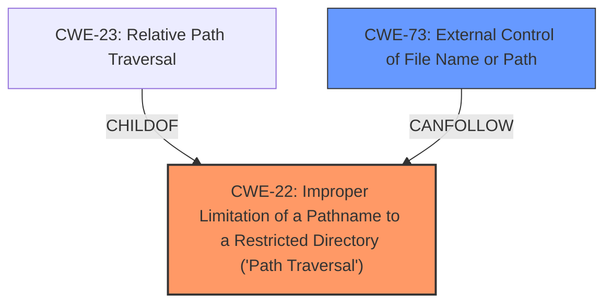

# Analysis for CVE-2022-31255

```markdown
# Summary
| CWE ID | CWE Name | Confidence | CWE Abstraction Level | CWE Vulnerability Mapping Label | CWE-Vulnerability Mapping Notes |
|---|---|---|---|---|---|
| CWE-22 | Improper Limitation of a Pathname to a Restricted Directory ('Path Traversal') | 1.0 | Base | Allowed | Primary CWE |
| CWE-73 | External Control of File Name or Path | 0.7 | Base | Allowed | Secondary Candidate |

## Evidence and Confidence

*   **Confidence Score:** 0.9
*   **Evidence Strength:** HIGH

## Relationship Analysis
The primary relationship that impacted my decision was the parent-child hierarchical relationship between CWE-23 and CWE-22, with CWE-23 being a child of CWE-22. Although both CWEs are applicable, CWE-22 is more precise as it explicitly mentions the **improper limitation of a pathname**, which aligns directly with the vulnerability description. CWE-73 was considered as a CANFOLLOW relationship. The abstraction levels were considered to stay at the base level for accuracy.



## Vulnerability Chain
The vulnerability chain starts with the **improper handling of pathnames**, leading to a **path traversal vulnerability** and culminating in the ability to **read arbitrary files**.

Root Cause: **Improper Limitation of a Pathname to a Restricted Directory (Path Traversal)** (CWE-22)
Weakness: Allows external control of file path (CWE-73)
Impact: Remote attackers can read files.

## Summary of Analysis
My analysis is based on the provided evidence, which clearly indicates a path traversal vulnerability due to **improper limitation of a pathname**.

The "Vulnerability Description" states: "An **Improper Limitation of a Pathname to a Restricted Directory (Path Traversal)** vulnerability in spacewalk/Uyuni of SUSE Linux Enterprise Module for SUSE Manager Server 4.2... allows remote attackers to read files available to the user running the process, typically tomcat."

The "CVE Reference Links Content Summary" further supports this by stating that the application takes a "path" parameter from the URL request without proper sanitization, leading to a path traversal vulnerability and the ability to access files outside the intended web server root directory. It also describes the fix which is to implement regex control on the “path” parameter to prevent access to locations outside the `/var/lib/cobbler/snippets` directory.

CWE-22 (Improper Limitation of a Pathname to a Restricted Directory ('Path Traversal')) is the most appropriate CWE because it accurately describes the **root cause** of the vulnerability, which is the **failure to properly restrict a pathname to a designated directory**. This aligns with the CWE's description: "The product uses external input to construct a pathname that is intended to identify a file or directory that is located underneath a restricted parent directory, but the product does not properly neutralize special elements within the pathname that can cause the pathname to resolve to a location that is outside of the restricted directory."

CWE-73 (External Control of File Name or Path) was considered as a secondary weakness because the file name or path is derived from user input. This is a prerequisite for path traversal.

Other CWEs were considered but deemed less relevant:

*   CWE-79 (Improper Neutralization of Input During Web Page Generation ('Cross-site Scripting')) is not applicable because the vulnerability does not involve the generation of web pages with un-neutralized input.
*   CWE-61 (UNIX Symbolic Link (Symlink) Following) is not applicable because the vulnerability does not involve the following of symbolic links.
*   CWE-770 (Allocation of Resources Without Limits or Throttling) is not applicable because the vulnerability does not involve resource allocation issues.
*   CWE-285 (Improper Authorization) is not applicable because the vulnerability is primarily related to path traversal, not authorization mechanisms.

The selected CWEs are at the optimal level of specificity as they accurately reflect the **root cause** (CWE-22) and a contributing factor (CWE-73) of the vulnerability.
```