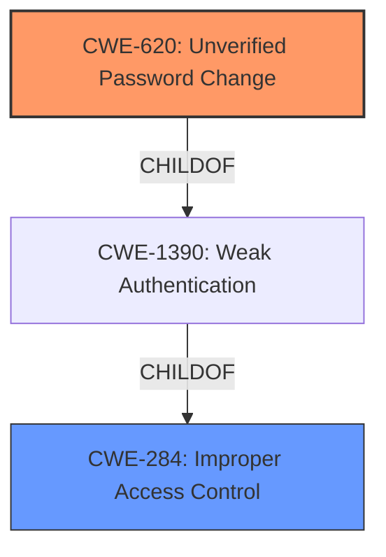

# Enhanced Analysis for CVE-2022-31257

# Summary
| CWE ID | CWE Name | Confidence | CWE Abstraction Level | CWE Vulnerability Mapping Label | CWE-Vulnerability Mapping Notes |
|---|---|---|---|---|---|
| CWE-620 | Unverified Password Change | 0.9 | Base | Allowed | Primary CWE |
| CWE-284 | Improper Access Control | 0.6 | Pillar | Discouraged | Secondary Candidate |

## Evidence and Confidence

*   **Confidence Score:** 0.9
*   **Evidence Strength:** HIGH

## Relationship Analysis
The primary CWE, CWE-620, is a base-level CWE that directly addresses the **lack of verification** when changing passwords. The secondary CWE, CWE-284, represents a broader category of **improper access control**.



## Vulnerability Chain
The vulnerability chain starts with an **improper access control**, specifically allowing a user with an active session to bypass password validations, leading to the ability to change the user's password without proper authentication.

## Summary of Analysis
The initial assessment focuses on identifying the root cause of the vulnerability. The provided evidence indicates that the vulnerability allows an attacker with access to an active user session to change the user's password, bypassing password validations.

**CWE-620: Unverified Password Change**
This CWE is the best fit as it directly describes the **weakness** where the product does not require knowledge of the original password or another form of authentication when setting a new password. This matches the vulnerability description which states it's possible to change a user's password, "bypassing password validations".
The supporting evidence is from the "CVE Reference Links Content Summary" which states "The vulnerability allows an attacker with access to an active user session to change the user's password, bypassing password validations, potentially setting weak passwords."
MITRE's mapping guidance for CWE-620 states, "This CWE entry is at the Base level of abstraction, which is a preferred level of abstraction for mapping to the root causes of vulnerabilities."
Confidence: 0.9

**CWE-284: Improper Access Control**
This CWE is considered as a secondary candidate. While the vulnerability does involve **improper access control**, the more specific **lack of password verification** (CWE-620) is a more accurate representation of the root cause. CWE-284 is a broader category and the mapping guidance advises against using it when more specific CWEs are available.
Confidence: 0.6

The selected CWEs are at the optimal level of specificity because CWE-620 directly addresses the root cause of the vulnerability, and CWE-284 provides a broader context of the access control issues.


## CWE Relationship Analysis

Current CWEs represent these abstraction levels: .


### Vulnerability Chain Analysis

**Chain starting from CWE-1390:**
- 1390 (Weak Authentication) - ROOT


**Chain starting from CWE-620:**
- 620 (Unverified Password Change) - ROOT


### CWE Relationship Diagram

```mermaid
graph TD
    classDef primary fill:#f96,stroke:#333,stroke-width:2px
    classDef secondary fill:#69f,stroke:#333
    classDef tertiary fill:#9e9,stroke:#333
```