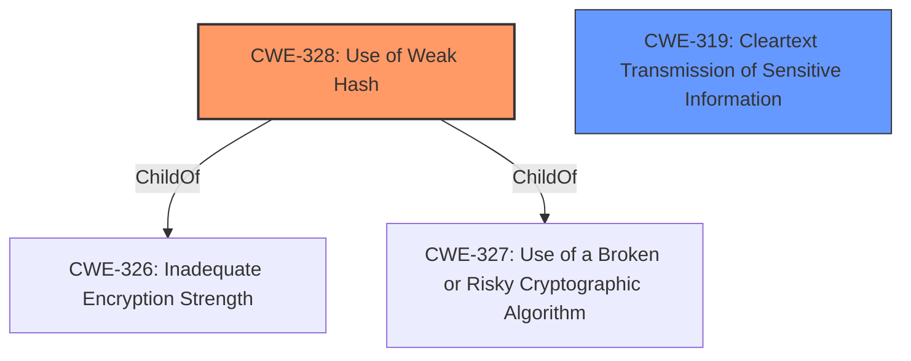

# Enhanced Analysis for CVE-2022-31459

# Summary
| CWE ID | CWE Name | Confidence | CWE Abstraction Level | CWE Vulnerability Mapping Label | CWE-Vulnerability Mapping Notes |
|---|---|---|---|---|---|
| CWE-328 | Use of Weak Hash | 0.9 | Base | Allowed | Primary CWE |
| CWE-319 | Cleartext Transmission of Sensitive Information | 0.6 | Base | Allowed | Secondary Candidate |

## Evidence and Confidence

*   **Confidence Score:** 0.8
*   **Evidence Strength:** HIGH

## Relationship Analysis
The primary CWE is CWE-328, Use of Weak Hash. This vulnerability involves exposing a passcode hash over Bluetooth, which can then be cracked offline. While the description doesn't explicitly state the hash algorithm, the fact that it's easily cracked suggests a weak hashing algorithm, which aligns with CWE-328.

CWE-328 is a Base level CWE, which is preferred for vulnerability mapping.

CWE-319 is also considered because the hash is transmitted over Bluetooth, which might be considered a cleartext transmission if the Bluetooth communication is not properly encrypted.



## Vulnerability Chain
The vulnerability chain starts with exposing a passcode hash over Bluetooth, which indicates a potential **lack of** or **improper** implementation of secure practices. The **use of a weak hash** (CWE-328) for the passcode allows attackers to retrieve the passcode via offline cracking. The chain can be summarized as:

1.  Passcode hash exposed over Bluetooth.
2.  **Use of Weak Hash** (CWE-328) makes it susceptible to offline cracking.
3.  Attacker retrieves the passcode.
4.  Attacker gains unauthorized access to device settings or control of the Meeting Owl.

## Summary of Analysis
Initially, the description points to a weakness related to passcode handling and Bluetooth exposure. The core issue is that the exposed hash is easily crackable, suggesting a weak hashing algorithm. This aligns well with CWE-328, Use of Weak Hash, because the hash algorithm doesn't meet security expectations, allowing an adversary to reasonably determine the original input. The CVE Reference Links Content Summary confirms that "the Meeting Owl Pro device exposes the passcode hash via Bluetooth" and the "hash is vulnerable to offline cracking" because "the passcode appears to be a short numeric value, which is easily brute-forced using tools like hashcat."

CWE-319, Cleartext Transmission of Sensitive Information, is considered because the passcode hash is transmitted over Bluetooth. However, without more information about the Bluetooth encryption, it is hard to assert that the transmission is happening in "cleartext".

Based on the evidence, CWE-328 is the primary weakness as the root cause enabling the passcode retrieval. It's at the Base level of abstraction, aligning with the mapping guidance.

Other CWEs Considered:

*   CWE-798 (Use of Hard-coded Credentials): This CWE was considered because a simple numeric passcode might be hard-coded. However, the description focuses on the **weakness** of the hash, not on the passcode itself being hard-coded. So, it's not the best fit.
*   CWE-916 (Use of Password Hash With Insufficient Computational Effort): While related to password hashing, this CWE is more specific to the computational effort. CWE-328 is more general and fits better since it covers broader weaknesses in hashing algorithms.
*   CWE-1390 (Weak Authentication): This is a class-level CWE, and more specific Base CWEs like CWE-328 are preferred.
*   CWE-306 (Missing Authentication for Critical Function): This CWE could be applicable if the Bluetooth communication lacked authentication. However, the primary issue is the weak hash, making CWE-328 a more direct match.

Therefore, the chosen CWEs are at the optimal level of specificity.


## CWE Relationship Analysis

Current CWEs represent these abstraction levels: .


### Vulnerability Chain Analysis

**Chain starting from CWE-916:**
- 916 (Use of Password Hash With Insufficient Computational Effort) - ROOT


**Chain starting from CWE-327:**
- 327 (Use of a Broken or Risky Cryptographic Algorithm) - ROOT


### CWE Relationship Diagram

```mermaid
graph TD
    classDef primary fill:#f96,stroke:#333,stroke-width:2px
    classDef secondary fill:#69f,stroke:#333
    classDef tertiary fill:#9e9,stroke:#333
```