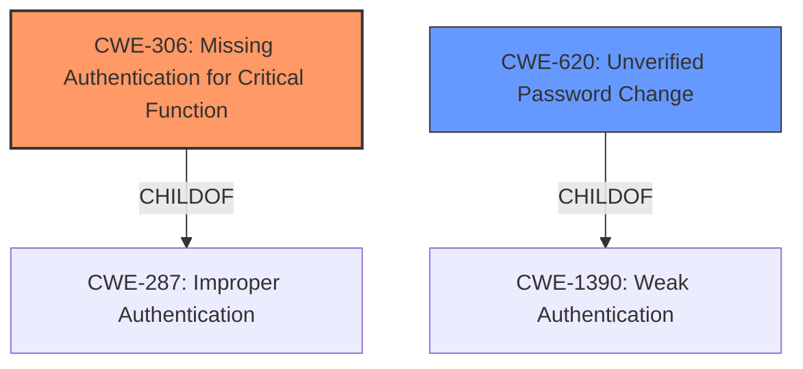

# Analysis for CVE-2022-31461

# Summary
| CWE ID | CWE Name | Confidence | CWE Abstraction Level | CWE Vulnerability Mapping Label | CWE-Vulnerability Mapping Notes |
|---|---|---|---|---|---|
| CWE-306 | Missing Authentication for Critical Function | 1.0 | Base | Primary | Allowed |
| CWE-620 | Unverified Password Change | 0.7 | Base | Secondary | Allowed |

## Evidence and Confidence

*   **Confidence Score:** 0.9
*   **Evidence Strength:** HIGH

## Relationship Analysis
The primary CWE selected is CWE-306 **[CWE-306: Missing Authentication for Critical Function]**, which is a Base level CWE. CWE-306 is a child of CWE-287 **[CWE-287: Improper Authentication]**, which is a class level CWE. The secondary CWE selected is CWE-620 **[CWE-620: Unverified Password Change]**, which is a Base level CWE. CWE-620 is a child of CWE-1390 **[CWE-1390: Weak Authentication]**.

## Vulnerability Chain
The vulnerability chain starts with a **lack of authentication** for a critical function (CWE-306), which allows an attacker to deactivate the passcode. The ability to deactivate the passcode without authentication leads to an **unverified password change** (CWE-620).

## Summary of Analysis
The vulnerability lies in the fact that the Owl Labs Meeting Owl 5.2.0.15 allows attackers to deactivate the passcode protection mechanism via a certain c 11 message.

The primary weakness is **lack of authentication** (CWE-306) for deactivating the passcode. The "CVE Reference Links Content Summary" explicitly mentions "The primary vulnerability is the absence of any authentication check before allowing the passcode to be deactivated or reset." and "The device accepts a command to reset the passcode without verifying the identity or authorization of the sender." This aligns perfectly with the description of CWE-306, which states, "The product does not perform any authentication for functionality that requires a provable user identity or consumes a significant amount of resources."

CWE-620 **[CWE-620: Unverified Password Change]** is a secondary candidate because deactivating the passcode is effectively an unverified password change. An attacker can **bypass** the existing passcode (effectively changing it to no passcode) without providing the original passcode.

I considered CWE-798 **[CWE-798: Use of Hard-coded Credentials]** because it also appeared in the retriever results, but it does not fit the vulnerability description. While a hard-coded credential *could* be bypassed, the core issue here is the **missing authentication**, not the presence of a hard-coded credential.

I also considered CWE-284 **[CWE-284: Improper Access Control]**, but it is too high-level. CWE-306 provides a more specific description of the vulnerability, focusing on the **lack of authentication**.

The selected CWEs are at the optimal level of specificity because they directly address the root cause of the vulnerability, which is the **missing authentication** for a critical function and the resultant **unverified password change**.