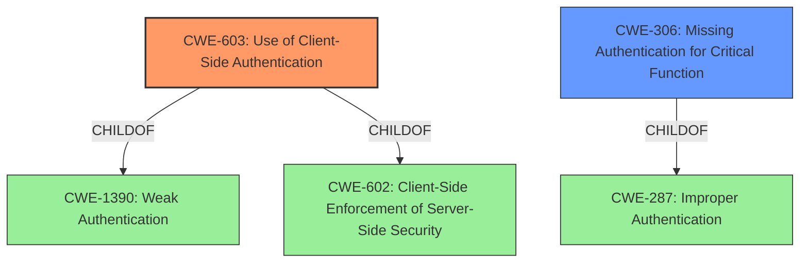

# Enhanced Analysis for CVE-2022-31463

# Summary
| CWE ID | CWE Name | Confidence | CWE Abstraction Level | CWE Vulnerability Mapping Label | CWE-Vulnerability Mapping Notes |
|---|---|---|---|---|---|
| CWE-603 | Use of Client-Side Authentication | 1.0 | Base | Allowed | Primary CWE |
| CWE-306 | Missing Authentication for Critical Function | 0.7 | Base | Allowed | Secondary Candidate |

## Evidence and Confidence

*   **Confidence Score:** 0.9
*   **Evidence Strength:** HIGH

## Relationship Analysis
The primary relationship influencing the decision is the ChildOf relationship, where CWE-603 is a child of CWE-1390 (Weak Authentication) and CWE-602. However, CWE-603 is a more specific Base CWE that describes the **root cause** more accurately. CWE-306 is also a child of CWE-287(Improper Authentication). The selection of CWE-603 over the Class CWE-1390 and CWE-287 is due to its greater specificity.



## Vulnerability Chain
The vulnerability chain starts with the **missing authentication** on the server-side for Bluetooth commands, leading to the use of only client-side authentication, which can be bypassed by attackers within Bluetooth range.

## Summary of Analysis
The initial analysis pointed towards authentication-related CWEs. The most relevant CWE based on the provided evidence and descriptions is CWE-603 (Use of Client-Side Authentication). The vulnerability description states that "Owl Labs Meeting Owl 5.2.0.15 does not require a password for Bluetooth commands, because only client-side authentication is used." This directly aligns with the description of CWE-603: "A client/server product performs authentication within client code but not in server code, allowing server-side authentication to be bypassed via a modified client that omits the authentication check."

The selection of CWE-603 is strongly supported by the "CVE Reference Links Content Summary," which highlights the "**weakness/vulnerability**" as "**missing authentication** for Bluetooth commands." The **root cause** is the absence of server-side authentication.

CWE-306 (Missing Authentication for Critical Function) was considered because the device does not perform any authentication for Bluetooth commands which is a critical function. However, since the vulnerability specifically mentions the use of client-side authentication only, CWE-603 is a more precise match.

The final decision to select CWE-603 is based on the direct evidence from the vulnerability description and the alignment with the CWE's characteristics. This selection provides the optimal level of specificity, as it captures the exact **root cause** of the vulnerability, and it aligns with the MITRE mapping guidance by selecting a Base level CWE.


## CWE Relationship Analysis

Current CWEs represent these abstraction levels: .


### Vulnerability Chain Analysis

**Chain starting from CWE-1390:**
- 1390 (Weak Authentication) - ROOT


**Chain starting from CWE-602:**
- 602 (Client-Side Enforcement of Server-Side Security) - ROOT


### CWE Relationship Diagram

```mermaid
graph TD
    classDef primary fill:#f96,stroke:#333,stroke-width:2px
    classDef secondary fill:#69f,stroke:#333
    classDef tertiary fill:#9e9,stroke:#333
```