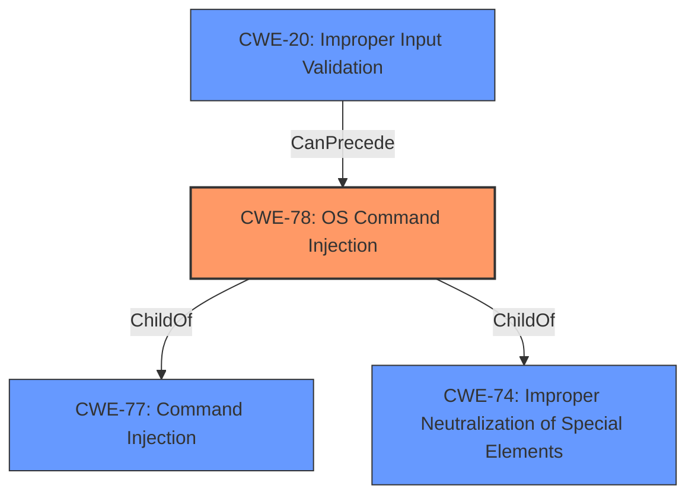

# Enhanced Analysis for CVE-2022-31479

# Summary
| CWE ID  | CWE Name                                                                       | Confidence | CWE Abstraction Level | CWE Vulnerability Mapping Label | CWE-Vulnerability Mapping Notes |
| :-------- | :----------------------------------------------------------------------------- | :--------- | :---------------------- | :------------------------------ | :--------------------------------- |
| CWE-78  | Improper Neutralization of Special Elements used in an OS Command ('OS Command Injection') | 1.0        | Base                    | Allowed                       | Primary CWE |
| CWE-20  | Improper Input Validation                                                      | 0.6        | Class                   | Discouraged                    | Secondary Candidate |

## Evidence and Confidence

*   **Confidence Score:** 0.9
*   **Evidence Strength:** MEDIUM

## Relationship Analysis
The primary relationship impacting the decision is the ChildOf relationship between CWE-78 and CWE-77 and CWE-74. CWE-78 is a Base level CWE and a more specific instance of CWE-77 (Command Injection). The relationship between CWE-20 and CWE-78 is more of a "CanPrecede" relationship, where improper input validation can lead to command injection. The abstraction level of CWE-78 (Base) is preferred over CWE-77 (Class) because it's more specific.



## Vulnerability Chain
The vulnerability chain starts with the **weakness** of **command injection** due to the **improper neutralization of special elements** in the hostname. This leads to the impact of executing shell commands, modifying onboard relays and configuration files, and causing device instability. The attacker is unauthenticated, and the vector is a specially crafted hostname.

## Summary of Analysis
The primary CWE is CWE-78, Improper Neutralization of Special Elements used in an OS Command ('OS Command Injection'). This is based on the **weakness** of **command injection** described in the vulnerability description: "An unauthenticated attacker can update the hostname with a specially crafted name that will allow for shell commands to be executed." The phrase "shell commands to be executed" aligns directly with the description of CWE-78, which focuses on the construction of OS commands using externally-influenced input without proper neutralization.

The retriever results also support this, with CWE-78 being a top candidate. The mapping guidance for CWE-78 allows its use, stating that it is at the Base level of abstraction, which is preferred.

CWE-20, Improper Input Validation, was considered as a secondary CWE because the specially crafted name is not properly validated. However, CWE-78 more accurately reflects the specific **weakness** of **command injection**. CWE-20 is a Class-level CWE and is discouraged when more specific CWEs are available.

Relevant CWE Information:
* CWE-78: Improper Neutralization of Special Elements used in an OS Command ('OS Command Injection')
  *   The product constructs all or part of an OS command using externally-influenced input from an upstream component, but it does not neutralize or incorrectly neutralizes special elements that could modify the intended OS command when it is sent to a downstream component.
  *   **Usage:** Allowed
* CWE-20: Improper Input Validation
  * The product receives input or data, but it does not validate or incorrectly validates that the input has the properties that are required to process the data safely and correctly.
  * **Usage:** Discouraged

The selection of CWE-78 is at the optimal level of specificity because it directly addresses the root cause of the vulnerability, which is the ability to execute shell commands due to the lack of proper neutralization of special elements in the crafted hostname.


## CWE Relationship Analysis

Current CWEs represent these abstraction levels: .


### Vulnerability Chain Analysis

**Chain starting from CWE-78:**
- 78 (Improper Neutralization of Special Elements used in an OS Command ('OS Command Injection')) - ROOT


**Chain starting from CWE-77:**
- 77 (Improper Neutralization of Special Elements used in a Command ('Command Injection')) - ROOT


### CWE Relationship Diagram

```mermaid
graph TD
    classDef primary fill:#f96,stroke:#333,stroke-width:2px
    classDef secondary fill:#69f,stroke:#333
    classDef tertiary fill:#9e9,stroke:#333
```