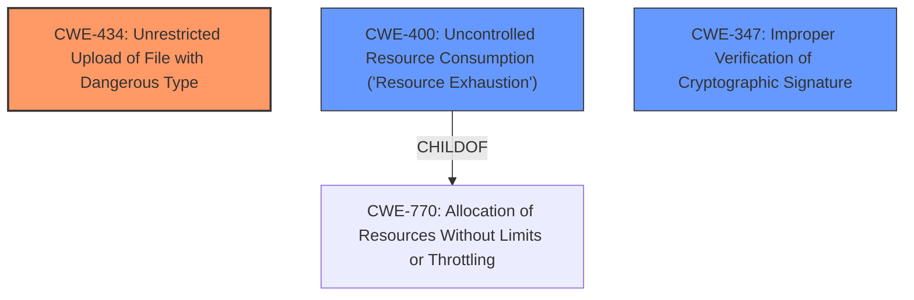

# Analysis for CVE-2022-31480

# Summary
| CWE ID  | CWE Name                                                                                                | Confidence | CWE Abstraction Level | CWE Vulnerability Mapping Label | CWE-Vulnerability Mapping Notes |
| :------- | :------------------------------------------------------------------------------------------------------- | :--------- | :---------------------- | :------------------------------ | :------------------------------ |
| CWE-434 | Unrestricted Upload of File with Dangerous Type                                                          | 0.75       | Base                    | Primary                         | Allowed                         |
| CWE-400 | Uncontrolled Resource Consumption ('Resource Exhaustion')                                                | 0.60       | Class                    | Secondary                       | Allowed-with-Review             |
| CWE-347 | Improper Verification of Cryptographic Signature                                                          | 0.50       | Base                    | Secondary                       | Allowed                         |

## Evidence and Confidence

*   **Confidence Score:** 0.70
*   **Evidence Strength:** MEDIUM

## Relationship Analysis
The primary CWE is CWE-434, representing the **unrestricted upload of a file with a dangerous type**, which directly aligns with the vulnerability description.

CWE-400, a class-level CWE, is a secondary candidate because the unrestricted upload leads to resource exhaustion, ultimately causing a denial-of-service. CWE-400 is a child of CWE-770 (Allocation of Resources Without Limits or Throttling).

CWE-347 is another secondary candidate due to the possibility of **improper verification of the signature** of the uploaded firmware.

## Vulnerability Chain
The vulnerability chain starts with an **unauthenticated attacker** uploading firmware files to the target device (**ROOT CAUSE:** Unrestricted Upload). Since there is no type checking, the firmware can be of a dangerous type. The device attempts to process this malicious firmware, which leads to excessive resource consumption (**WEAKNESS:** Uncontrolled Resource Consumption). The excessive resource consumption ultimately triggers a reboot, causing a Denial-of-Service (**IMPACT**).

## Summary of Analysis
The analysis focuses on the root cause of the vulnerability, which is the **unrestricted upload of firmware files** by an **unauthenticated attacker**. The device proceeds to process this firmware, and upon loading, it triggers a reboot causing a DoS.

The primary CWE, CWE-434, directly reflects the root cause as the application allows the upload of files with dangerous types without restriction. The vulnerability description states, "An **unauthenticated attacker** could arbitrarily **upload firmware files** to the target device, ultimately causing a Denial-of-Service (DoS)." The uploaded file is the firmware itself.

CWE-400 is included as a secondary weakness because the act of loading and attempting to process the uploaded firmware consumes resources, leading to the DoS.

CWE-347 is considered because the vulnerability mentions "properly signed and encrypted binary," implying that signature verification, if present, is insufficient or bypassed.

The selected CWEs are at the optimal level of specificity. CWE-434 is a Base-level CWE that directly describes the **unrestricted upload** issue. CWE-400 and CWE-347 highlight the consequences and contributing factors, respectively.

Relevant CWE Information:

# Enhanced Context (25 CWEs)
The following CWEs were identified as potentially relevant to this vulnerability:

## CWE-807: Reliance on Untrusted Inputs in a Security Decision
**Abstraction Level**: Base
**Similarity Score**: 0.78
**Source**: dense

**Description**:
The product uses a protection mechanism that relies on the existence or values of an input, but the input can be modified by an untrusted actor in a way that bypasses the protection mechanism.

**Mapping Guidance**:
- Usage: Allowed
- Rationale: This CWE entry is at the Base level of abstraction, which is a preferred level of abstraction for mapping to the root causes of vulnerabilities.

## CWE-1220: Insufficient Granularity of Access Control
**Abstraction Level**: Base
**Similarity Score**: 0.78
**Source**: dense

**Description**:
The product implements access controls via a policy or other feature with the intention to disable or restrict accesses (reads and/or writes) to assets in a system from untrusted agents. However, implemented access controls lack required granularity, which renders the control policy too broad because it allows accesses from unauthorized agents to the security-sensitive assets.

**Mapping Guidance**:
- Usage: Allowed
- Rationale: This CWE entry is at the Base level of abstraction, which is a preferred level of abstraction for mapping to the root causes of vulnerabilities.

## CWE-1289: Improper Validation of Unsafe Equivalence in Input
**Abstraction Level**: Base
**Similarity Score**: 0.77
**Source**: dense

**Description**:
The product receives an input value that is used as a resource identifier or other type of reference, but it does not validate or incorrectly validates that the input is equivalent to a potentially-unsafe value.

**Mapping Guidance**:
- Usage: Allowed
- Rationale: This CWE entry is at the Base level of abstraction, which is a preferred level of abstraction for mapping to the root causes of vulnerabilities.

## CWE-345: Insufficient Verification of Data Authenticity
**Abstraction Level**: Class
**Similarity Score**: 0.77
**Source**: dense

**Description**:
The product does not sufficiently verify the origin or authenticity of data, in a way that causes it to accept invalid data.

**Mapping Guidance**:
- Usage: Discouraged
- Rationale: This CWE entry is a level-1 Class (i.e., a child of a Pillar). It might have lower-level children that would be more appropriate

## CWE-280: Improper Handling of Insufficient Permissions or Privileges
**Abstraction Level**: Base
**Similarity Score**: 0.77
**Source**: dense

**Description**:
The product does not handle or incorrectly handles when it has insufficient privileges to access resources or functionality as specified by their permissions. This may cause it to follow unexpected code paths that may leave the product in an invalid state.

**Mapping Guidance**:
- Usage: Allowed
- Rationale: This CWE entry is at the Base level of abstraction, which is a preferred level of abstraction for mapping to the root causes of vulnerabilities.

## CWE-799: Improper Control of Interaction Frequency
**Abstraction Level**: Class
**Similarity Score**: 0.77
**Source**: dense

**Description**:
The product does not properly limit the number or frequency of interactions that it has with an actor, such as the number of incoming requests.

**Mapping Guidance**:
- Usage: Allowed-with-Review
- Rationale: This CWE entry is a Class and might have Base-level children that would be more appropriate

## CWE-274: Improper Handling of Insufficient Privileges
**Abstraction Level**: Base
**Similarity Score**: 0.77
**Source**: dense

**Description**:
The product does not handle or incorrectly handles when it has insufficient privileges to perform an operation, leading to resultant weaknesses.

**Mapping Guidance**:
- Usage: Discouraged
- Rationale: This CWE entry could be deprecated in a future version of CWE.

## CWE-691: Insufficient Control Flow Management
**Abstraction Level**: Pillar
**Similarity Score**: 0.76
**Source**: dense

**Description**:
The code does not sufficiently manage its control flow during execution, creating conditions in which the control flow can be modified in unexpected ways.

**Mapping Guidance**:
- Usage: Discouraged
- Rationale: This CWE entry is extremely high-level, a Pillar. However, classification research is limited for weaknesses of this type, so there can be gaps or organizational difficulties within CWE that force use of this weakness, even at such a high level of abstraction.

## CWE-657: Violation of Secure Design Principles
**Abstraction Level**: Class
**Similarity Score**: 0.76
**Source**: dense

**Description**:
The product violates well-established principles for secure design.

**Mapping Guidance**:
- Usage: Discouraged
- Rationale: This CWE entry is a level-1 Class (i.e., a child of a Pillar). It might have lower-level children that would be more appropriate

## CWE-184: Incomplete List of Disallowed Inputs
**Abstraction Level**: Base
**Similarity Score**: 0.76
**Source**: dense

**Description**:
The product implements a protection mechanism that relies on a list of inputs (or properties of inputs) that are not allowed by policy or otherwise require other action to neutralize before additional